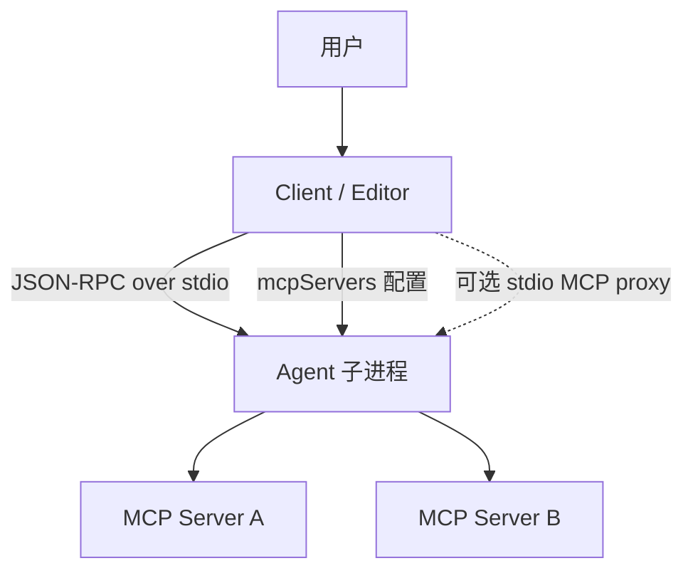
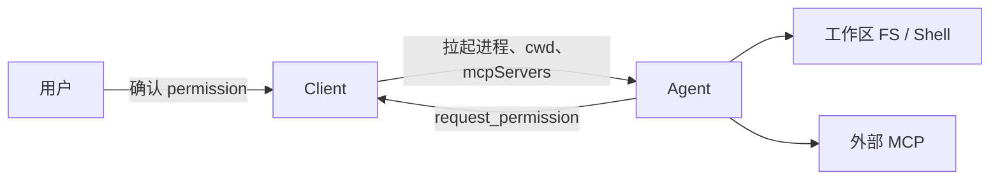
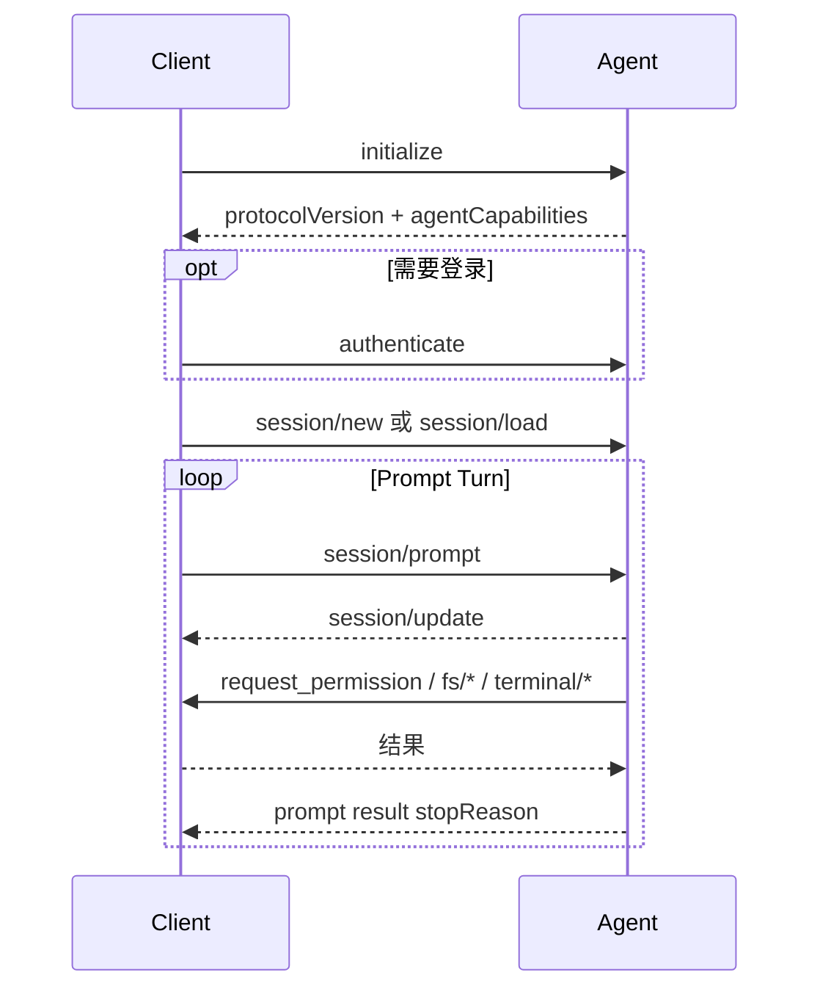
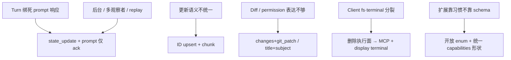
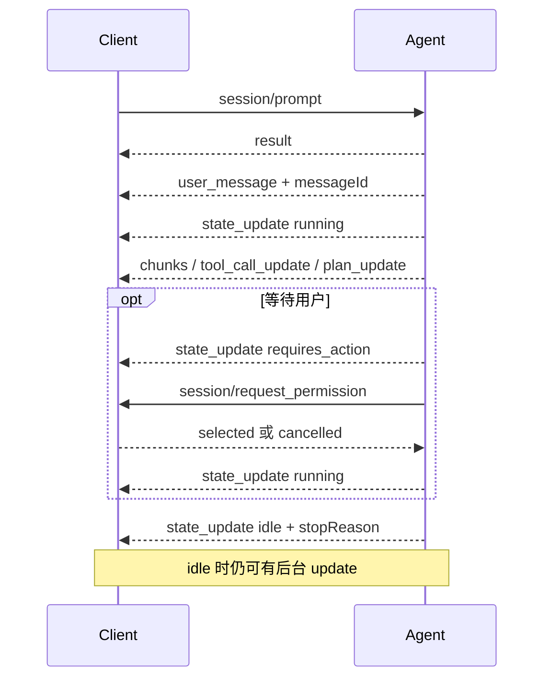
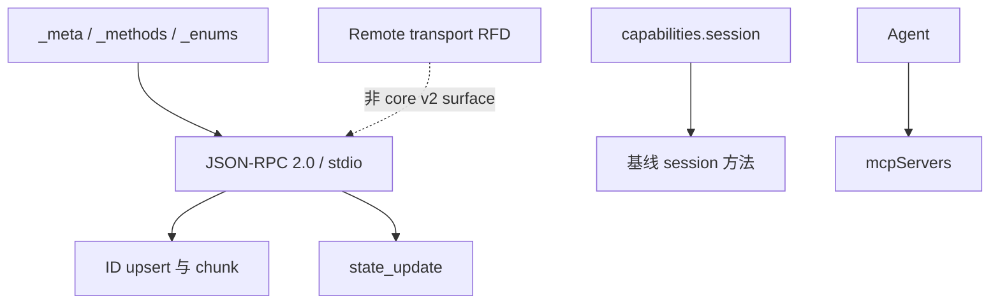

# Agent Client Protocol

## 摘要

Agent Client Protocol（ACP）标准化 **code editor / IDE（Client）** 与 **coding agent（Agent）** 之间的通信，角色类似 LSP：Agent 实现一次 ACP 即可接入兼容 Client；Client 支持 ACP 即可接入生态中的 Agent。

协议基于 **JSON-RPC 2.0**（Methods + Notifications）。本地场景下 Client 按需拉起 Agent 子进程，经 **stdio** 通信。内容类型尽量复用 [[MCP]] 的 JSON 表示，并增加 coding UX 所需的 diff、plan、permission 等类型。默认面向用户的文本是 Markdown。

| 版本 | 状态 | 心智模型 |
| --- | --- | --- |
| **v1** | 稳定，生态主力 | **Prompt turn**：`session/prompt` 挂起整轮，响应携带 `stopReason` |
| **v2** | Draft（公告 2026-07-20） | **Session lifecycle**：prompt 只表示受理；结束靠 `state_update`；消息/tool/plan 按 ID upsert |

实现应 **v1/v2 并存**：按 `initialize` 协商版本；v2 用 feature flag 闸住，稳定前不要默认生产开启。一手调研见 `raw/sources/2026-08-06-agent-client-protocol-v1-v2-research.md`。

## ACP 不是什么

- **不是** Agent 框架（规划、记忆、多 Agent 编排不在协议范围）。
- **不是** [[MCP]]：MCP 连接工具与数据；ACP 连接 editor 与 coding agent。二者常同时出现——Client 经 `mcpServers` 把 MCP 配置交给 Agent。
- **不是** 模型 API（Chat Completions / Responses / Messages）。
- **默认不是零信任沙箱**：官方信任模型是“在 editor 里使用可信 agent”；仍有 permission，但会暴露本地文件与 MCP 访问。

## 基本架构

| 角色 | 典型形态 | 职责 |
| --- | --- | --- |
| **Client** | IDE、编辑器、agent UI | UX、会话展示、权限确认、cwd / MCP 配置 |
| **Agent** | coding agent 子进程（或远程 agent） | 推理与工具执行、流式 `session/update`；v2 中拥有 session 历史与 `messageId` |

设计原则：**MCP-friendly**、**UX-first**、**Trusted**。一条连接可多 concurrent session。约定：路径绝对；行号 1-based；属性 `camelCase`，判别值 `snake_case`。

## 信任与边界

v2 删除 Client 侧 `fs/*` 与 `terminal/*` 执行面后，Client 若仍要暴露本地能力，官方推荐走 **MCP server**（与其它工具同等），而不是 ACP 上的私有执行 API。Agent-owned terminal 在 v2 仅为 **display-only**。

## v1：Prompt Turn

### 消息流

核心语义：`session/prompt` **在整轮期间保持 pending**；期间推送 `session/update`；最终响应用 `stopReason` 结束（`end_turn` | `max_tokens` | `max_turn_requests` | `refusal` | `cancelled`）。

### v1 能力要点

- **版本协商：** Client 发最新 `protocolVersion`；Agent 回支持版本；省略的 capability = 不支持；新能力优先靠 capability 加法，不靠涨 major。
- **Client 可选面：** `fs.readTextFile` / `fs.writeTextFile`、`terminal`、`elicitation` 等。
- **Agent 可选面：** `loadSession`、`promptCapabilities.*`、`mcpCapabilities.http|sse`、`sessionCapabilities.list|resume|close|delete`、`auth.logout` 等。
- **session/update 常见变体：** message chunks、`tool_call` / `tool_call_update`、`plan`、`usage_update`、`available_commands_update`、`current_mode_update`、`config_option_update`、`session_info_update`。
- **Diff：** `oldText` / `newText`；**Permission：** 以 `toolCall` 为中心。

## v2 改动出发点（Why）

官方定位：v2 是 **consolidation release**，不是功能大礼包。v1 已用 RFD 加法演进 15+ 项且可前向兼容；但仍有一批问题 **卡在 turn 语义和表面不一致上**，必须 breaking 才能解开。新功能若可 optional/additive，继续走 RFD，不塞进 v2 本身。

核心设计目标仍是：给 agent 与 client **尽量多的实现自由**，只在语义上必须对齐的地方立约。v2 明确要让 agent 在 session 里更灵活地工作，并为新的 client 模式铺路。

### 问题 1：世界已超过「用户一问一答一轮」

v1 心智是 **prompt turn**：多数 agent 在用户消息后吐事件，生成完就停；实现者也常把 `session/update` 理解成「只能出现在 turn 内」。协议并未严格禁止 turn 外更新，但 **turn 所有权绑在 pending 的 `session/prompt` 上**，导致：

| 现实需求 | v1 为何别扭 |
| --- | --- |
| Agent 跑得更久、后台编排更多工作 | 进度更新与「prompt 是否还 pending」缠在一起 |
| 排队 / steering / 未必要用户发起的更新 | turn 模型默认「一轮 = 一次 prompt 生命周期」 |
| 前景已 idle，后台仍要推状态 | client 想用「turn 结束」当可输入信号，agent 还想继续 update |
| 多 client 观察同一 session、历史 replay | 用户消息只活在 request 里，没有 agent 侧权威回放点 |

**出发点：** 把「消息已被受理」和「前景工作结束」拆开。`session/prompt` 响应只表示 **ack**；完成与可输入靠 `state_update`（running / idle / requires_action）；`session/update` 可在 session 任意时刻流动。Agent 回放用户消息插入点（自有 `messageId`），便于 replay 与多观察者。

> 官方原话方向：*moving beyond the turn*；prompt 不再拥有整段工作生命周期。

### 问题 2：同一类「会话条目」更新语义不统一

Tool call 已有按 ID 更新的模式，但消息、terminal、plan 等没有同一套 upsert。流式时只能反复重发整段 content；纠错、脱敏、replay 缺少稳定身份。

**出发点：** 消息 / tool call / terminal / plan **统一 ID + patch**（省略不变、`null` 清空、有值替换、chunk 追加）；tool content 可流式 chunk，不必整包重传。

### 问题 3：表达力缺口与实现分裂

- **Diff：** 仅 `oldText`/`newText`，难区分删文件 vs 清空、rename/copy/binary。
- **Permission：** 文案常塞进 tool `title`，污染工具展示；subject 死绑 tool call，难扩展到「批准一条命令」等。
- **Client fs/terminal：** 协议有执行面，但生态实现参差；agent 往往已有自己的文件/命令路径 → v2 **删掉** 该 Client 执行面，本地能力改走 **MCP**；terminal 改为 agent-owned **display-only**。
- **Modes vs config：** 专用 mode API 与后来的 config options 重叠 → 并入 config。
- **扩展：** v1 已证明 capability/`_meta` 有用 → v2 把开放 enum（`_` 前缀扩展）做成默认，减少未知字段噎死旧实现。

### 刻意不做的

- 不把所有 wishlist 塞进一次 major（避免 v2 永远不落地）。
- Queueing / steering 的完整产品策略 **不** 由 prompt lifecycle RFD 单独标准化（lifecycle 只铺路）。
- 标准远程 HTTP/WS **不** 进 core v2 surface（独立 transport RFD）。

### v1 → v2 因果一览

## v2 Draft：Session lifecycle 与统一 upsert

**状态：** Draft（公告约 2026-07-20）。schema 分 `schema/v2/schema.json`（baseline）与 `schema.unstable.json`（opt-in）；**协商 `protocolVersion: 2` ≠ 开启全部 unstable 特性**。稳定前可能改；生产默认勿强切；**保留 v1**。

### 五大主题（What，对应上面 Why）

1. **Beyond the turn：** prompt 响应 = 受理；进度/结束用 `state_update`；`session/update` 可随时发送。
2. **统一 upsert：** 按稳定 ID patch——省略不变、`null` 清空、有值替换、chunk 追加。
3. **Diff overhaul：** 结构化 `changes` + 可选 `git_patch`。
4. **Permission 解耦：** 必填 `title`、可选 `description`、可扩展 `subject`。
5. **默认前向兼容：** 开放 enum；`_` 前缀留给实现扩展。

### Prompt 生命周期

| 前景信号 | v1 | v2 |
| --- | --- | --- |
| 已受理 | 隐含（request 挂起） | `session/prompt` → `{}` |
| 用户消息进历史 | 隐含 | `user_message` / chunks（Agent 生成 `messageId`） |
| 工作中 | prompt pending | `state_update: running` |
| 等用户 | 隐含 | `state_update: requires_action` |
| 结束 | prompt + `stopReason` | `idle` + `stopReason` |
| 取消确认 | prompt `cancelled` | idle + `cancelled` |

`stopReason` 取值集合与 v1 相同，仅位置迁移。**idle = 可接新 prompt**；后台 update 可不改变 state。Queueing / steering **尚未**由该 lifecycle 单独标准化（见下表「协议铺路 vs 产品自建」）。

### v2 才能干净做的事（相对 v1）

下面按 **场景 → v1 卡点 → v2 具体机制 → 实现上多出来的能力** 写。不是新 RPC 名词表，而是「以前只能 hack，现在协议有一等表达」。

#### 1. 前景结束后仍推后台进度

| | |
| --- | --- |
| **场景** | Agent 主回复已结束，但仍在跑测试、索引、长命令，UI 要继续刷日志/状态 |
| **v1 卡点** | 完成信号 = `session/prompt` 的 response + `stopReason`。Client 常把「prompt 返回」当成整轮结束、关流式、解禁输入；turn 外再发 `session/update` 虽未必被禁，但与「响应已结束」语义打架，实现者容易拒收或丢更新 |
| **v2 机制** | `session/prompt` → 立即 `{}`；前景结束 = `state_update` `idle` + `stopReason`；**idle 不禁止** 其它 `session/update` |
| **多出来的能力** | Client 用 `idle` 解禁输入框，同时继续渲染后台 tool/terminal/usage；Agent 不必为了「还能推送」而假装 prompt 仍 pending |

#### 2. 连发 / 插队用户消息（排队与 steering 的协议前提）

| | |
| --- | --- |
| **场景** | 用户在 agent 还在跑时又发一条；或插入纠正（「停，改用 pnpm」） |
| **v1 卡点** | 上一轮 `session/prompt` 仍 pending 时，下一轮 prompt 的生命周期、与旧 turn 的 `stopReason` 如何交错没有清晰模型；用户正文主要活在 **request params** 里，没有「插入历史的哪一点」的权威事件 |
| **v2 机制** | 每条 prompt 先 ack；Agent **必须** 发 `user_message` / `user_message_chunk`（自有 `messageId`）标明写入历史的位置与内容；前景用 `running` / `idle` / `requires_action` 表达，与「是否已 ack 某条 prompt」解耦 |
| **多出来的能力** | Client 可在 `idle` 或实现自定义队列时再发 `session/prompt`，而不靠「卡住旧 prompt 请求」；steering 消息与模型输出一样进入可 replay 的 update 流。**注意：** 队列调度策略（FIFO、取消旧任务、合并）仍由产品实现，协议只提供可组合的状态与历史事件 |

#### 3. 多 Client 观察同一 session / 断线重连对齐

| | |
| --- | --- |
| **场景** | 桌面 + 网页同时看一个 agent session；或刷新后要看到同一套消息与 tool 时间线 |
| **v1 卡点** | 用户消息真相在各 Client 自己的 prompt 请求里；`session/load`（全量 replay）与 `session/resume`（不 replay）分裂，capability 还不一致 |
| **v2 机制** | Agent 拥有历史与 `messageId`；统一 `session/resume`，`replayFrom: { type: "start" }` 用 **与线上相同** 的 update（message/tool/plan/terminal upsert）重放；省略 `replayFrom` = 只挂接不重放 |
| **多出来的能力** | 第二观察者/重连方可以只信 Agent 推的流，而不用向「谁发过哪些 prompt」做双边对账；load/resume 不必维护两套 UI 管道 |

#### 4. 改写、清空、纠错已展示内容

| | |
| --- | --- |
| **场景** | 流式打错后改正；输出含密钥要红acted；resume 时用快照对齐而不是重放每一 token |
| **v1 卡点** | `messageId` 在 chunk 上可选；缺少「整消息替换 / 清空」与 chunk 追加如何组合的统一语义；tool 常整表重发 `content` |
| **v2 机制** | 所有 message 更新 **必填** `messageId`；`user_message` / `agent_message` / `agent_thought` 整段 upsert：`content` 省略=不变，`null`/`[]`=清空，数组=整段替换；`*_chunk` **只追加**；tool 同理 + `tool_call_content_chunk`；terminal 有 snapshot 整段替换 + `terminal_output_chunk` 按字节追加 |
| **多出来的能力** | 可做「先流式再定稿替换」、脱敏清空、大 tool 输出增量推、terminal 用 snapshot resync 而不重放全部 chunk |

#### 5. 文件变更的完整语义（给 UI / review）

| | |
| --- | --- |
| **场景** | Agent 删文件、改名、拷贝、改二进制；Client 要画文件树 + diff，而不是猜 |
| **v1 卡点** | 基本只有 path + `oldText`/`newText`：删 vs 清空难区分；rename/copy/binary 无一等操作 |
| **v2 机制** | `type: "diff"` → 必填 `changes[]`：`add` / `delete` / `modify` / `move` / `copy`，可选 `fileType`（text/binary/directory/symlink）、`mimeType`；可选 `patch: { format: "git_patch", text }` 供渲染（须与 changes 一致） |
| **多出来的能力** | 文件树/摘要只读 `changes` 即可；有 patch 再渲染文本 diff；无 patch 时仍能表示「删了这个 binary」 |

#### 6. 权限：文案与工具状态分离，批准「命令」而不只是 tool 卡片

| | |
| --- | --- |
| **场景** | 弹窗要写清风险说明，但不改 tool 列表上的短标题；或批准即将执行的 shell，而执行方是 Agent 不是 Client |
| **v1 卡点** | `session/request_permission` 以 `toolCall` 为中心；实现常把长说明塞进 `title`，副作用是 tool UI 标题被改掉 |
| **v2 机制** | 必填权限 `title`、可选 `description`（只服务弹窗）；可选 `subject`：`tool_call`（ToolCallUpdate upsert）或 `command`（`command` + 绝对 `cwd`，可选关联 `toolCallId`/`terminalId`）；pending 时 **SHOULD** `state_update: requires_action` |
| **多出来的能力** | 弹窗文案 ⊥ tool 展示状态；可对「Agent 执行这条命令」建模而不要求 Client `terminal/*`；UI 可用 `requires_action` 显示「等你」而非空转 |

#### 7. Agent 拥有的终端展示（不依赖 Client 执行 API）

| | |
| --- | --- |
| **场景** | Agent 自己跑了 `cargo test`，要把输出流式给编辑器，且不要求 IDE 实现 `terminal/create|kill|...` |
| **v1 卡点** | tool content 里的 terminal 引用的是 **Client 侧** terminal 能力；没实现该 cap 的 Client 整条链路缺失；执行与展示耦在同一套 API |
| **v2 机制** | 删除 Client `terminal/*` 与 `fs/*`；tool 里 `terminal` 只是 `terminalId` 引用；状态用 `terminal_update`（command/cwd/output 快照/exitStatus）+ `terminal_output_chunk`（独立 base64 字节追加）。**无** input/resize/kill/wait——纯展示 |
| **多出来的能力** | 任意 Client 都能渲染 Agent 输出的终端流；需要读工作区/跑命令时，Client 改通过 `mcpServers` 提供 MCP 工具，与第三方 MCP 同构。Agent 不必再维护「有 fs cap 走 Client、没有走本地」双路径（就协议而言） |

#### 8. 多计划、可演进计划条目

| | |
| --- | --- |
| **场景** | 同一 session 并行或先后两套 plan；某步取消；resume 后按 id 更新而非整表盲替换 |
| **v1 卡点** | `plan` 是无 ID 的 entries 列表，难表达多 plan 与稳定身份 |
| **v2 机制** | `plan_update` + `{ type: "items", planId, entries }`；同 `planId` 替换该 plan 的 entries；status 含 `cancelled`，enum 可扩展 |
| **多出来的能力** | UI 可钉住多个 plan 卡片；后续可加其它 plan `type`（unstable/未来）而不新开 notification 名 |

#### 9. 会话基线能力可依赖（少探测）

| | |
| --- | --- |
| **场景** | Client 要 list / resume / close，不希望每个能力单独 probe |
| **v1 卡点** | `list` / `resume` / `close` / `loadSession` 等分散 optional marker，行为不一致 |
| **v2 机制** | 只要广告 `capabilities.session`，**必须** 实现 new/list/resume/close/prompt/cancel/update；delete 等仍 optional |
| **多出来的能力** | 会话管理 UI 可默认假设基线在；减少「有的 agent 能 resume 不能 list」的矩阵 |

#### 协议铺路 vs 仍须产品自建

| 已有一等协议表达（v2） | 仍非 core 标准 / 须自建 |
| --- | --- |
| idle 后后台 update、state 三态、用户消息回放事件 | 队列策略、取消哪一条、优先级 |
| resume + replayFrom 同一管道 | 多写者冲突、OT/CRDT、权限谁可写 |
| message/tool/terminal 三态 patch | 业务层「何时 redact」策略 |
| changes + git_patch | 具体 diff UI 组件 |
| subject command + 删 Client terminal 执行面 | MCP filesystem/shell server 的质量与安全策略 |
| 开放 enum / `_` 扩展 | 各家 `_foo` 扩展的互通 |

### 迁移对照（压缩）

| 区域 | v1 | v2 |
| --- | --- | --- |
| 初始化 | `clientCapabilities` / `agentCapabilities`；info 可选 | 双向 `capabilities` + **必填** `info` |
| 支持标记 | bool 与 `{}` 混用 | **一律对象**；有/`{}`=支持 |
| Session 能力 | 分散可选 marker | `capabilities.session` 存在 ⇒ **基线方法必实现** |
| 认证 | `authenticate` / `logout` | `auth/login` / `auth/logout` |
| 加载会话 | `session/load` + `session/resume` | 仅 `session/resume` + 可选 `replayFrom` |
| 模式 | `session/set_mode`、`current_mode_update` | config options（`category: mode` 等） |
| Client fs/terminal | 可选执行面 | **删除**；本地能力走 MCP |
| Tool 通知 | `tool_call` + `tool_call_update` | 仅 `tool_call_update` + `tool_call_content_chunk` |
| Plan | `plan` 无 ID | `plan_update` + `planId` |
| Diff | `oldText`/`newText` | `changes` + 可选 `patch.git_patch` |
| MCP 配置 | stdio 可无 `type`；可有 SSE | 必填 `type`；**去掉 SSE** |

**Session 基线方法**（声明 `capabilities.session` 即承诺）：`session/new`、`session/list`、`session/resume`、`session/close`、`session/prompt`、`session/cancel`、`session/update`。`session/delete` 等仍可选。

### 扩展面

stdio 仍是主路径；v2 明确 JSON-RPC **batch**，但不要 batch `initialize`、`auth/login`、`session/new|resume|prompt`。标准 HTTP/WebSocket 在独立 RFD 与 Transports WG，**不是** migration 所称的 core v2 surface。

## 与 MCP、Code Agent

| 层 | 连接 | 解决 |
| --- | --- | --- |
| [[MCP]] | Host ↔ 外部工具/数据 | 发现、调用、授权 |
| **ACP** | Editor ↔ Coding Agent | 会话、流式 UX、permission、diff/plan、能力协商 |
| [[Code Agent]] / `AGENTS.md` | 仓库 ↔ agent 行为 | 权限、流程、输出约定 |

## 实现要点

1. 每连接协商恰好一个 major 版本；共享业务逻辑 + 两套 thin protocol surface。
2. v2 与 unstable 特性分别 feature flag。
3. Upsert 必须区分 **omitted / null / concrete**（含 `_meta`、content、terminal output）。
4. v2 UI 跟 `state_update` 与 `user_message` ack，不要把 prompt 响应当 turn 结束。
5. Cancel 后仍接受 update，直到 idle + `cancelled`。
6. 未知 permission outcome **不得**当批准；未知 enum 尽量透传，勿占用无 `_` 前缀值。
7. Terminal：每 chunk 单独 base64 decode 再 append；后续 snapshot 整段替换。

## 证据矩阵

| 结论 | 证据位置 | 置信度 |
| --- | --- | --- |
| ACP 标准化 editor↔coding agent，类比 LSP | introduction | 高 |
| 本地 stdio 子进程、多 session、MCP-friendly / Trusted | architecture | 高 |
| v1 prompt turn：响应带 stopReason 结束 | v1 prompt-turn / overview | 高 |
| v2 是 consolidation：解开 turn 语义，而非塞满新功能 | acp-v2-draft 公告；rfds/v2 | 高 |
| 主因：后台工作、排队/steering、多观察者、replay 与 turn 模型冲突 | 公告 Beyond the turn；prompt RFD | 高 |
| v2 具体解锁：idle 后台推送、user_message 历史点、resume replay、三态 upsert、changes diff、permission subject、agent terminal 展示等 | migration 各节；prompt-lifecycle | 高（产品队列策略仍自建） |
| v2 Draft；双版本 + feature flag；勿默认生产开 | acp-v2-draft 公告、migration | 高 |
| prompt `{}` 仅受理；完成靠 state_update | migration、v2 prompt-lifecycle | 高 |
| 删除 Client fs/terminal；改走 MCP | migration | 高 |
| Diff → changes + 可选 git_patch | migration | 高 |
| Remote HTTP/WS 非 core v2 surface | migration Transports；transport RFD 并行 | 高（进度会变） |
| Queueing 未由 prompt lifecycle 标准化 | v2 prompt RFD 范围说明 | 高 |

完整 URL 与方法对照表见调研笔记。

## 当前张力 / 风险 / 未决

- v2 仍 Draft，无已读文档中的 GA 日期；字段可能变。
- 双栈与 SDK dual-version 表达成本高。
- 去掉 Client 执行面后，短期依赖各 Client 是否提供合格 MCP filesystem/terminal。
- Remote transport 与 “是否算 v2” 在 migration 与 transport RFD 表述上需区分：实现以 core 不含标准 HTTP 为准。
- Multi-client 同 session、排队/steering 多为设计动机，完整冲突规则未在本次精读展开。
- MCP-over-ACP 等 RFD 仅索引、未展开。
- Unstable schema 特性列表未逐条核对 schema 文件。

## 相关页面

- [[Code Agent]]
- [[Agent]]
- [[MCP]]
- [[MCP Client]]

## 来源指针

- 调研笔记：[[raw/sources/2026-08-06-agent-client-protocol-v1-v2-research.md]]
- [Introduction](https://agentclientprotocol.com/get-started/introduction)
- [Architecture](https://agentclientprotocol.com/get-started/architecture)
- [v1 Overview](https://agentclientprotocol.com/protocol/v1/overview) / [Prompt Turn](https://agentclientprotocol.com/protocol/v1/prompt-turn)
- [v2 Migration](https://agentclientprotocol.com/protocol/v2/migration) / [Prompt Lifecycle](https://agentclientprotocol.com/protocol/v2/prompt-lifecycle)
- [ACP v2 Draft 公告](https://agentclientprotocol.com/announcements/acp-v2-draft)
- [v2 RFD overview](https://agentclientprotocol.com/rfds/v2/overview) / [Prompt RFD](https://agentclientprotocol.com/rfds/v2/prompt)
