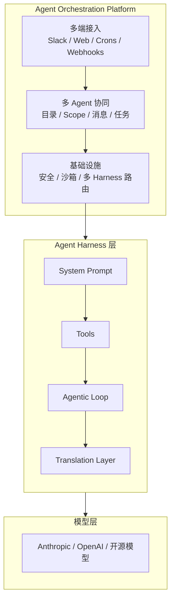
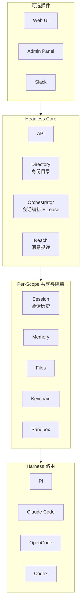

# Agent Orchestration Platform

## 摘要

企业级多人 Agent 编排平台（Agent Orchestration Platform）运行在单一 Agent Harness 之上。它的核心不是提供 Agent 的运行循环，而是解决**多 Agent 与人的协同**问题：多个 Agent 和人如何在同一个工作空间里分工、通信、共享上下文、协调任务。

## 与 Agent Harness 的边界

| 层 | 职责 | 代表 |
| --- | --- | --- |
| **Agent Harness** | 单个 Agent 的运行循环：system prompt、tools、agentic loop、translation layer | Pi、Claude Code、OpenCode、Codex |
| **编排平台** | 多 Agent、多用户的协同：身份目录、上下文共享、消息投递、任务委派、并发控制 | QM、Raft、Orca |

关系：编排平台通过路由层调用具体的 Harness，Harness 负责单 Agent 的实际执行。

## 架构分层

## 核心：多 Agent 协同机制

### 1. 统一身份目录

人和 Agent 在同一个 Directory 里，都是 `Principal`。Agent 有名字、头像、身份，可以被 @、被发消息、被加入频道。

- `DirectoryMember`：成员（人或 Agent）
- `DirectoryChannel`：频道（多人/多 Agent 共享）
- `Group`：群组 DM

这让 Agent 看起来像团队成员，而不是后台服务。

### 2. Scope 级上下文共享

每个频道、群组、个人都是一个 Scope。同一个 Scope 里的人和 Agent **共享**：

- **会话历史**：所有消息和事件都记录在同一个 Session 里，Agent 可以看到之前的对话
- **Memory**：Scope 级的长期记忆，所有成员可读写
- **Files**：共享的文件空间
- **Keychain**：共享的凭据

Scope 之间互相隔离，但 Scope 内部是共享的——这是多 Agent 协同的基础。

### 3. 消息投递

Agent 可以主动给人或其他 Agent 发消息：

- 给特定成员发 DM（`principalDestination`）
- 往频道里发消息
- 群组 DM（最多 8 人）

投递前会检查成员身份和权限，确保 Agent 只能往自己有权限的地方发消息。

### 4. 会话并发控制

多个 Agent 可能同时往同一个 Scope 发消息。平台用 **Lease 机制**保证一致性：

- 同一时间只有一个 turn 可以写入 Session
- Lease 持有者可以是 turn、compaction、fork、backfill
- 其他写入请求会等待或失败

这避免了多个 Agent 同时修改同一会话导致的冲突。

### 5. 任务委派

Agent 可以创建任务并分配给其他 Agent 或人。任务有状态、负责人、截止时间，可以在频道里跟踪进度。

## 基础设施

这些是支撑多 Agent 协同的底层能力，不是核心但必不可少：

- **安全与权限**：Security Posture（Strict/Auto/Dangerous）、Command Policy（审批规则和硬拒绝）、Audit
- **沙箱执行**：每个 Scope 的代码在独立沙箱中运行（Docker、Fly、AWS MicroVM）
- **多 Harness 路由**：同一平台可驱动 Pi、Claude Code、OpenCode、Codex 等

## 代表产品

### QM（YC）

YC 开源的多人 Agent 编排平台。

QM 内部架构：

QM 的协同设计：
- 人和 Agent 在同一个 Slack 频道里，可以互相 @
- 每个频道是一个 Scope，共享会话历史、memory、files
- Agent 可以主动发消息、创建任务
- Lease 机制保证多 Agent 并发写入的一致性

### Raft

Botiverse 的多 Agent 协作平台。核心是托管的协作控制面（频道、DM、线程、任务、身份），Agent 运行在连接的本地 Computer 或外部 runtime 上。

### Orca

MIT 开源的 local-first Agent 开发环境。围绕代码仓库、Git worktree、终端、diff 审查组织多个 coding agent。

## 相关页面

- [[Agent Harness]]
- [[Agent]]
- [[Code Agent]]
- [[wiki/comparisons/product/Raft vs Orca：多 Agent 协作与本地执行|Raft vs Orca]]

## 来源指针

- `raw/sources/2026-08-26-yc-qm-agent-harness.md`
- `raw/sources/2026-08-26-qm.md`
- https://qm.ycombinator.com/
- https://github.com/yc-software/qm
