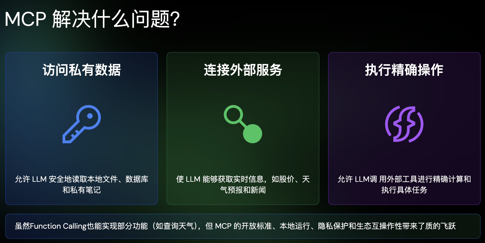

# MCP

## 摘要

MCP 是连接 LLM 应用与外部数据、工具和工作流的开放协议。它的主要价值不是独占某种工具调用能力，而是统一 host、client 与 server 之间的发现、调用、授权和扩展边界。

- https://github.com/ComposioHQ/composio
- 介绍 MCP 的 slide： https://talks.ayaka.io/nekoayaka/2025-04-13-what-is-mcp-and-how-it-helps/#/1
- 
	- 感觉这个私有性也不是很说的通，毕竟 FC 应该也能实现吧（也写死用 stdio 来通信就行了应该），我感觉最大的价值还是有了一个标准的协议
- 好用的 MCP 收集：
	- https://github.com/wrale/mcp-server-tree-sitter
- https://mp.weixin.qq.com/s?__biz=MzI1MzYzMjE0MQ==&mid=2247516461&idx=1&sn=ce4917a4ab56c2c136290e20c5ba79f5&poc_token=HEU_vWijo0oCrhmjt2qVAlM4teQ4khEUbS98qphk
	- [[OAuth]] 授权下带来的风险：
		- **恶意客户端通过授权码拦截窃取用户令牌**：由于任何应用都能动态注册为合法客户端，攻击者可以构建一个功能与正常应用类似的恶意 MCP 客户端，并通过各种渠道（如钓鱼邮件、非官方应用市场）诱导用户下载安装。
		- **恶意服务端利用“Confused Deputy”问题窃取令牌**：即便 MCP 客户端本身是可信的，如果用户在客户端中添加了一个恶意的 MCP 服务端地址，风险同样存在。这在安全领域被称为**“Confused Deputy Problem”**。
			- 可能是因为 MCP Client 是三方的，所以带来了可以授权任意页面，但是我们正常的一方页面就不会有这个问题，我们发起的授权应用都是可控的，不然感觉现在一方的也会有问题？
		- 解决方案：
			- **授权前二次确认**作为第一道防线，主动防范钓鱼攻击。
			- **令牌身份隔离**作为核心举措，极大限制了风险半径，防止危害横向扩散。
			- **API 级别权限管控**遵循最小权限原则，为潜在的未知风险提供了最终的安全保障。
- 作为实现侧补充，2025-03-29 的提醒了一个很实用的点：MCP client 不一定非要依赖模型原生 function calling；只要模型能稳定产出可解析的结构化协议，client 仍然可以把 tool 调用链跑起来。
- 这也说明 MCP 的关键不仅是 server 端的工具暴露，还包括 client 端如何把模型输出安全地翻译成执行动作。见 [[MCP Client]]。

## 2026-07-28：无状态核心

第五版规范把 MCP 从依赖协议会话和双向长连接的模型，改为无状态、请求自描述的 request/response 核心：

- 移除 `initialize` / `initialized` 握手和 `Mcp-Session-Id`；每个请求自行携带协议版本、客户端身份和能力。需要预先发现服务端能力时，可选调用 `server/discover`。
- `Mcp-Method` 和 `Mcp-Name` HTTP header 让网关、WAF、限流与鉴权系统可以直接按方法和工具名路由，不必解析 JSON body。
- Multi Round-Trip Requests（MRTR）用 `input_required` 和重试原调用的方式承载中途确认、补参数、elicitation 等交互，不再要求服务端保持双向流。
- `tools/list`、`prompts/list`、`resources/list` 和 `resources/read` 增加缓存提示与确定性顺序，降低重复发现成本，并减少工具目录变化对上游 Prompt Cache 的扰动。
- Tasks、MCP Apps、Skills over MCP 等能力进入显式协商、独立版本化的扩展框架。长任务不再挤进核心协议。
- OAuth / OIDC 授权加强 issuer 校验和凭据签发方绑定；Dynamic Client Registration 开始弃用，迁移方向是 Client ID Metadata Documents。

这次变化的工程意义是让远程 MCP 成为普通 HTTP 基础设施的一等工作负载：请求可落到任意实例，容易部署到 serverless / edge，也更容易接入现有的网关、缓存、观测和企业身份系统。

协议无状态不等于应用不能保存状态。需要跨调用延续的业务状态，应由工具显式签发 handle，再让模型在后续调用参数中带回。这样状态归属对模型、日志和调用链可见，不再隐藏在 transport session 里。

## 迁移边界

- 依赖 `Mcp-Session-Id` 或进程内 session 的服务需要显式迁移状态。
- Roots、Sampling、Logging 和旧 HTTP + SSE transport 已进入弃用期，至少保留 12 个月兼容窗口；新实现不应继续采用。
- 2026-07-28 是破坏性升级。现有部署不必立刻重写，但新 server 应优先使用新版 SDK 和无状态模型。
- [[MCP SSE 多实例路由策略]] 仍记录旧协议下真实存在的部署问题，但其中的 session 路由方案已从“当前推荐架构”变成迁移背景。

## Source Pointers

- `raw/sources/MCP.md`
- https://github.com/ComposioHQ/composio
- https://talks.ayaka.io/nekoayaka/2025-04-13-what-is-mcp-and-how-it-helps/#/1
- https://mp.weixin.qq.com/s?__biz=MzI1MzYzMjE0MQ==&mid=2247516461&idx=1&sn=ce4917a4ab56c2c136290e20c5ba79f5&poc_token=HEU_vWijo0oCrhmjt2qVAlM4teQ4khEUbS98qphk
- <https://modelcontextprotocol.io/specification/2026-07-28>
- <https://blog.modelcontextprotocol.io/posts/2026-07-28/>
- <https://claude.com/blog/bringing-mcp-2026-07-28-to-claude>
