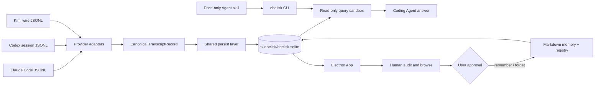
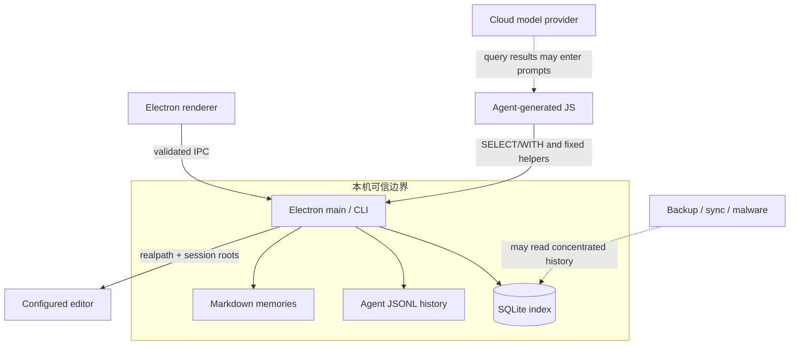
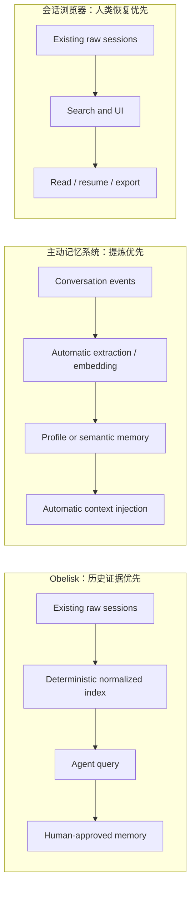

# Obelisk

## 摘要

Obelisk 是一个面向 coding agent 历史的 local-first 证据与显式记忆层。它读取 Claude Code、Codex 和 Kimi Code 已保存在本机的会话文件，将消息、工具调用、子 Agent、workflow、文件引用和 token usage 统一投影到 SQLite；Agent 通过受限 JavaScript 查询历史，人则通过 Electron App 浏览和审计同一份索引。它不是通用聊天记忆，也不是自动把所有历史总结成画像的系统。

截至 2026-08-02，项目处于 v0.2.1、单维护者的早期阶段。架构与测试质量值得进入技术雷达，但中文检索、检索效率和敏感历史集中存储仍限制正式采用。当前定位应为 **Trial，而不是 Adopt**。

## 系统架构



关键分层：

- provider 负责解释不同 Agent 的原始协议，并产出统一 `TranscriptRecord`；共享层不靠 provider 分支恢复语义。
- SQLite 是查询投影和索引，不替代原始 JSONL；Markdown memory 保存从证据中提炼、经用户批准的结论。
- CLI 运行时与 Agent skill 分离。skill 是说明文档，实际读写委托给本地 `obelisk` 命令。
- CLI 与 App 共用数据库；writer heartbeat、SQLite lease 和事务策略协调单写者。

## 核心数据流与记忆生命周期

```mermaid
sequenceDiagram
  participant S as Local session files
  participant I as Indexer
  participant D as SQLite evidence index
  participant A as Agent
  participant H as Human
  participant M as Markdown memory

  S->>I: new or changed transcript
  I->>I: provider parse and normalize
  I->>D: atomic incremental persist
  A->>D: search / context / sql / fileHistory
  D-->>A: evidence rows and provenance
  A-->>H: answer plus proposed conclusion
  H->>A: approve durable memory
  A->>M: create or update Markdown
  A->>D: attune remember metadata
  Note over D,M: raw evidence remains authoritative; memory is a synthesis cache
```

这条链路的成熟之处在于没有把“查到历史”和“写入长期记忆”合并成一个隐式动作。显式批准降低了错误总结自动固化的风险，但并不能保证记忆结论本身正确。

## 查询与信任边界



已经体现出的控制：

- query sandbox 只接受 `SELECT` / `WITH`，记忆修改使用独立 attune API。
- Electron 打开本地文件时，由主进程基于 session roots、`realpath` 和 symlink 结果校验路径。
- SQLite 写入使用单写者 lease、`BEGIN IMMEDIATE`、有限重试和 WAL 协调；读取连接保持只读。
- 发布的 CLI 保留可读、未压缩的编译 JavaScript，便于审计。

仍需自行承担的边界：

- 会话里可能含源码、终端输出、路径、凭据误打印和工具结果；集中索引放大了单文件泄露的影响。
- local-first 不等于加密。当前未见字段级加密、敏感信息脱敏或项目级访问控制。
- 查询结果交给云模型时，相关历史片段仍可能离开本机。
- 官方推荐让 Agent 获取远程 bootstrap `SKILL.md` 后安装；更稳妥的做法是固定 release 或 commit 并先审阅脚本。

## 与相邻路线的架构差异



| 路线 | 一等对象 | 优势 | 主要代价 |
| --- | --- | --- | --- |
| Obelisk | 多 Provider 原始会话与可追溯查询 | Agent 可编程查询，结论可回到证据，记忆写入显式 | 查询依赖 Agent 编排；跨语言与语义召回有限 |
| claude-history / agent-sessions | 人类浏览、搜索、恢复会话 | 使用直接，Provider 覆盖可更广 | 通常不把结构化历史查询和长期记忆作为核心 |
| Letta Code / OpenMemory | 长期 Agent 的主动语义记忆 | 同义召回和自动上下文注入更强 | 自动提炼更可能产生漂移，治理与云端边界更复杂 |
| Claude Code 原生 session | 单产品的恢复与导出 | 无额外基础设施 | 跨项目、跨客户端和跨 Provider 统一检索有限 |

## 工程质量判断

对源码快照 `71a80114` 的本地验证结果：

- 295/295 tests passed；TypeScript typecheck passed。
- ESLint 0 errors、4 warnings。
- 测试覆盖 provider normalization、增量索引、Codex 子线程、Kimi undo/clear、FTS、事务回滚、跨进程 writer lease、Electron IPC 和长时间线虚拟化。
- ADR 明确记录运行时 contract、可审计构建、Electron 进程边界和 SQLite 并发策略。

这些证据说明工程实现不是演示壳子，但不能抵消采用规模小、维护者单一和版本早期的问题。根工作区 `npm audit` 还报告了一个可修复的 high severity 间接依赖问题；它不是已证实的远程利用链，但发布前应清理。

## 扩展面

- **Provider adapter**：注册新的 transcript source，并映射到 canonical record；目前内置 Claude、Codex、Kimi。
- **Query helper**：在稳定 contract 下增加结构化查询，但要同步 API reference 和 contract tests。
- **Human surface**：Electron App 可扩展 session、memory、activity、recap 等视图。
- **Memory files**：结论保存在 Markdown，通过 `remember` / `forget` 注册或软删除。

扩展限制：provider registry 已经存在，但可插拔的第三方 provider package 仍是公开 feature request；目前新增 Provider 仍需要修改主仓库并补 conformance tests。

## 当前张力、风险与未决问题

1. **证据完整性 vs 检索质量**：保留完整历史便于审计，但关键词 FTS 对同义表达和模糊记忆不稳。
2. **local-first vs 敏感数据集中化**：数据不上传是优势，单一 SQLite 又成为高价值泄露目标。
3. **统一 schema vs Provider 语义损失**：canonical record 降低共享层复杂度，也可能丢失新 Provider 的独有概念。
4. **Agent 可编程查询 vs token 成本**：动态 JS 查询灵活，但首次召回已有预算浪费问题。
5. **英文设计 vs 中文工作流**：默认 FTS5 `unicode61` 对 CJK 不友好，memory query 和 summary 还被要求使用英文。中文采用前必须先解决 tokenizer 或查询翻译层。
6. **单作者速度 vs 维护连续性**：早期提交密度高、测试认真，但 bus factor 为 1。
7. **AGPL 主仓库 vs 再分发模式**：个人本地试用边界较清楚；修改后作为网络服务或嵌入闭源产品，需要单独评估许可证义务。

可能随版本快速变化的事项：CJK tokenizer、provider 插件机制、桌面跨平台发行、检索排序、依赖漏洞和外部采用规模。

## 采用建议

当前建议 **Trial**：

1. 固定 `v0.2.1` 或具体 commit，不跟随 `main` 执行远程安装脚本。
2. 先只装 CLI，用 20–50 个非敏感会话做 7 天隔离试验。
3. 用真实问题测精确关键词、中文描述、文件历史、失败工具调用和跨 session 决策。
4. 备份并限制 `~/.obelisk` 权限，确认备份与同步软件不会扩大暴露面。
5. 将其作为现有文件记忆和 wiki 的证据检索补充，不替代长期知识治理。
6. 中文命中率达不到验收线时，等待 CJK 修复，不自行长期维护 fork。

## 证据矩阵

| 结论 | 证据来源 | 证据位置 | 置信度或限制 |
| --- | --- | --- | --- |
| 三种 coding agent 共享同一 SQLite schema | 仓库文档与源码 | `README.md`、`packages/core/src/providers/`、`schema.sql` | 高；源码直接验证 |
| Provider 语义在 adapter 层归一化 | 源码与 ADR | `providers/types.ts`、ADR 0001/0007 | 高 |
| query 与 attune 权限分离 | 源码与测试 | `query.ts`、query/runtime contract tests | 高；只覆盖应用设计，不代表宿主机绝对安全 |
| SQLite 并发边界经过系统设计 | 源码、ADR 与测试 | `writer-lease.ts`、`tx.ts`、ADR 0006 | 高；本地测试通过 |
| 完整测试基线通过 | 本地复现 | 295 tests、typecheck、lint | 高；基于 2026-08-02 快照，不代表所有平台 |
| 中文检索当前不适合直接采用 | schema、源码、公开 Issue | `unicode61` FTS、英文 memory guard、Issue #9 | 高 |
| 语义召回弱于 embedding-first 系统 | 查询实现对比 | `query.ts` 与 Letta/OpenMemory 产品资料 | 中高；未做统一数据集 benchmark |
| 当前应 Trial 而非 Adopt | 工程验证、版本与社区数据综合判断 | v0.2.1、单 contributor、公开 issues | 中；采用等级属于判断，会随项目演进变化 |

## 相关页面

- [[可审计的本地 Agent 记忆架构]]
- [[Agent 主动上下文管理]]
- [[Agent Harness 演进范式]]
- [[Code Agent]]

## 来源指针

- [[raw/sources/2026-08-02-obelisk-project-research|Obelisk 项目调研快照（2026-08-02）]]
- <https://github.com/tommy0103/obelisk>
- <https://github.com/tommy0103/obelisk/issues/9>
- <https://github.com/tommy0103/obelisk/issues/16>
- <https://github.com/tommy0103/obelisk/issues/22>
- <https://code.claude.com/docs/en/sessions>
- <https://github.com/raine/claude-history>
- <https://github.com/jazzyalex/agent-sessions>
- <https://github.com/letta-ai/letta-code>
- <https://mem0.ai/openmemory>
