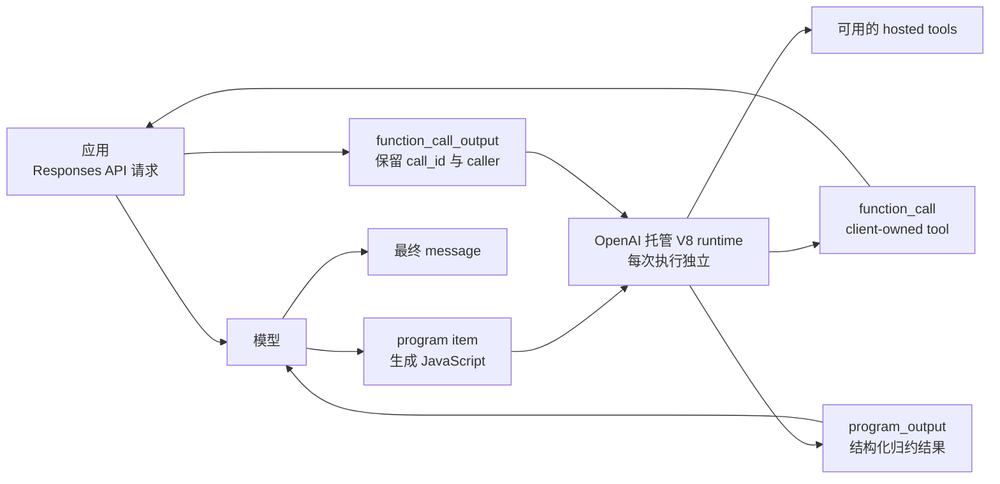
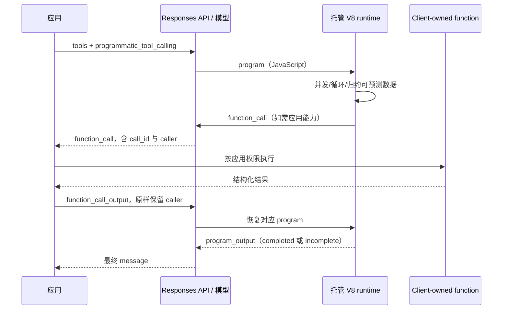
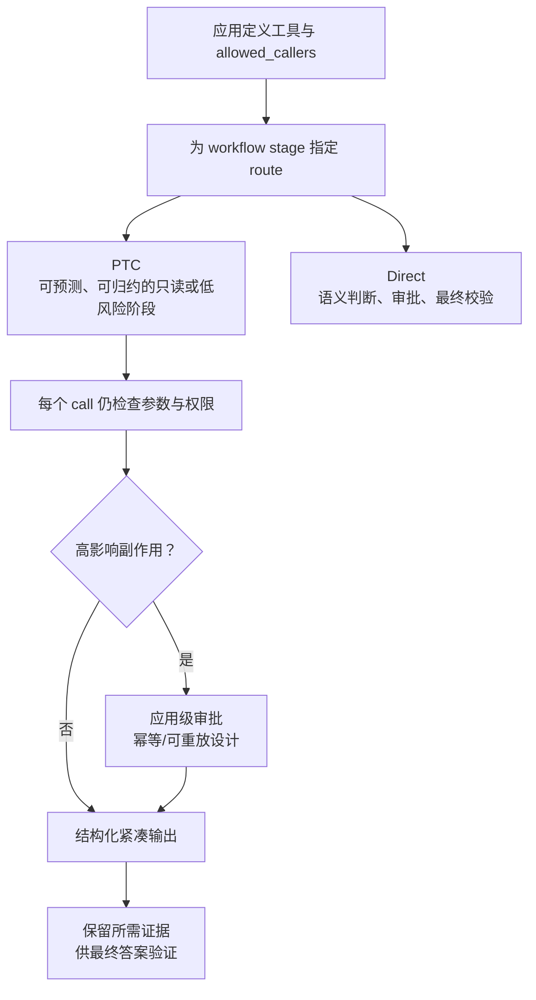

# OpenAI Programmatic Tool Calling

## 摘要

Programmatic Tool Calling（PTC）是 Responses API 的 hosted tool：模型可以生成并运行 JavaScript，在一个受限的托管运行时中并发、循环、分支和归约多个工具调用，然后只把更小的结构化结果带回模型上下文。它适合**控制流可预测、工具输出可程序化处理**的阶段；语义判断、审批、高影响写入、最终引用或原生工件校验，默认仍应走直接工具调用。

本页依据 OpenAI 官方文档于 2026-07-11 的内容；模型可用性、支持工具与保留策略均可能变化，应在启用前复核对应模型和工具文档。

## 这是什么

PTC 不让应用执行模型生成的 JavaScript。模型生成的程序在 OpenAI 托管的隔离 V8 runtime 中运行；程序只能通过本次请求显式启用且允许 programmatic 调用的工具与外部系统交互。若程序调用的是 client-owned function，应用仍要执行该函数，再把结果作为 `function_call_output` 返回，服务据此恢复正确的 program。

它解决的是“模型不必逐个阅读大量中间结果”的问题。例如对多个库存/需求来源做并发查询、字段校验、去重和差额计算，程序可只输出最终所需的 JSON。它不是通用 agent runtime，也不是把任意副作用放进自动循环的授权。

## 系统架构

运行时支持 JavaScript 和 top-level `await`，但不是 Node.js：没有包安装、直接网络、通用文件系统、子进程、console 或跨 program 的持久 JavaScript 状态。程序输出使用 `text(...)` 或 `image(...)`；外部能力来自请求中启用的工具，而不是运行时本身。

## 何时使用

| 任务形状 | 推荐 |
| --- | --- |
| 一次查询或一次动作 | 直接工具调用 |
| 可由代码过滤、join、排序、去重、聚合或校验的大量结果 | PTC，返回更小的结构化结果 |
| 后续参数可从前一步结果确定、失败边界明确的依赖调用 | PTC |
| 每个结果都需模型重新做语义判断的自适应搜索 | 直接工具调用 |
| 写入或审批敏感动作 | 默认直接调用，保留清晰授权边界 |
| 最终引用或原生工件校验 | 默认直接调用，除非 program 保留原始输出并验证所有必需项 |

选择 PTC 的首要条件不是“工具多”，而是该阶段能定义输入、停止条件、重试上限、失败形态和最终结果 schema。不能定义这些边界时，节省 context 的收益通常不值得交换可解释性。

## 执行链路

Response 仍是标准 Responses API object，而不是新的 response envelope。其 `output` 可出现：

- `program`：生成的 JavaScript、`call_id` 与可恢复/回放的 opaque `fingerprint`；
- `function_call`：由 program 发起的 client-owned call，`caller.caller_id` 指回 program；
- `program_output`：program 结果与 `completed` / `incomplete` 状态。

应用应持续处理到最终 `message`。使用 `previous_response_id` 的已存储响应可以继续；`store: false` 时必须按顺序回放完整 output，包括 program、reasoning、function call/output 和 program output。对无状态 reasoning 请求，还要保留并回放 `reasoning.encrypted_content`。

## 配置与工具契约

在请求 tools 中加入 `{ type: "programmatic_tool_calling" }`，并在每个可被程序调用的工具上设置 `allowed_callers`：

| `allowed_callers` | 含义 |
| --- | --- |
| 缺省或 `["direct"]` | 模型只能直接调用 |
| `["programmatic"]` | 只能由 `program` item 调用 |
| `["direct", "programmatic"]` | 两条路径都可用 |

当前文档列出的可 programmatic 调用类型为 `function`、`custom`、`mcp`、`apply_patch`、local/hosted `shell` 和 `code_interpreter`。MCP tool 的 `require_approval` 可以暂停 program 等待批准。若 function 回传的是可预测结构化数据，应同时定义输入 `parameters` 和返回 `output_schema`；如果返回形态不确定，更适合保持 direct，让模型检查原始结果。

Tool search 是顶层 Responses API tool，不能由正在执行的 program 调用。设置 `defer_loading: true` 的 function/custom/MCP 必须先被模型加载，后续 program 才能通过 `tools.*` 使用它。

## Trust model

PTC 的 hosted runtime 是隔离层，不是业务授权层。即使请求允许 programmatic 调用，应用仍须逐次校验参数与权限；高影响动作仍应要求应用级审批。工具尽量设计为幂等，避免 retry 或 replay 重复产生不安全副作用。对 OpenAI-hosted tools，还要在启用前审阅各工具的数据保留与安全说明。

文档指出 PTC 可用于满足 ZDR workflow，但 ZDR 必须由组织或项目启用；单独设置 `store: false` 只提供无状态 continuation，不会开启 ZDR。实际 eligibility 与 retention 取决于完整请求中的模型、工具及第三方服务。

## 设计与评估原则

1. 把 PTC 限定为一个清楚的 workflow stage，显式列出可用工具、输出字段、停止条件、错误形态与有限重试；不要只写“高效使用 PTC”。
2. 让工具返回紧凑、结构化、带 `output_schema` 的数据，并定义 program result 所需证据；不确定输出保持 direct。
3. 在 direct 与 programmatic 并存时只定义一次 handoff，避免在两条路径间来回切换、重复调用或丢失出处。
4. 先以 direct tool calling 为 baseline，再用代表性任务对比；“少进 context”并非自动等于更正确或更便宜。
5. 评估至少覆盖最终答案正确性/完整性/证据覆盖、输入与总 token、端到端延迟和成本、模型 turn/工具调用/重试恢复、安全结果及实际 route 是否符合预期 stage。

## 证据矩阵

| 结论 | 官方来源位置 | 置信度 / 限制 |
| --- | --- | --- |
| PTC 让模型写并运行 JavaScript 协调工具，并可并发、循环和在 runtime 保存中间结果 | “Programmatic Tool Calling” 开头 | 高；以当前指南为准 |
| runtime 是每次 program 独立的隔离 V8，且不提供 Node、直接网络、通用文件系统和子进程 | “Understand the runtime environment” | 高；不是对任何其他 OpenAI runtime 的结论 |
| 应用仍执行 client-owned function，必须以原 caller 返回结果才能恢复 program | “Understand program response items” 与 “Continue after client-owned function calls” | 高；适用于该指南描述的 Responses API loop |
| `allowed_callers` 控制 direct/programmatic 路由，且有六类支持工具 | “Configure…” 与 “Supported tools” | 高；支持矩阵可能随版本改变 |
| 写入/审批敏感动作和最终验证默认走 direct | “Choose when to use…” | 高；这是官方默认建议，不等于绝对禁止 PTC |
| 评估需同时考察质量、效率、恢复和安全 | “Evaluate Programmatic Tool Calling” | 高；指标仍应按业务风险扩展 |

## 当前张力 / 风险 / 未决问题

- **context 效率与可审计性**：program 归约中间结果可减少模型上下文，但会隐藏原始细节；引用、证据或原生工件需要额外保留与验证机制。
- **自动编排与授权**：predictable control flow 不等于低风险操作。把写入、付款、权限或外部状态更改交给 program 会模糊审批点；应在应用层保留显式确认。
- **schema 质量决定可靠性**：过宽或未定义的 output 迫使模型解析文本，削弱 PTC 的优势；错误形态和重试语义不清会导致重复调用或不可解释的 incomplete 状态。
- **存储与回放复杂度**：无状态 continuation 需要完整保留 output/reasoning 序列；丢失任一关键 item 会破坏恢复。存储、ZDR 与第三方工具的数据治理必须分别确认。
- **模型与工具支持会变动**：本页没有替代 model page、各 hosted tool 的 retention/security 文档或 API reference；上线配置前必须复核它们。

## 相关页面

- [[Agent]]
- [[MCP]]
- [[LLM 结构化输出的可靠性边界]]
- [[Coding Agent Shell 与 Git 权限边界]]

## 来源指针

- [OpenAI：Programmatic Tool Calling](https://developers.openai.com/api/docs/guides/tools-programmatic-tool-calling)
