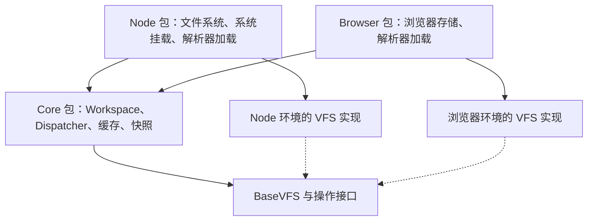
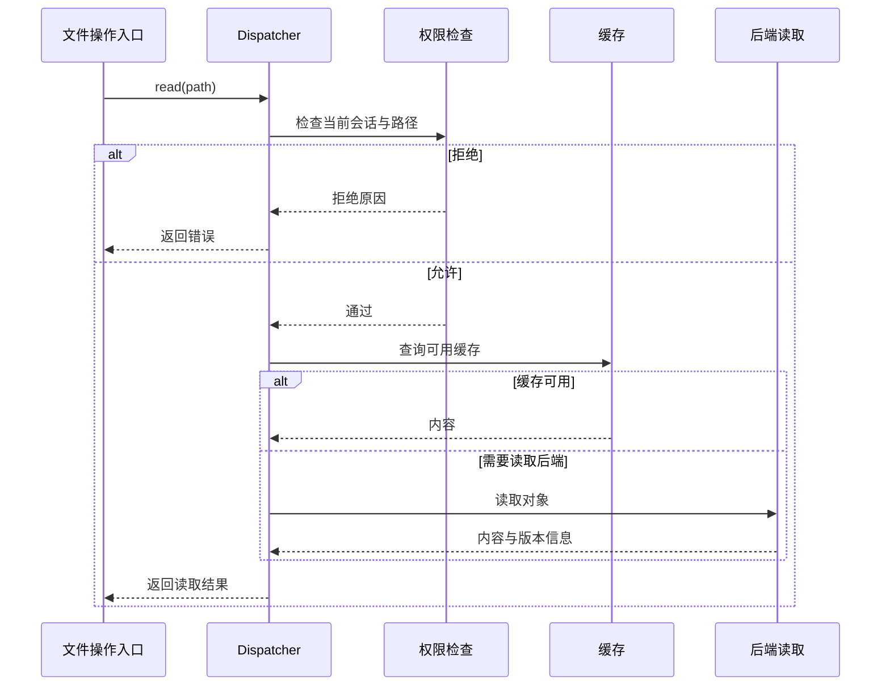
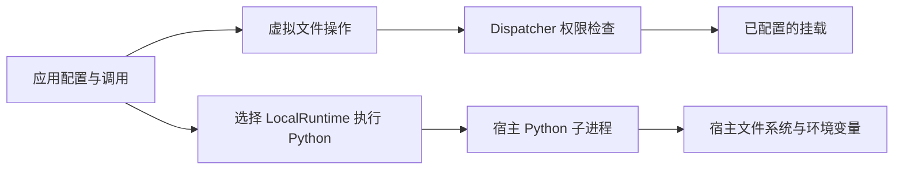

# Mirage：用文件路径访问不同服务

## 它是什么

Mirage 把 S3、Slack、GitHub 等服务里的数据表示成目录和文件。开发者先配置服务连接、凭据和路径，agent 再通过 `ls`、`cat`、`grep` 等命令列目录、读内容或搜索，不必为每个服务使用一套不同的工具。官方称它为统一虚拟文件系统（VFS）；这里的“虚拟”指路径背后可以是远端接口，而不一定是磁盘文件。[Introduction](https://docs.mirage.strukto.ai/home/introduction)

例如，把 S3 接到 `/s3` 后，`ls /s3/reports/` 可以列出报告；把 Slack 接到 `/slack` 后，agent 可以搜索频道消息。接入服务并授权仍由开发者完成，Mirage 统一的是 agent 使用这些服务的方式。[Introduction](https://docs.mirage.strukto.ai/home/introduction)

## 一条命令如何读到远端数据

以 `cat /s3/reports/daily.txt` 为例，按官方架构可分为四步：

1. Mirage 解析命令，确定要读取的路径。
2. 工作区找到负责 `/s3` 的服务连接，并检查访问权限。
3. 如果缓存可用，直接返回缓存；否则调用 S3 读取对象。
4. 读取结果成为命令输出，后续可以通过管道继续处理。

这里的“挂载”就是把一个服务接到指定路径。工作区负责管理这些路径，具体的 VFS 实现负责与服务通信。官方还提供 Python、TypeScript SDK 和 CLI，供应用或 agent 接入。[Architecture](https://docs.mirage.strukto.ai/home/architecture)、[Introduction](https://docs.mirage.strukto.ai/home/introduction)

## 可以怎样使用

官方介绍页用一个反馈处理任务说明它的用途：agent 从 Slack 读取用户反馈和附件，到 GitHub 查找相关代码，再通过已注册的 Linear 命令创建 issue。文件读取和业务操作可以出现在同一套 shell 工具里；创建 issue 仍是 Linear 的业务命令，不是把任意文本写进目录就能自动完成。[官方示例](https://docs.mirage.strukto.ai/home/introduction#a-real-world-example)

本页判断：当任务经常需要跨服务查资料时，这种统一访问方式值得了解；是否能简化实际项目，要看所需服务、操作和权限是否已被支持。本次除官方文档外，还静态阅读了 Python、TypeScript 的相关实现与测试，代码固定在提交 `95a3a1f`。下文四项机制已在两种实现中逐项核对，但未运行 Mirage 示例或测试，也未验证全部功能一致。

## 使用前需要知道的限制

- **命令看起来像 Bash，但并非完整 Bash。** `ws.shell()` 由 Mirage 的解析器和执行器处理，不是直接调用本机 `/bin/bash`。官方架构页还列出与本地命令的差异，例如文件大小未知时，`find -empty` 不会为了判断是否为空而把文件读一遍。[Introduction](https://docs.mirage.strukto.ai/home/introduction)、[Architecture](https://docs.mirage.strukto.ai/home/architecture)
- **能访问哪些数据、能否写入，要分别配置。** 写操作受挂载模式和会话授权约束，服务支持写入并不代表当前会话有写入权限；设为只读的挂载会拒绝写操作。[Architecture](https://docs.mirage.strukto.ai/home/architecture)
- **能访问哪里，还取决于所选的执行环境。** 内置 shell 通过挂载访问数据，但 `LocalRuntime` 会启动本机 Python 子进程，使用宿主机的文件系统和环境变量；它并不受虚拟文件路径范围限制。执行不可信代码时仍需要独立沙箱。[LocalRuntime 源码](https://github.com/strukto-ai/mirage/blob/95a3a1f447b9f48bc8249069241e0a0fc9a6b723/python/mirage/runtime/python/local/runtime.py#L31-L109)
- **快照不能恢复所有远端数据。** 它保存工作区配置、会话、历史及读过路径的缓存等内容，不保存未访问的文件。快照页的支持情况表明确区分各服务：S3 在有版本号时可以读取记录的版本，GitHub 支持内容变更检测但尚未接入 commit 固定，Google Drive 当前仍读实时内容。恢复工作区不等于回滚外部服务。[Snapshot & Replay](https://docs.mirage.strukto.ai/home/snapshot)
- **远端请求仍有延迟和成本。** 缓存可以减少重复访问，但从服务获取新内容仍需调用其接口；统一路径本身不会消除这些请求。[Introduction](https://docs.mirage.strukto.ai/home/introduction)

## TypeScript 版如何组织

TypeScript 版在 `@struktoai/mirage-core` 中直接实现工作区、分发、缓存和快照逻辑，上述四项机制并不需要调用 Python 才能完成。`@struktoai/mirage-node` 与 `@struktoai/mirage-browser` 各自扩展 core 的 `Workspace`，装配所在环境需要的解析器和服务实现。[core 工作区](https://github.com/strukto-ai/mirage/blob/95a3a1f447b9f48bc8249069241e0a0fc9a6b723/typescript/packages/core/src/workspace/workspace/workspace.ts#L418-L479)、[Node 入口](https://github.com/strukto-ai/mirage/blob/95a3a1f447b9f48bc8249069241e0a0fc9a6b723/typescript/packages/node/src/workspace.ts#L16-L88)、[浏览器入口](https://github.com/strukto-ai/mirage/blob/95a3a1f447b9f48bc8249069241e0a0fc9a6b723/typescript/packages/browser/src/workspace.ts#L16-L70)

需要区分“使用 TypeScript SDK”和“执行 Python 代码”：Node 包里的 `LocalRuntime` 是一个可选执行环境，它仍会启动本机 Python，默认从 PATH 找 `python3`；此前阅读的 Python 版默认使用运行 Mirage 自身的解释器。选择 TS SDK 本身并不意味着会启动 Python。[TS LocalRuntime](https://github.com/strukto-ai/mirage/blob/95a3a1f447b9f48bc8249069241e0a0fc9a6b723/typescript/packages/node/src/runtime/python/local/runtime.ts#L16-L91)

## 源码里值得学习的做法

以下以 Python 符号解释机制，并附上 TypeScript 中对应的实现。每项都区分“代码怎么做”和“可以借鉴什么”，对应测试仅作设计证据，不代表本次已经运行通过。

### 1. 从缓存返回数据之前，也要检查权限

`Dispatcher._dispatch()` 先调用 `OpBoundary.admit()`，再初始化后端、查缓存或读取数据。因此，即使某个文件已经在缓存里，当前会话没有读取权限时也不能直接拿到它。只读挂载的写入拒绝同样发生在后端初始化之前。[分发顺序](https://github.com/strukto-ai/mirage/blob/95a3a1f447b9f48bc8249069241e0a0fc9a6b723/python/mirage/workspace/dispatcher/dispatcher.py#L576-L635)、[权限检查入口](https://github.com/strukto-ai/mirage/blob/95a3a1f447b9f48bc8249069241e0a0fc9a6b723/python/mirage/ops/boundary.py#L45-L69)

测试刻意把缓存设成已有内容，再拒绝该路径的读取，并断言缓存查询根本没有发生；另一项测试确认只读写入被拒绝时，后端没有初始化。[缓存权限测试](https://github.com/strukto-ai/mirage/blob/95a3a1f447b9f48bc8249069241e0a0fc9a6b723/python/tests/workspace/dispatcher/test_dispatcher.py#L115-L126)、[只读写入测试](https://github.com/strukto-ai/mirage/blob/95a3a1f447b9f48bc8249069241e0a0fc9a6b723/python/tests/workspace/dispatcher/test_dispatcher.py#L514-L526)

TypeScript 的 `Dispatcher` 同样先执行 `boundary.admit()` 再查缓存；测试对比有缓存、无缓存时受限会话的结果。[TS 分发器](https://github.com/strukto-ai/mirage/blob/95a3a1f447b9f48bc8249069241e0a0fc9a6b723/typescript/packages/core/src/workspace/dispatcher/dispatcher.ts#L458-L584)、[TS 权限测试](https://github.com/strukto-ai/mirage/blob/95a3a1f447b9f48bc8249069241e0a0fc9a6b723/typescript/packages/core/src/workspace/state_doors.test.ts#L2557-L2590)

**可以借鉴**：缓存只负责减少读取成本，不能代替授权。给 agent 工具或带权限的资料库加缓存时，应保证从缓存和从原始服务取数据都受当前权限约束。

### 2. 删除缓存还不够，要阻止旧请求把它重新填回去

假设读取 A 尚未返回，写入 B 已经更新了文件并清除缓存；随后 A 返回旧内容。如果 A 直接把结果存入缓存，后面的读取又会拿到旧数据。

Mirage 的 `CacheManager` 用一个递增计数处理这类顺序问题：开始读取时记下 `_read_generation`，缓存失效时把这个数加一；读取完成后，只有计数未变、路径仍属于原来的挂载，才在锁内存入结果。[读取与回填](https://github.com/strukto-ai/mirage/blob/95a3a1f447b9f48bc8249069241e0a0fc9a6b723/python/mirage/cache/manager.py#L562-L619)、[更新计数](https://github.com/strukto-ai/mirage/blob/95a3a1f447b9f48bc8249069241e0a0fc9a6b723/python/mirage/cache/manager.py#L198-L207)

TypeScript 的 `CacheManager.fill()` 也比较 `readGeneration`，并在 `withCacheMutation()` 中决定是否存入结果；测试同样允许本次读取返回旧值，但要求不留下缓存。[TS 实现](https://github.com/strukto-ai/mirage/blob/95a3a1f447b9f48bc8249069241e0a0fc9a6b723/typescript/packages/core/src/cache/manager.ts#L455-L495)、[TS 测试](https://github.com/strukto-ai/mirage/blob/95a3a1f447b9f48bc8249069241e0a0fc9a6b723/typescript/packages/core/src/cache/read_through.test.ts#L177-L186)

**可以借鉴**：处理异步读取时，不仅要清除已有缓存，还要处理尚未返回的请求。这里防止的是旧结果重新进入缓存，**不是保证已经开始的读取一定返回新值**；测试明确允许那次读取返回 `old`，但要求缓存保持为空。[并发顺序测试](https://github.com/strukto-ai/mirage/blob/95a3a1f447b9f48bc8249069241e0a0fc9a6b723/python/tests/cache/test_read_through.py#L204-L216)

### 3. 把“发现数据变了”和“取回旧数据”分开设计

读取 S3 对象时，代码从同一次响应记录内容标记 `ETag` 和可用的版本号 `VersionId`。恢复快照时，有版本号就指定旧版本读取；只有内容标记时，就检查远端是否发生变化，不能因此保证找回旧内容。[S3 读取](https://github.com/strukto-ai/mirage/blob/95a3a1f447b9f48bc8249069241e0a0fc9a6b723/python/mirage/core/s3/read.py#L51-L100)、[快照恢复](https://github.com/strukto-ai/mirage/blob/95a3a1f447b9f48bc8249069241e0a0fc9a6b723/python/mirage/workspace/snapshot/drift.py#L183-L308)

`capture_fingerprints()` 还会处理后续写入：如果文件改过、却没有拿到新的有效标记，就删除旧记录；如果拿到新标记，就整体替换该条记录，避免把旧版本号和新内容标记拼在一起。对应测试覆盖了追加内容以及“先读后写”的情况。[实现与原因](https://github.com/strukto-ai/mirage/blob/95a3a1f447b9f48bc8249069241e0a0fc9a6b723/python/mirage/workspace/snapshot/drift.py#L183-L308)、[标记更新测试](https://github.com/strukto-ai/mirage/blob/95a3a1f447b9f48bc8249069241e0a0fc9a6b723/python/tests/workspace/snapshot/test_drift.py#L210-L251)

TypeScript 的 `captureFingerprints()` 与 `installDriftState()` 对应这两步；S3 读取同样传递 `VersionId` 并记录响应中的内容标记。[TS 标记记录](https://github.com/strukto-ai/mirage/blob/95a3a1f447b9f48bc8249069241e0a0fc9a6b723/typescript/packages/core/src/workspace/snapshot/drift.ts#L228-L267)、[TS 恢复](https://github.com/strukto-ai/mirage/blob/95a3a1f447b9f48bc8249069241e0a0fc9a6b723/typescript/packages/core/src/workspace/snapshot/drift.ts#L126-L164)、[TS S3 读取](https://github.com/strukto-ai/mirage/blob/95a3a1f447b9f48bc8249069241e0a0fc9a6b723/typescript/packages/core/src/core/s3/read.ts#L46-L86)

**可以借鉴**：保存 agent 会话时，要明确保存了哪些数据、哪些只记录了版本、哪些恢复后仍需读取实时内容。保存配置和操作历史，不等于保存了任务当时看到的整个外部世界。

### 4. 给 agent 看的内容，与修改时读回的原始内容分开

Mirage 允许按文件类型注册读取处理器，返回便于阅读的内容。`Ops.read(raw=True)` 则跳过这种转换，也不使用可能已经存了转换结果的文件缓存，直接请求原始内容。[读取接口](https://github.com/strukto-ai/mirage/blob/95a3a1f447b9f48bc8249069241e0a0fc9a6b723/python/mirage/ops/ops.py#L404-L438)、[处理器选择](https://github.com/strukto-ai/mirage/blob/95a3a1f447b9f48bc8249069241e0a0fc9a6b723/python/mirage/workspace/mount/mount.py#L947-L1027)

测试把同一路径的原始内容设为 `STORED`，展示内容设为 `RENDERED`，缓存设为 `CACHED`，确认原始读取仍返回 `STORED`。[原始读取测试](https://github.com/strukto-ai/mirage/blob/95a3a1f447b9f48bc8249069241e0a0fc9a6b723/python/tests/ops/test_raw_read.py#L47-L84)

TypeScript 对应调用是 `ws.vfs.read(path, { raw: true })`，测试同样区分存储内容、展示内容和缓存。[TS 接口](https://github.com/strukto-ai/mirage/blob/95a3a1f447b9f48bc8249069241e0a0fc9a6b723/typescript/packages/core/src/ops/ops.ts#L300-L325)、[TS 测试](https://github.com/strukto-ai/mirage/blob/95a3a1f447b9f48bc8249069241e0a0fc9a6b723/typescript/packages/core/src/ops/ops.test.ts#L446-L481)

**可以借鉴**：如果工具提供“先读取、再修改、再写回”，就必须区分展示格式和存储格式。否则，用来帮助 agent 理解的转换结果可能被当成原文写回，破坏原始文件。

这几项做法比完整照搬一个虚拟 shell 更容易用于普通项目。它们解决的是具体问题：缓存不能绕过权限、过期请求不能污染缓存、快照不能承诺自己没保存的数据、展示内容不能冒充原始文件。

## 实现结构与调用流程

以下三图概括前文核对的 TypeScript 实现，分别表示包依赖、一次文件读取和两种操作的访问范围。

### 包依赖

Node 与浏览器分别装配环境相关能力，共用 core 中的工作区逻辑；箭头表示依赖关系。

### 文件读取

图从已解析的文件路径开始，省略目录解析和输出限制，突出权限检查先于缓存返回。

### 文件操作与代码执行的访问范围

图中的 LocalRuntime 特指 Node 包调用宿主 Python 的实现，不代表所有执行环境。各图依据见前文相应的源码链接。

## 相关页面

- [[wiki/topics/ai/agent|Agent]]
- [[wiki/topics/ai/mcp|MCP]]
- [[wiki/syntheses/ai/agent-native-system-interface-design|Agent Native 系统接口设计]]

## 来源指针

- [源码提交 95a3a1f](https://github.com/strukto-ai/mirage/tree/95a3a1f447b9f48bc8249069241e0a0fc9a6b723)：本页实现分析的固定版本。

- [[raw/sources/2026-10-07-mirage|Mirage 介绍与补充文档摘录]]
- [Introduction](https://docs.mirage.strukto.ai/home/introduction)
- [Architecture](https://docs.mirage.strukto.ai/home/architecture)
- [Snapshot & Replay](https://docs.mirage.strukto.ai/home/snapshot)
