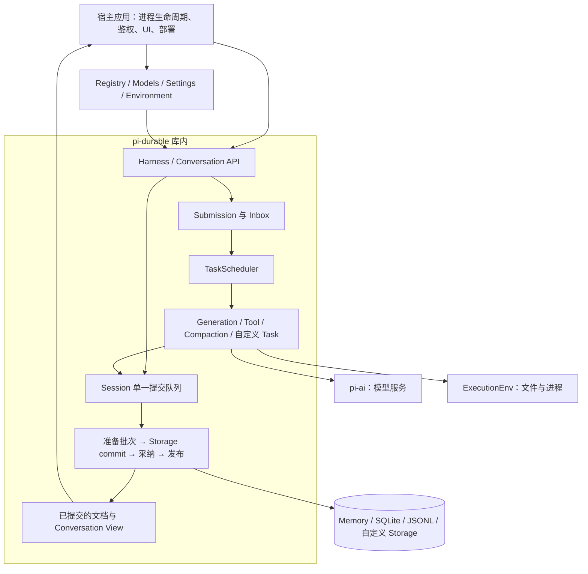
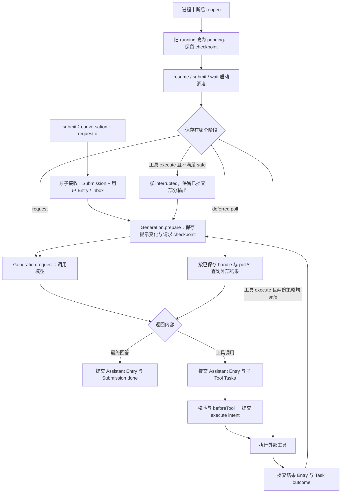
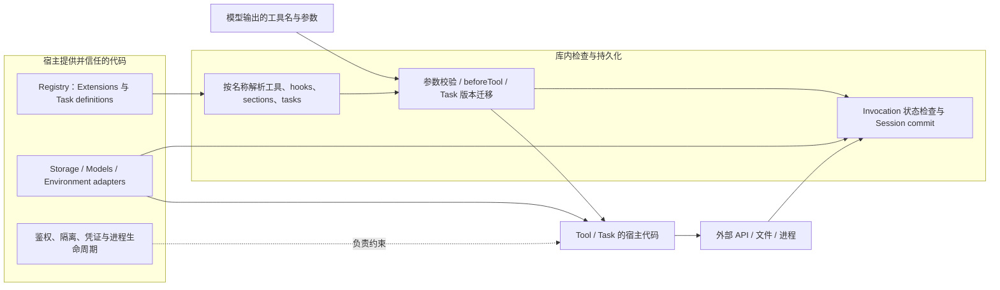

# Pi Durable：可恢复的 Agent 执行库

## 摘要与范围

`@earendil-works/pi-durable` 把对话、输入接收、模型生成、工具调用和自定义任务保存到同一个 Session。进程重启后，调度器读取已提交检查点，决定继续请求、等待外部结果、重跑安全工具，或报告中断。它提供进程内执行库；进程启动、隔离、存储独占和外部服务幂等性由宿主负责。[README][readme]、[Session][session]、[Scheduler][scheduler]

本文固定源码快照 **`9b3c19da5cffc4c5e8b6bd74c45abc1ab6bfcd16`**，包版本 **1.0.0**，CHANGELOG 发布日期 **2026-10-01**。README 仍将 API 标为 Experimental。同期 `pi-agent-core` 移除了实验 harness，保留 Agent、基础 loop 和代理流；durable 包依赖 `pi-ai` 与 Chord，不是套在旧 AgentHarness 外面的持久化适配器。[发布说明][changelog]、[agent-core 变更][agent-changelog]、[package.json][package]

## 系统架构与运行位置

`HarnessImpl` 继承 `SessionImpl`，在其上增加调度、输入队列与对话视图。内建工具通过 Environment 接口访问文件和进程；模型通过宿主传入的 `Models` 调用。SQLite/JSONL 核心有不依赖 Node 的入口，Node 文件与 SQLite 适配单独导出。因此可以给 Cloudflare Durable Object 等环境写适配，但库不替宿主提供对象路由、唤醒或分布式所有权协调。[Harness][harness]、[环境接口][env]、[可移植边界测试][runtime-test]

## 核心数据模型

| 对象 | 保存什么 | 作用 |
| --- | --- | --- |
| Conversation | 对话 ID、fork 来源、可选 owner task | 组织 transcript 和父子归属 |
| Entry | 不可变消息记录、可选模型内容、上下文编辑 | 保留输入、回答、工具结果和系统提示变化 |
| Document | 带类型与版本的 JSON 状态，以及 base/delta | 保存配置、运行状态、队列和应用自有状态 |
| Task | kind/version、input、完整 checkpoint、owner、abortRequested | 保存可恢复状态机，而非 JavaScript 调用栈 |
| Submission | 输入或写入请求、接收状态、最终结果引用 | 区分“已经接收”与“已经回答” |

内建 Document 包括 `pi.agent`、`pi.live`、`pi.inbox`、`pi.usage`。文档可属于 Session、Conversation 或 Task；对话文档分别声明历史和 fork 策略。例如 `pi.agent` 可按 fork 时刻还原，`pi.live` 在 fork 时清空运行状态。[数据模型][types]、[agent 配置][agent]、[live 状态][live]

同一 Session 的 `commit` 可以一起追加 Entry、改 Document、创建子 Task 和推进 checkpoint。存储成功后才更新可观察内存并发布；如果存储返回不能确定是否落盘的错误，Session 会进入不可继续使用的状态，避免在未知结果上继续写入。[提交实现][session]

## 一次执行与恢复

图中省略了重试退避和压缩分支；它们同样由任务检查点表达。`open()` 会恢复调度状态，但不直接执行任务；`resume()`、提交或等待才请求继续工作。[调度器][scheduler]、[GenerationTask][generation]

这里的恢复是**从已保存的阶段重新运行代码**。模型请求被中断时会重发；已提交的流式部分回答先转为 `aborted` Entry，再重新请求，不是接着原连接的下一个 token。`prepare` 保存 model、thinkingLevel、streamOptions 与 transcript cutoff；`beforeRequest` 在 request 阶段再次执行，所以不能据此声称任意 hook 改写后的完整请求都被冻结。[生成实现][generation]、[生成恢复测试][generation-test]

## 副作用会不会重复

库内原子提交和外部副作用是两个边界。流程为“提交意图 → 调用外部系统 → 提交结果”；若外部系统完成后进程立即崩溃，本地只有意图，无法仅凭它确定外部结果。[设计说明 §5.2][spec]

| 情况 | 当前行为 | 不能推导出的保证 |
| --- | --- | --- |
| 重复 `submit` 使用同一 conversation 和 requestId | 返回已有 Submission | 不等于工具或模型调用去重；不能复用 key 表示另一项新工作 |
| 工具结果已提交 | 从后续阶段继续 | 不需要因恢复再次执行这个工具任务 |
| 工具意图已提交，结果未提交 | 保存策略与当前实现均为 `safe` 才重跑；其他情况返回 interrupted | unsafe 也可能已经产生部分副作用，不是回滚 |
| 自定义 Task 重做外部动作 | handler 按 checkpoint 决定重试、查询或中断 | 幂等动作或外部幂等 key 由实现者提供 |
| 模型 request 中断 | 重发请求；支持 deferred 时可保存 handle 后继续 poll | 不保证生成结果相同，也不保证供应商只计费一次 |

`ToolTask` 默认 `unsafe`，恢复会复用保存的参数，不重新执行已跨过意图阶段的 `beforeTool`；但当前工具实现和 Environment 可能变化。一个 safe 工具必须在这样的重跑条件下仍安全，必要输入应事先保存在 checkpoint 或 memo。[工具实现][tool]、[工具恢复测试][tool-test]

上游测试给出了准确的示范：模拟转账恢复后服务调用次数为 **2**，实际应用次数为 **1**，因为模拟服务按 key 去重。单次生效依赖外部服务的幂等实现，不能归结为 Harness 自动提供端到端 exactly-once。[任务恢复测试][task-test]

## 并发、存储与取消

**执行可并行，提交串行。** Session 的 Promise 队列覆盖回调、准备、存储、内存采纳和发布；外部调用在队列外执行。调度器为每个运行任务保存一个内存 invocation，并在写入时重新检查该 invocation、任务状态及 abort 标记。多个任务能并行调用外部系统，但共享 Session 的状态变更按同一队列提交。[Session][session]、[调度器写入检查][scheduler]

**一个 Storage 必须由一个进程独占。** 包没有跨进程 owner 锁、租约或分布式任务抢占。SQLite 的数据库锁保障事务，不会把两个 Harness 自动变成协调好的调度集群。宿主交接应等旧 Harness 关闭，再打开新的实例。[README Storage][readme]、[设计说明 §7.5][spec]

| 后端 | 提交方式 | 持久性限制 |
| --- | --- | --- |
| Memory | 内存批次 | 进程退出不保留 |
| SQLite | 一个 SQL 事务写记录、文档变化和序列号 | Node 默认 WAL / `synchronous=NORMAL`；最新提交在主机故障或掉电时仍可能丢失 |
| JSONL | 先写 sidecar，再追加主文件 commit marker；恢复按 marker 重建 | 默认不 fsync；启用后在 marker 前刷新 sidecar，不能泛化为每次提交都耐断电 |

SQLite 的事务实现在 [storage.ts][sqlite]，Node 策略在 [node.ts][sqlite-node]；JSONL 的提交与恢复在 [storage.ts][jsonl]。JSONL 主文件刷新出现在回收路径，部署若要求断电持久性，需要单独核对完整写入顺序与文件系统保证。

取消包含三种不同操作：

- **取消等待**只停止当前等待者，不取消已接收工作。
- **abort**先持久化标记，再通知正在运行的调用；标记沿前台 owner 关系传播，清理完成后写 terminal outcome。后台任务是默认传播和 idle 检查边界，可显式包含后台工作。
- **close**停止接收新工作、发出取消信号并等待调用结束，不把所有任务写成已取消；后续可 reopen 恢复。忽略信号的 JavaScript 可能阻塞 close，强制终止需要宿主使用进程或 worker 隔离。

这些区别见 [ownership 测试][ownership-test]、[关闭测试][lifecycle-test] 与 [Scheduler][scheduler]。取消信号不撤销已发生的外部副作用。

## 扩展与信任边界

Extension 可以组合工具、提示章节、hooks、wrappers 与任务定义。Registry 是进程本地代码，Conversation 保存名称；重启时宿主重新安装定义。任务输入或 checkpoint 语义改变时需要升 version 并迁移；定义缺失、版本不兼容或迁移失败会使任务保持 blocked，而不是伪造执行成功。[扩展接口][extensions]、[调度器][scheduler]

`beforeTool` 可检查、改参数或拒绝调用，但这是应用策略入口，不构成恶意 JavaScript 的沙箱。Environment 的文件和进程接口提供替换执行位置的能力；是否隔离目录、容器、网络和凭证仍由宿主实现。因此，Pi Durable 适合把已有应用的 agent loop 变成可恢复执行，不能单靠这个包建立不可信代码执行服务。[工具实现][tool]、[环境接口][env]

## 证据矩阵

| 结论 | 证据位置 | 置信度与限制 |
| --- | --- | --- |
| 这是独立 durable 包，旧 agent-core harness 已移除 | [两个包的发布说明][agent-changelog]、[package.json][package] | 高；仅限固定 1.0.0 快照 |
| 状态变更原子提交后才发布 | [Session `#runCommit`][session]、[存储失败测试][documents-test] | 高；依赖 Storage 正确实现接口 |
| reopen 不自动派发，running 回到 pending | [Scheduler `open/resume`][scheduler]、[任务恢复测试][task-test] | 高；待办定义必须能解析 |
| safe/safe 重放，否则 interrupted | [ToolTask `execute`][tool]、[工具恢复测试][tool-test] | 高；安全性是工具作者的声明 |
| 外部单次生效依赖幂等实现 | [转账恢复测试 `service.calls / applied.size`][task-test] | 高；测试模拟外部服务，并非真实支付验证 |
| 模型中断重发，已提交 partial 保留为 aborted | [Generation `request/convertPartial`][generation]、[恢复测试][generation-test] | 高；真实供应商的费用与重试行为仍由其接口语义决定 |
| SQLite 使用事务；JSONL 采用 marker | [SQLite `commit`][sqlite]、[JSONL `commit/recover`][jsonl] | 高；事务原子性不等于断电或磁盘损坏后的数据保留保证 |
| close 要等待非协作代码 | [lifecycle 的 stubborn handler 测试][lifecycle-test] | 高；不是强制隔离能力 |
| portable 入口可以被宿主适配 | [源码依赖图检查][runtime-test] | 中高；不能据此声称已完成特定平台部署 |

## 当前风险与未决问题

1. **API 演进**：首版仍标 Experimental；需要固定版本，并为 Task / Document 迁移建立应用自己的回归用例。
2. **独占所有权**：水平扩展和故障切换需要宿主保证一个 storage 同时只有一个活跃拥有者；不能因存储可并发访问就启动多个 Harness。
3. **重放环境变化**：safe 工具恢复时可能遇到新 cwd、新实现和新服务配置。测试已经覆盖 cwd 变化；业务是否允许这种变化需自行定义。
4. **费用与真实副作用**：工具和模型可能重新调用；需要外部幂等、可查询回执或人工处理未知结果。仅保存 requestId 不能覆盖这一层。
5. **关闭和持久性**：非协作代码会拖住关闭；文件系统、数据库同步策略及主机故障会影响提交保留范围。
6. **生产可靠性**：源码与上游测试说明实现语义和测试覆盖范围；宿主环境中的真实模型调用、平台适配、存储故障与进程恢复仍需要部署验证，不能据此推导生产可靠性指标。

## 相关页面

- [[wiki/syntheses/ai/agent-harness-design-tradeoffs|Agent Harness 的设计取舍]]：讨论持久化执行、沙箱解耦与工具组合的关键取舍。
- [[wiki/topics/ai/agent-harness|Agent Harness]]。
- [[wiki/topics/ai/tetral|Tetral]]。
- [[wiki/syntheses/ai/agent-loop-control-boundaries|Agent 循环工作流的控制边界]]。

## 来源指针

- [[raw/sources/2026-10-02-pi-durable.md|固定源码快照与原始材料]]。
- 下列源码链接全部固定到 `9b3c19da5cffc4c5e8b6bd74c45abc1ab6bfcd16`，不是随 main 漂移的引用。

[readme]: https://github.com/earendil-works/pi/blob/9b3c19da5cffc4c5e8b6bd74c45abc1ab6bfcd16/packages/durable/README.md
[changelog]: https://github.com/earendil-works/pi/blob/9b3c19da5cffc4c5e8b6bd74c45abc1ab6bfcd16/packages/durable/CHANGELOG.md
[agent-changelog]: https://github.com/earendil-works/pi/blob/9b3c19da5cffc4c5e8b6bd74c45abc1ab6bfcd16/packages/agent/CHANGELOG.md
[package]: https://github.com/earendil-works/pi/blob/9b3c19da5cffc4c5e8b6bd74c45abc1ab6bfcd16/packages/durable/package.json
[spec]: https://github.com/earendil-works/pi/blob/9b3c19da5cffc4c5e8b6bd74c45abc1ab6bfcd16/packages/durable/docs/spec.md
[harness]: https://github.com/earendil-works/pi/blob/9b3c19da5cffc4c5e8b6bd74c45abc1ab6bfcd16/packages/durable/src/harness/harness.ts
[types]: https://github.com/earendil-works/pi/blob/9b3c19da5cffc4c5e8b6bd74c45abc1ab6bfcd16/packages/durable/src/types.ts
[session]: https://github.com/earendil-works/pi/blob/9b3c19da5cffc4c5e8b6bd74c45abc1ab6bfcd16/packages/durable/src/session/session.ts#L404
[scheduler]: https://github.com/earendil-works/pi/blob/9b3c19da5cffc4c5e8b6bd74c45abc1ab6bfcd16/packages/durable/src/harness/scheduler.ts
[generation]: https://github.com/earendil-works/pi/blob/9b3c19da5cffc4c5e8b6bd74c45abc1ab6bfcd16/packages/durable/src/harness/generation.ts
[tool]: https://github.com/earendil-works/pi/blob/9b3c19da5cffc4c5e8b6bd74c45abc1ab6bfcd16/packages/durable/src/harness/tool.ts#L50
[agent]: https://github.com/earendil-works/pi/blob/9b3c19da5cffc4c5e8b6bd74c45abc1ab6bfcd16/packages/durable/src/harness/agent.ts#L35
[live]: https://github.com/earendil-works/pi/blob/9b3c19da5cffc4c5e8b6bd74c45abc1ab6bfcd16/packages/durable/src/harness/live.ts
[env]: https://github.com/earendil-works/pi/blob/9b3c19da5cffc4c5e8b6bd74c45abc1ab6bfcd16/packages/durable/src/env/index.ts
[extensions]: https://github.com/earendil-works/pi/blob/9b3c19da5cffc4c5e8b6bd74c45abc1ab6bfcd16/packages/durable/src/harness/types.ts#L252
[sqlite]: https://github.com/earendil-works/pi/blob/9b3c19da5cffc4c5e8b6bd74c45abc1ab6bfcd16/packages/durable/src/storage/sqlite/storage.ts#L162
[sqlite-node]: https://github.com/earendil-works/pi/blob/9b3c19da5cffc4c5e8b6bd74c45abc1ab6bfcd16/packages/durable/src/storage/sqlite/node.ts#L179
[jsonl]: https://github.com/earendil-works/pi/blob/9b3c19da5cffc4c5e8b6bd74c45abc1ab6bfcd16/packages/durable/src/storage/jsonl/storage.ts#L277
[generation-test]: https://github.com/earendil-works/pi/blob/9b3c19da5cffc4c5e8b6bd74c45abc1ab6bfcd16/packages/durable/test/harness-generation-recovery.test.ts#L74
[tool-test]: https://github.com/earendil-works/pi/blob/9b3c19da5cffc4c5e8b6bd74c45abc1ab6bfcd16/packages/durable/test/harness-tools-recovery.test.ts#L109
[task-test]: https://github.com/earendil-works/pi/blob/9b3c19da5cffc4c5e8b6bd74c45abc1ab6bfcd16/packages/durable/test/harness-tasks-recovery.test.ts#L112
[ownership-test]: https://github.com/earendil-works/pi/blob/9b3c19da5cffc4c5e8b6bd74c45abc1ab6bfcd16/packages/durable/test/harness-ownership.test.ts
[lifecycle-test]: https://github.com/earendil-works/pi/blob/9b3c19da5cffc4c5e8b6bd74c45abc1ab6bfcd16/packages/durable/test/harness-lifecycle.test.ts#L127
[documents-test]: https://github.com/earendil-works/pi/blob/9b3c19da5cffc4c5e8b6bd74c45abc1ab6bfcd16/packages/durable/test/session-documents.test.ts#L440
[runtime-test]: https://github.com/earendil-works/pi/blob/9b3c19da5cffc4c5e8b6bd74c45abc1ab6bfcd16/packages/durable/test/storage-runtime-boundary.test.ts
