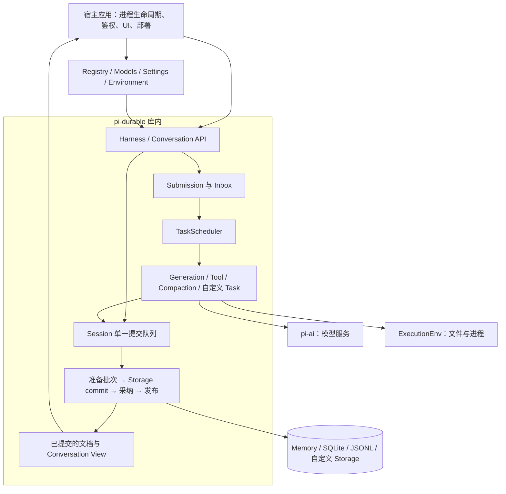
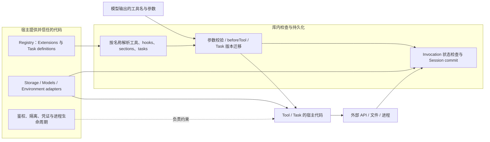

# Pi Durable：可恢复的 Agent 执行库

## 摘要与范围

`@earendil-works/pi-durable` 把对话、输入接收、模型生成、工具调用和自定义任务保存到同一个 Session。进程重启后，调度器读取已提交检查点，决定继续请求、等待外部结果、重跑安全工具，或报告中断。它提供进程内执行库；进程启动、隔离、存储独占和外部服务幂等性由宿主负责。[README][readme]、[Session][session]、[Scheduler][scheduler]

本文固定源码快照 **`9b3c19da5cffc4c5e8b6bd74c45abc1ab6bfcd16`**，包版本 **1.0.0**，CHANGELOG 发布日期 **2026-10-01**。README 仍将 API 标为 Experimental。同期 `pi-agent-core` 移除了实验 harness，保留 Agent、基础 loop 和代理流；durable 包依赖 `pi-ai` 与 Chord，不是套在旧 AgentHarness 外面的持久化适配器。[发布说明][changelog]、[agent-core 变更][agent-changelog]、[package.json][package]

## 系统架构与运行位置

`HarnessImpl` 继承 `SessionImpl`，在其上增加调度、输入队列与对话视图。内建工具通过 Environment 接口访问文件和进程；模型通过宿主传入的 `Models` 调用。SQLite/JSONL 核心有不依赖 Node 的入口，Node 文件与 SQLite 适配单独导出。因此可以给 Cloudflare Durable Object 等环境写适配，但库不替宿主提供对象路由、唤醒或分布式所有权协调。[Harness][harness]、[环境接口][env]、[可移植边界测试][runtime-test]

## 核心数据模型

| 对象 | 保存什么 | 作用 |
| --- | --- | --- |
| Conversation | 对话 ID、fork 来源、可选 owner task | 组织 transcript 和父子归属 |
| Entry | 不可变消息记录、可选模型内容、上下文编辑 | 保留输入、回答、工具结果和系统提示变化 |
| Document | 带类型与版本的 JSON 状态，以及 base/delta | 保存配置、运行状态、队列和应用自有状态 |
| Task | kind/version、input、完整 checkpoint、owner、abortRequested | 保存可恢复状态机，而非 JavaScript 调用栈 |
| Submission | 输入或写入请求、接收状态、最终结果引用 | 区分“已经接收”与“已经回答” |

内建 Document 包括 `pi.agent`、`pi.live`、`pi.inbox`、`pi.usage`。文档可属于 Session、Conversation 或 Task；对话文档分别声明历史和 fork 策略。例如 `pi.agent` 可按 fork 时刻还原，`pi.live` 在 fork 时清空运行状态。[数据模型][types]、[agent 配置][agent]、[live 状态][live]

同一 Session 的 `commit` 可以一起追加 Entry、改 Document、创建子 Task 和推进 checkpoint。存储成功后才更新可观察内存并发布；如果存储返回不能确定是否落盘的错误，Session 会进入不可继续使用的状态，避免在未知结果上继续写入。[提交实现][session]

## 一次执行与恢复

图中省略了重试退避和压缩分支；它们同样由任务检查点表达。`open()` 会恢复调度状态，但不直接执行任务；`resume()`、提交或等待才请求继续工作。[调度器][scheduler]、[GenerationTask][generation]

这里的恢复是**从已保存的阶段重新运行代码**。模型请求被中断时会重发；已提交的流式部分回答先转为 `aborted` Entry，再重新请求，不是接着原连接的下一个 token。`prepare` 保存 model、thinkingLevel、streamOptions 与 transcript cutoff；`beforeRequest` 在 request 阶段再次执行，所以不能据此声称任意 hook 改写后的完整请求都被冻结。[生成实现][generation]、[生成恢复测试][generation-test]

## 副作用会不会重复

库内原子提交和外部副作用是两个边界。流程为“提交意图 → 调用外部系统 → 提交结果”；若外部系统完成后进程立即崩溃，本地只有意图，无法仅凭它确定外部结果。[设计说明 §5.2][spec]

| 场景 | 框架当前行为 | 实际限制与边界 |
| --- | --- | --- |
| 重复 `submit` 使用同一 conversation 和 requestId | 返回已有 Submission | 仅去重本次输入接收，不等于外部工具调用去重；不能复用旧 key 发起新工作 |
| 工具结果已提交 | 从后续阶段继续 | 不需要因恢复再次执行这个工具任务 |
| 工具意图已提交，结果未提交 | 检查点策略与当前代码均标记为 `safe` 才重跑；否则标记为 interrupted 中断 | 即使未重跑，工具也可能已经产生了部分外部影响，本地无法回滚 |
| 自定义 Task 重做外部动作 | handler 按 checkpoint 决定重试、查询或中断 | 幂等操作或外部幂等 key 必须由业务代码自行提供 |
| 模型 request 中断 | 重发请求；支持 deferred 时可保存 handle 后继续 poll | 不保证重发后生成结果相同，也不保证模型供应商只计费一次 |

`ToolTask` 默认 `unsafe`，恢复会复用保存的参数，不重新执行已跨过意图阶段的 `beforeTool`；但当前工具实现和 Environment 可能变化。一个 safe 工具必须在这样的重跑条件下仍安全，必要输入应事先保存在 checkpoint 或 memo。[工具实现][tool]、[工具恢复测试][tool-test]

上游测试给出了准确的示范：模拟转账恢复后服务调用次数为 **2**，实际应用次数为 **1**，因为模拟服务按 key 去重。单次生效依赖外部服务的幂等实现，不能归结为 Harness 自动提供端到端 exactly-once。[任务恢复测试][task-test]

## 并发、存储与取消

**执行可并行，提交串行。** Session 的 Promise 队列覆盖回调、准备、存储、内存采纳和发布；外部调用在队列外执行。调度器为每个运行任务保存一个内存 invocation，并在写入时重新检查该 invocation、任务状态及 abort 标记。多个任务能并行调用外部系统，但共享 Session 的状态变更按同一队列提交。[Session][session]、[调度器写入检查][scheduler]

**一个 Storage 必须由一个进程独占。** 包没有跨进程所有权锁、执行超时锁定机制或分布式任务抢占。SQLite 的数据库锁保障事务，不会把两个 Harness 自动变成协调好的调度集群。宿主交接应等旧 Harness 关闭，再打开新的实例。[README Storage][readme]、[设计说明 §7.5][spec]

| 后端 | 提交方式 | 持久性限制 |
| --- | --- | --- |
| Memory | 内存批次 | 进程退出不保留 |
| SQLite | 单个 SQL 事务写入记录、文档变化和序列号 | Node 默认 WAL / `synchronous=NORMAL`；若操作系统异常崩溃或机器掉电，尚未刷入物理磁盘的最新提交仍可能丢失 |
| JSONL | 先写 sidecar 临时文件，再向主文件追加 commit marker；恢复时按 marker 重建 | 默认不执行 fsync；仅在历史文件压缩清理（compaction）时对主文件执行完整刷盘 |

SQLite 的事务实现在 [storage.ts][sqlite]，Node 策略在 [node.ts][sqlite-node]；JSONL 的提交与恢复在 [storage.ts][jsonl]。部署若要求断电级持久性，需要根据底层文件系统与存储介质单独验证。

取消包含三种不同操作：

- **取消等待**：只停止当前等待该任务的调用方，不中断已经在后台运行的任务。
- **abort**：先在存储中落盘中断标记，再向正在运行的任务派发取消信号。取消信号会顺着父子任务的归属链路向下传递；等所有关联任务清理完成后，再将最终状态更新为已终止。
- **close**：停止接收新工作、发出取消信号并等待当前正在运行的任务退出。如果某个工具函数没有监听取消信号（例如陷入无限循环或未设超时的网络请求），`close()` 会一直挂起等待；因为同一 JavaScript 进程内无法强行终止正在执行的函数，必须由外层宿主使用独立的 Worker 线程或直接杀死进程来强制终止。

这些区别见 [ownership 测试][ownership-test]、[关闭测试][lifecycle-test] 与 [Scheduler][scheduler]。取消信号不撤销已发生的外部副作用。

## 扩展与信任边界

Extension 可以组合工具、提示章节、hooks、wrappers 与任务定义。Registry 是进程本地代码，Conversation 保存名称；重启时宿主重新安装定义。任务输入或 checkpoint 语义改变时需要升 version 并迁移；定义缺失、版本不兼容或迁移失败会使任务保持 blocked，而不是伪造执行成功。[扩展接口][extensions]、[调度器][scheduler]

`beforeTool` 可检查、修改参数或拒绝调用，但这属于应用层面的拦截逻辑，不能替代操作系统级别的沙箱隔离。Environment 的文件和进程接口允许替换底层执行环境；是否隔离物理目录、网络与敏感凭证，仍需由宿主实现负责。因此，Pi Durable 适合把已有应用的 Agent Loop 包装为支持持久化恢复的执行流，但本身不提供不可信代码的安全隔离沙箱。[工具实现][tool]、[环境接口][env]

## 当前风险与工程限制

1. **版本演进风险**：1.0.0 版 API 官方仍标注为实验性（Experimental）；生产落地需固定包版本，并针对 Task 和 Document 的结构迁移编写回归测试。
2. **单进程独占限制**：存储必须由单个进程独占使用。包内未内置跨节点分布式锁或限时认领抢占机制，多节点部署时必须由外层调度系统保证同一时刻只有一个活跃实例访问底层存储。
3. **环境重放的不确定性**：声明为 safe 的工具在故障恢复重跑时，可能面临宿主工作目录、外部依赖或配置变更的问题。业务代码需明确重试对环境变动的容忍度。
4. **外部副作用无法自动防重**：工具与模型请求被中断后重新发起，Harness 无法自动保证外部第三方接口不重复收费或不产生副作用；涉及写操作时必须由外部接口提供基于唯一 ID 的幂等去重。
5. **无法强制终止正在执行的函数**：调用 `close()` 时，如果某个工具函数内部没有监听取消信号（例如陷入无限循环或未设超时的网络请求），进程会一直挂起等待。Pi Durable 运行在单个 JavaScript 进程内，无法像操作系统 `kill -9` 那样强杀某一段函数代码；需要硬超时的场景，必须由宿主将工具放入独立的 Worker 线程或子进程中执行。
6. **未经过大规模多节点容灾验证**：官方源码和测试主要覆盖了单机单进程场景下的状态落盘与重启恢复逻辑；在云端复杂网络分区、存储脑裂或极端并发下的稳定性，仍需结合具体宿主架构进行验证。

## 相关页面

- [[wiki/syntheses/ai/agent-harness-runtime-architecture|Agent Harness 运行时架构与演进]]：讨论持久化执行、沙箱解耦与工具组合的关键工程限制与演进。
- [[wiki/topics/ai/agent-harness|Agent Harness]]。
- [[wiki/topics/ai/tetral|Tetral]]。
- [[wiki/syntheses/ai/agent-loop-control-boundaries|Agent 循环工作流的控制边界]]。

## 来源指针

- [[raw/sources/2026-10-02-pi-durable.md|固定源码快照与原始材料]]。
- 下列源码链接全部固定到 `9b3c19da5cffc4c5e8b6bd74c45abc1ab6bfcd16`，不是随 main 漂移的引用。

[readme]: https://github.com/earendil-works/pi/blob/9b3c19da5cffc4c5e8b6bd74c45abc1ab6bfcd16/packages/durable/README.md
[changelog]: https://github.com/earendil-works/pi/blob/9b3c19da5cffc4c5e8b6bd74c45abc1ab6bfcd16/packages/durable/CHANGELOG.md
[agent-changelog]: https://github.com/earendil-works/pi/blob/9b3c19da5cffc4c5e8b6bd74c45abc1ab6bfcd16/packages/agent/CHANGELOG.md
[package]: https://github.com/earendil-works/pi/blob/9b3c19da5cffc4c5e8b6bd74c45abc1ab6bfcd16/packages/durable/package.json
[spec]: https://github.com/earendil-works/pi/blob/9b3c19da5cffc4c5e8b6bd74c45abc1ab6bfcd16/packages/durable/docs/spec.md
[harness]: https://github.com/earendil-works/pi/blob/9b3c19da5cffc4c5e8b6bd74c45abc1ab6bfcd16/packages/durable/src/harness/harness.ts
[types]: https://github.com/earendil-works/pi/blob/9b3c19da5cffc4c5e8b6bd74c45abc1ab6bfcd16/packages/durable/src/types.ts
[session]: https://github.com/earendil-works/pi/blob/9b3c19da5cffc4c5e8b6bd74c45abc1ab6bfcd16/packages/durable/src/session/session.ts#L404
[scheduler]: https://github.com/earendil-works/pi/blob/9b3c19da5cffc4c5e8b6bd74c45abc1ab6bfcd16/packages/durable/src/harness/scheduler.ts
[generation]: https://github.com/earendil-works/pi/blob/9b3c19da5cffc4c5e8b6bd74c45abc1ab6bfcd16/packages/durable/src/harness/generation.ts
[tool]: https://github.com/earendil-works/pi/blob/9b3c19da5cffc4c5e8b6bd74c45abc1ab6bfcd16/packages/durable/src/harness/tool.ts#L50
[agent]: https://github.com/earendil-works/pi/blob/9b3c19da5cffc4c5e8b6bd74c45abc1ab6bfcd16/packages/durable/src/harness/agent.ts#L35
[live]: https://github.com/earendil-works/pi/blob/9b3c19da5cffc4c5e8b6bd74c45abc1ab6bfcd16/packages/durable/src/harness/live.ts
[env]: https://github.com/earendil-works/pi/blob/9b3c19da5cffc4c5e8b6bd74c45abc1ab6bfcd16/packages/durable/src/env/index.ts
[extensions]: https://github.com/earendil-works/pi/blob/9b3c19da5cffc4c5e8b6bd74c45abc1ab6bfcd16/packages/durable/src/harness/types.ts#L252
[sqlite]: https://github.com/earendil-works/pi/blob/9b3c19da5cffc4c5e8b6bd74c45abc1ab6bfcd16/packages/durable/src/storage/sqlite/storage.ts#L162
[sqlite-node]: https://github.com/earendil-works/pi/blob/9b3c19da5cffc4c5e8b6bd74c45abc1ab6bfcd16/packages/durable/src/storage/sqlite/node.ts#L179
[jsonl]: https://github.com/earendil-works/pi/blob/9b3c19da5cffc4c5e8b6bd74c45abc1ab6bfcd16/packages/durable/src/storage/jsonl/storage.ts#L277
[generation-test]: https://github.com/earendil-works/pi/blob/9b3c19da5cffc4c5e8b6bd74c45abc1ab6bfcd16/packages/durable/test/harness-generation-recovery.test.ts#L74
[tool-test]: https://github.com/earendil-works/pi/blob/9b3c19da5cffc4c5e8b6bd74c45abc1ab6bfcd16/packages/durable/test/harness-tools-recovery.test.ts#L109
[task-test]: https://github.com/earendil-works/pi/blob/9b3c19da5cffc4c5e8b6bd74c45abc1ab6bfcd16/packages/durable/test/harness-tasks-recovery.test.ts#L112
[ownership-test]: https://github.com/earendil-works/pi/blob/9b3c19da5cffc4c5e8b6bd74c45abc1ab6bfcd16/packages/durable/test/harness-ownership.test.ts
[lifecycle-test]: https://github.com/earendil-works/pi/blob/9b3c19da5cffc4c5e8b6bd74c45abc1ab6bfcd16/packages/durable/test/harness-lifecycle.test.ts#L127
[documents-test]: https://github.com/earendil-works/pi/blob/9b3c19da5cffc4c5e8b6bd74c45abc1ab6bfcd16/packages/durable/test/session-documents.test.ts#L440
[runtime-test]: https://github.com/earendil-works/pi/blob/9b3c19da5cffc4c5e8b6bd74c45abc1ab6bfcd16/packages/durable/test/storage-runtime-boundary.test.ts
