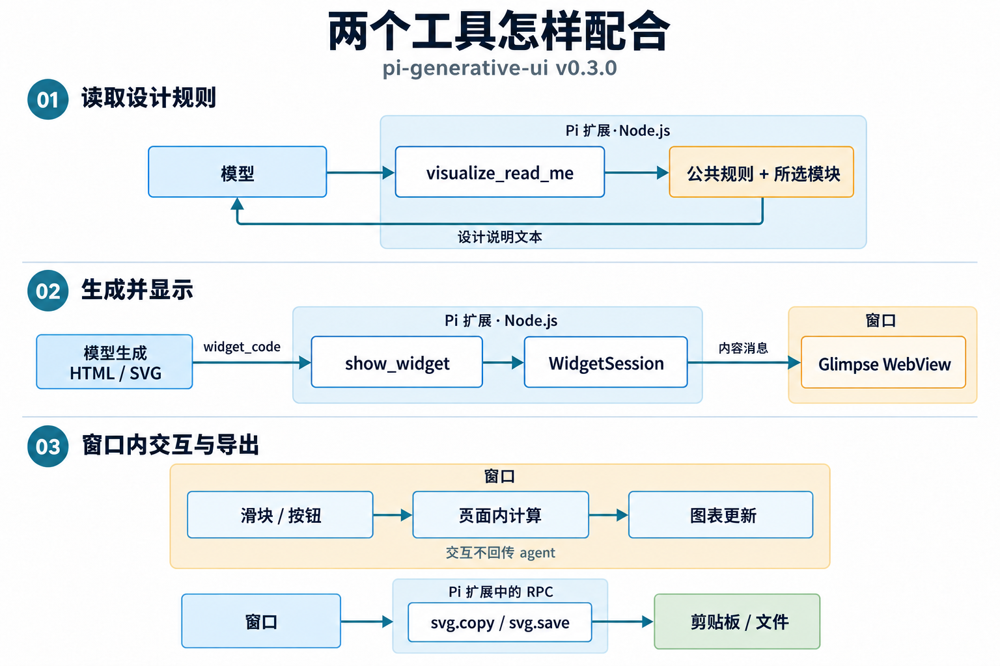
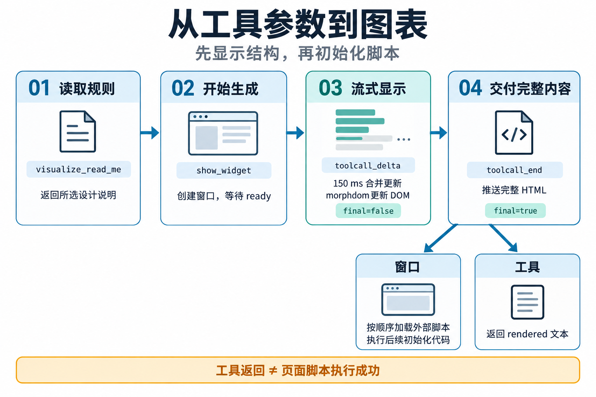

# pi-generative-ui：read_me 与 show_widget 工具设计

`pi-generative-ui` 用两个工具让模型生成图形界面：`visualize_read_me` 把当前任务需要的设计说明作为工具结果交给模型，`show_widget` 接收模型随后生成的 HTML/SVG，并交给 Glimpse 的 WebView 窗口显示。模型负责生成代码，工具负责提供规则和显示代码；设计说明的内容、装载时机和输出方式共同决定这套机制怎样工作。[两个工具的注册实现](https://github.com/Michaelliv/pi-generative-ui/blob/d1abf2cb38fbf54c4b91d06677c700193d495887/.pi/extensions/generative-ui/index.ts#L109-L217)

它复现了 Michael Liv 在 2026-03-13 文章中观察到的 Claude 工具模式。以下实现对应 Pi `v0.3.0`；Claude 的工具信息来自作者当时的第三方记录。[原文 Part 1、2、4](https://michaellivs.com/blog/reverse-engineering-claude-generative-ui)

## 两个工具的接口定义

Pi 的两个工具定义如下，包含名称、中文说明和参数 schema（输入结构定义）。[参数源码](https://github.com/Michaelliv/pi-generative-ui/blob/d1abf2cb38fbf54c4b91d06677c700193d495887/.pi/extensions/generative-ui/index.ts#L14-L36)

### visualize_read_me：让模型先拿到设计说明

```json
{
  "name": "visualize_read_me",
  "description": "返回 show_widget 所需的设计说明，包括样式、配色、排版、布局和示例。首次调用 show_widget 前先读取与任务相符的模块。",
  "parameters": {
    "type": "object",
    "properties": {
      "modules": {
        "type": "array",
        "items": {
          "type": "string",
          "enum": ["interactive", "chart", "mockup", "art", "diagram"]
        }
      }
    },
    "required": ["modules"]
  }
}
```

`modules` 可以一次选择多个模块。调用约定要求首次生成 widget 前先读说明；Pi 的 `promptGuidelines` 还把这一步描述为内部准备，不必向用户播报。工具执行时组合 Markdown 说明，返回给模型读取，不生成图形，也不调用另一个模型。[工具说明与返回值](https://github.com/Michaelliv/pi-generative-ui/blob/d1abf2cb38fbf54c4b91d06677c700193d495887/.pi/extensions/generative-ui/index.ts#L111-L130)

调用 `{"modules":["interactive","chart"]}` 后返回设计说明文本和模块列表（文本节略）：

```json
{
  "content": [{ "type": "text", "text": "公共规则……UI 组件……配色……Chart.js 规则……" }],
  "details": { "modules": ["interactive", "chart"] }
}
```

各模块都先包含公共规则，再追加下面的内容。共同章节只出现一次，所以同时读取 `interactive` 和 `chart` 不会重复加入 UI 组件和配色说明。[章节组合和去重](https://github.com/Michaelliv/pi-generative-ui/blob/d1abf2cb38fbf54c4b91d06677c700193d495887/.pi/extensions/generative-ui/guidelines.ts#L775-L801)

| 模块 | 主要任务 | 追加的设计说明 |
| --- | --- | --- |
| `interactive` | 带滑块、按钮和局部计算的解释组件 | UI 组件、配色 |
| `chart` | 图表和数据分析 | UI 组件、配色、Chart.js |
| `mockup` | 界面示意、表单、卡片 | UI 组件、配色 |
| `art` | 插图和生成艺术 | SVG 基础、艺术与插图 |
| `diagram` | 流程、结构和说明图 | 配色、SVG 基础、图形类型与布局 |

### show_widget：接收模型已经生成的代码

```json
{
  "name": "show_widget",
  "description": "在原生窗口显示 HTML/SVG 图形、图表或交互组件。先调用 visualize_read_me，再生成代码。窗口内可交互，当前版本不把点击和输入返回 agent。",
  "parameters": {
    "type": "object",
    "properties": {
      "i_have_seen_read_me": { "type": "boolean" },
      "title": { "type": "string" },
      "widget_code": { "type": "string" },
      "width": { "type": "number" },
      "height": { "type": "number" },
      "floating": { "type": "boolean" }
    },
    "required": ["i_have_seen_read_me", "title", "widget_code"]
  }
}
```

- `i_have_seen_read_me`：调用者声明已读取说明；执行入口要求值为 `true`。
- `title`：工具说明要求使用 snake_case，Pi 将下划线替换为空格作为窗口标题。schema 本身只要求字符串。
- `widget_code`：模型生成的 HTML 内容片段或以 `<svg>` 开始的 SVG。HTML 不带 `DOCTYPE`、`html`、`head`、`body` 外壳；通常按样式、内容、脚本顺序生成。
- `width`、`height`、`floating`：可选窗口参数，分别控制宽度、高度和是否置顶。工具说明给出的默认值为 800、600 和 `false`。

`i_have_seen_read_me` 只检查传入的布尔值，没有查询历史调用，不能把它当成已读证明或权限检查。[字段说明](https://github.com/Michaelliv/pi-generative-ui/blob/d1abf2cb38fbf54c4b91d06677c700193d495887/.pi/extensions/generative-ui/index.ts#L21-L36)、[工具调用约定](https://github.com/Michaelliv/pi-generative-ui/blob/d1abf2cb38fbf54c4b91d06677c700193d495887/.pi/extensions/generative-ui/index.ts#L146-L177)

在 `v0.3.0`，显示代码交给窗口后，工具返回 `content` 中的一条 rendered 文本，以及 `details` 中的 `title`、`width`、`height`、`isSVG`。**HTML 是工具的输入参数，工具执行时将它送入窗口；返回结果包含显示状态和尺寸等信息，不包含窗口点击数据。** [执行与返回](https://github.com/Michaelliv/pi-generative-ui/blob/d1abf2cb38fbf54c4b91d06677c700193d495887/.pi/extensions/generative-ui/index.ts#L179-L217)

### 原文中的 Claude 接口与 Pi 有哪些差别

| 项目 | 原文记录的 Claude 工具 | Pi 复现 |
| --- | --- | --- |
| 读取说明的名称 | 正文简称 `read_me`，工具记录里是 `visualize:read_me` | 注册为 `visualize_read_me` |
| 读取说明的输入 | `modules`，上述五种任务类别 | 同样按模块选择并组合说明 |
| 显示工具的输入 | `i_have_seen_read_me`、`title`、`loading_messages`、`widget_code` | 三个共同字段，加 `width`、`height`、`floating`；没有 `loading_messages` |
| 加载提示 | `loading_messages` 是 1–4 条短提示 | Pi 工具参数中没有该字段 |
| 交互回到对话 | 作者记录的说明提供 `sendPrompt(text)` | 原文的 Pi 实现等待窗口消息；`v0.3.0` 已取消这条业务回调 |

Claude 一列是作者记录的输入形状与说明，Pi 一列对应公开源码和 `v0.3.0` 的行为。[原文 Part 1、2、4](https://michaellivs.com/blog/reverse-engineering-claude-generative-ui)、[Pi v0.3.0](https://github.com/Michaelliv/pi-generative-ui/releases/tag/v0.3.0)

## 设计说明怎样影响生成结果

这套设计把短工具说明和详细规则分开：短说明让模型知道何时调用工具，`read_me` 的返回文本再提供当前任务需要的知识。模型根据这些规则设计界面，把具体样式、布局和交互写进 `widget_code`。

| 规则所在部分 | 交给模型的具体内容 | 对生成代码的影响 |
| --- | --- | --- |
| 公共规则 | 解释文字留在聊天正文，widget 只承载视觉内容 | 避免在小窗口内重复整篇说明 |
| 公共规则 | 使用宿主颜色变量、兼顾深色模式、限制字体层级 | 让生成内容沿用宿主的视觉样式 |
| 流式规则 | HTML 的样式在前、内容随后、脚本最后；SVG 先给标记定义再绘制 | 让结构尽早可见，脚本负责后续初始化 |
| SVG 与 diagram | 检查 viewBox 边界、文本宽度、箭头交叉和节点排列 | 给图形布局提供可检查的条件 |
| chart | 为 canvas 提供确定尺寸，处理图例和数字格式 | 给 Chart.js 生成提供具体实现规则 |

依据：[公共与流式规则](https://github.com/Michaelliv/pi-generative-ui/blob/d1abf2cb38fbf54c4b91d06677c700193d495887/.pi/extensions/generative-ui/guidelines.ts#L25-L84)、[SVG 说明](https://github.com/Michaelliv/pi-generative-ui/blob/d1abf2cb38fbf54c4b91d06677c700193d495887/.pi/extensions/generative-ui/claude-guidelines/sections/svg_setup.md)、[图形类型](https://github.com/Michaelliv/pi-generative-ui/blob/d1abf2cb38fbf54c4b91d06677c700193d495887/.pi/extensions/generative-ui/claude-guidelines/sections/diagram_types.md)、[图表说明](https://github.com/Michaelliv/pi-generative-ui/blob/d1abf2cb38fbf54c4b91d06677c700193d495887/.pi/extensions/generative-ui/claude-guidelines/sections/charts_chart_js.md)。这些是模型生成时的指导，不能当成渲染器已经执行的强制校验。

例如用户要求“用滑块解释复利”，模型先用 `interactive` 和 `chart` 读取说明，再根据返回规则生成布局、滑块和图表代码，把它们放进 `show_widget.widget_code`。用户拖动滑块后的计算可以在页面内完成，不必每次重新请求模型。

可复用的做法是：**提供按任务读取的具体设计知识，再让模型用明确的工具参数交付代码。** 按需读取减少每轮都装入全部说明的必要；宿主样式、组件和库的使用规则有固定维护位置。复制时要同时适配规则与运行环境，例如 Pi 已没有 `sendPrompt` 回调，就不能照搬原说明中的相关交互示例。

## 组件怎样配合

Pi 扩展负责工具调用和窗口管理，WebView 负责显示内容和执行页面脚本。



扩展运行在 Pi 的 Node.js 进程中。终端负责对话和工具状态，窗口负责图表、滑块和动画；`WidgetSession` 管理窗口与内容更新，页面侧用 `morphdom` 修改 DOM（文档对象模型）。[窗口与 RPC 初始化](https://github.com/Michaelliv/pi-generative-ui/blob/d1abf2cb38fbf54c4b91d06677c700193d495887/.pi/extensions/generative-ui/session.ts#L31-L55)

## 一次图表生成怎样完成



源码把连续更新按 150ms 的窗口合并，只保留最新 HTML，跳过过短或完全相同的内容；最终内容会取消待发定时器，并带 `final=true`。页面先用 `morphdom` 修改现有节点，随后在最终内容到达时重建脚本元素，依次等待外部脚本加载，避免初始化代码先于 Chart.js 等依赖执行。[内容生命周期](https://github.com/Michaelliv/pi-generative-ui/blob/d1abf2cb38fbf54c4b91d06677c700193d495887/.pi/extensions/generative-ui/session.ts#L57-L91)、[DOM 与脚本执行](https://github.com/Michaelliv/pi-generative-ui/blob/d1abf2cb38fbf54c4b91d06677c700193d495887/.pi/extensions/generative-ui/runtime/morph.ts#L14-L71)

这里的后置执行针对 `<script>` 元素的初始化顺序，不是对任意 HTML 行为的安全保证；生成内容仍需运行环境提供隔离。

宿主把最终内容交给窗口后即可返回。页面的 `runScripts` 异步运行，失败写入控制台；没有把脚本完成或渲染成功作为工具完成条件。因此 `Widget rendered` 不能代替实际画面核对。[页面入口](https://github.com/Michaelliv/pi-generative-ui/blob/d1abf2cb38fbf54c4b91d06677c700193d495887/.pi/extensions/generative-ui/runtime/index.ts#L26-L42)、[工具返回](https://github.com/Michaelliv/pi-generative-ui/blob/d1abf2cb38fbf54c4b91d06677c700193d495887/.pi/extensions/generative-ui/index.ts#L185-L217)

## 原文之后的实际变化

截至 2026-10-08，仓库最新公开 release 是 2026-06-03 的 `v0.3.0`。它延续了流式 HTML 路线，同时重写了运行时。[发布记录](https://github.com/Michaelliv/pi-generative-ui/releases/tag/v0.3.0)

| 项目 | 文章中的实现 | v0.3.0 的变化 |
| --- | --- | --- |
| 窗口环境 | macOS WKWebView | Glimpse 0.8 系列，加入 macOS、Linux、Windows 适配 |
| 运行时代码 | 在扩展中拼 HTML 和脚本字符串 | 页面侧 TypeScript 由 esbuild 打包，宿主通过带类型的消息发送内容 |
| 外部脚本 | 完成时替换脚本元素 | 逐个等待外部脚本加载，之后才执行后续初始化代码 |
| 用户反馈 | 工具等待输入、关闭或超时 | 交付最终 HTML 后结束；不把窗口点击或输入返回 agent |
| SVG 产物 | 主要用于显示 | 增加复制、保存菜单和系统适配 |

其中最容易误读的是“仅显示”：窗口中的滑块、局部状态和动画仍能工作，只是没有回到 agent 的业务事件。普通 `glimpse.send` 数据会被宿主忽略，符合协议的 RPC（远程过程调用）仍可调用已注册的 `svg.copy`、`svg.save`。因此它适合解释和展示；表单提交后继续让 agent 工作，需要另行设计事件通道。[工具描述](https://github.com/Michaelliv/pi-generative-ui/blob/d1abf2cb38fbf54c4b91d06677c700193d495887/.pi/extensions/generative-ui/index.ts#L146-L165)、[RPC 分派](https://github.com/Michaelliv/pi-generative-ui/blob/d1abf2cb38fbf54c4b91d06677c700193d495887/.pi/extensions/generative-ui/rpc.ts#L38-L69)

## 扩展面与使用限制

- **原文的隔离推断需要保留边界。** “Not an Iframe” 一节通过流式显示推断没有 iframe，但 MCP Apps 的公开规范同时定义 iframe 沙箱与部分工具参数通知，说明这个推理不成立；这也不等于证明 Claude 自生成视觉内容采用 MCP Apps。[Sandbox proxy](https://github.com/modelcontextprotocol/ext-apps/blob/82221c0c8ce7661efa6771c9d461511b1650495f/specification/2026-01-26/apps.mdx#L470-L487)、[部分参数通知](https://github.com/modelcontextprotocol/ext-apps/blob/82221c0c8ce7661efa6771c9d461511b1650495f/specification/2026-01-26/apps.mdx#L1120-L1142)
- **设计说明与实际权限要分开。** 当前扩展的 HTML 外壳没有声明 CSP（内容安全策略），说明文字里的 CDN（内容分发网络）名单不能证明请求被运行时限制。页面脚本会执行，并能访问注册的宿主 RPC；这里不能据此推断底层 Glimpse 的全部隔离行为。[外壳生成](https://github.com/Michaelliv/pi-generative-ui/blob/d1abf2cb38fbf54c4b91d06677c700193d495887/.pi/extensions/generative-ui/build.mjs#L43-L54)
- **窗口保存与数据持久化不同。** 此版本会在内存中管理窗口，Pi 退出时关闭它们；`svg.save` 通过系统保存对话框写文件。上述实现不提供跨会话恢复图表参数的存储机制。[关闭处理](https://github.com/Michaelliv/pi-generative-ui/blob/d1abf2cb38fbf54c4b91d06677c700193d495887/.pi/extensions/generative-ui/index.ts#L239-L245)、[SVG 写入](https://github.com/Michaelliv/pi-generative-ui/blob/d1abf2cb38fbf54c4b91d06677c700193d495887/.pi/extensions/generative-ui/features/svg-saver.ts#L26-L43)
- **部署成本在本地运行环境。** 扩展依赖 Pi、Glimpse 和各平台 WebView/系统工具；不同系统有不同编译或运行依赖。跨平台声明不等于任意机器安装即用，也不等于所有平台原生窗口都经过同等程度的测试。[安装要求](https://github.com/Michaelliv/pi-generative-ui/blob/d1abf2cb38fbf54c4b91d06677c700193d495887/README.md#L26-L36)
- **设计说明按需拼接，不等于浏览器代码按需下载。** 前者减少模型收到的无关文本；页面运行时和 `morphdom` 已由构建脚本打包进外壳。图表自己的外部依赖仍可能依靠网络。[构建入口](https://github.com/Michaelliv/pi-generative-ui/blob/d1abf2cb38fbf54c4b91d06677c700193d495887/.pi/extensions/generative-ui/build.mjs#L28-L54)

## 相关页面

- [[wiki/syntheses/ai/generative-ui-evolution|生成式 UI 的社区演进与工程边界]]
- [[wiki/topics/ai/agent-harness|Agent Harness]]
- [[wiki/syntheses/frontend/same-origin-iframe-sandbox-design|同源 iframe 沙箱设计]]

## 来源指针

- [[raw/sources/michael-liv-claude-generative-ui|文章与 Pi 源码证据、核查范围]]
- [Michael Liv 原文](https://michaellivs.com/blog/reverse-engineering-claude-generative-ui)
- [pi-generative-ui v0.3.0](https://github.com/Michaelliv/pi-generative-ui/releases/tag/v0.3.0)
- [固定源码快照](https://github.com/Michaelliv/pi-generative-ui/tree/d1abf2cb38fbf54c4b91d06677c700193d495887)
