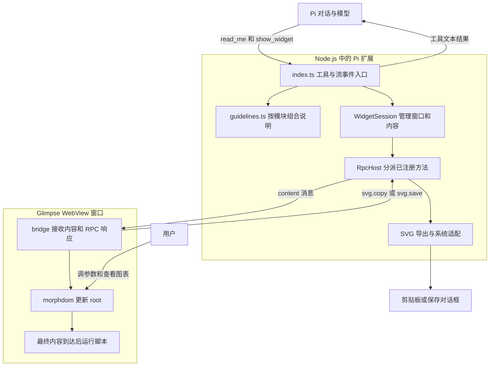
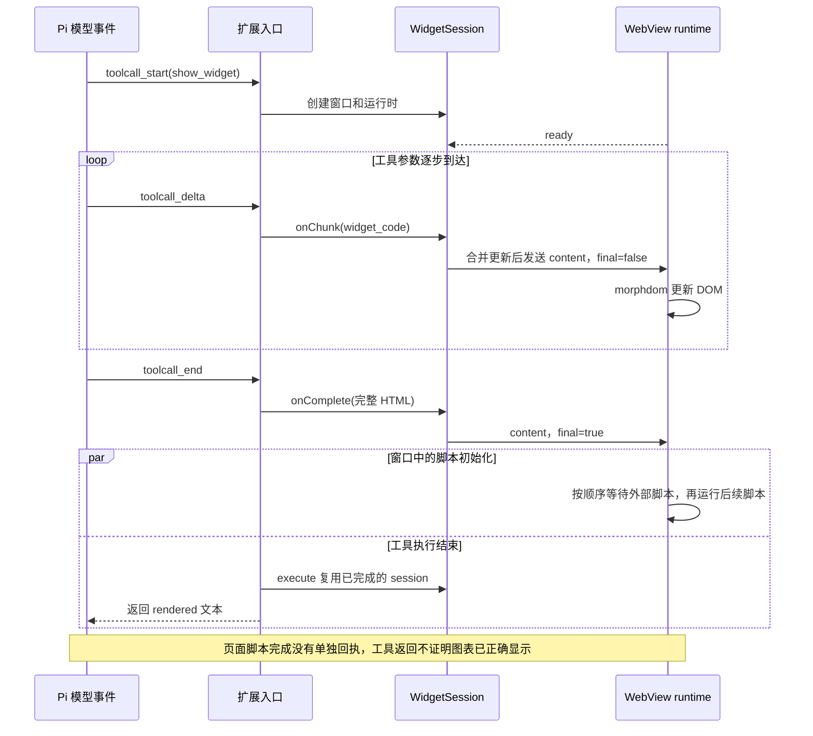

# pi-generative-ui：流式图形窗口与执行边界

`pi-generative-ui` 是运行在 Pi 的 Node.js 进程中的 TypeScript 扩展：模型通过工具参数生成 HTML/SVG，扩展把逐步到达的内容交给 Glimpse 打开的 WebView 窗口。终端负责对话和工具状态，窗口负责图表、滑块和动画。本文实现说明固定到 `v0.3.0` 发布提交 `67e575a` 之后的 `d1abf2c`；两者之间只修改了 README 安装命令。[入口源码](https://github.com/Michaelliv/pi-generative-ui/blob/d1abf2cb38fbf54c4b91d06677c700193d495887/.pi/extensions/generative-ui/index.ts#L41-L107)

## 原文讲清了什么

Michael Liv 在 2026-03-13 的文章中记录了从 Claude 对话和工具响应观察到的模式，并为 Pi 做了复现。值得保留的是四个具体做法：把 HTML 放进工具参数；按任务加载设计说明；用 DOM（文档对象模型）差异更新减少闪烁；先显示结构，最后启用脚本。原文也记录了整页替换、`innerHTML` 替换和按节点数追加的失败尝试，最后采用 `morphdom`。[原文 Part 1–4](https://michaellivs.com/blog/reverse-engineering-claude-generative-ui)

这是一份第三方观察与复现记录。作者关于 Claude 内部实现的解释，需要与自己公开的 Pi 实现分开。特别是原文 “Not an Iframe” 一节的推断不能作为隔离机制的证明：流式内容也能通过消息送进 iframe。MCP Apps 的公开规范同时定义了 iframe 沙箱与部分工具参数通知，已经给出反例；这不等于证明 Claude 自生成视觉内容采用 MCP Apps。[规范：Sandbox proxy](https://github.com/modelcontextprotocol/ext-apps/blob/82221c0c8ce7661efa6771c9d461511b1650495f/specification/2026-01-26/apps.mdx#L470-L487)、[部分参数通知](https://github.com/modelcontextprotocol/ext-apps/blob/82221c0c8ce7661efa6771c9d461511b1650495f/specification/2026-01-26/apps.mdx#L1120-L1142)

## 组件怎样配合

下面是当前 Pi 扩展的进程与消息关系，箭头表示已读源码中的调用。它不描述 Claude 网站的内部结构。

`visualize_read_me` 返回公共说明加选中模块的补充内容，共享章节通过集合去重。`show_widget` 接收代码和窗口参数。设计说明告诉模型使用什么样式，`WidgetSession` 决定内容何时进入窗口，两者职责独立。[模块组合](https://github.com/Michaelliv/pi-generative-ui/blob/d1abf2cb38fbf54c4b91d06677c700193d495887/.pi/extensions/generative-ui/guidelines.ts#L775-L801)、[窗口与 RPC 初始化](https://github.com/Michaelliv/pi-generative-ui/blob/d1abf2cb38fbf54c4b91d06677c700193d495887/.pi/extensions/generative-ui/session.ts#L31-L55)

`i_have_seen_read_me` 只是调用者传入的布尔值：执行入口检查它是否为真，没有查询历史工具调用。它可以提示模型遵循流程，不能证明模型已经读过说明，也不是权限检查。[参数和检查](https://github.com/Michaelliv/pi-generative-ui/blob/d1abf2cb38fbf54c4b91d06677c700193d495887/.pi/extensions/generative-ui/index.ts#L171-L177)

## 一次图表生成怎样完成

源码把连续更新按 150ms 的窗口合并，只保留最新 HTML，跳过过短或完全相同的内容；最终内容会取消待发定时器，并带 `final=true`。页面先用 `morphdom` 修改现有节点，随后在最终内容到达时重建脚本元素，依次等待外部脚本加载，避免初始化代码先于 Chart.js 等依赖执行。[内容生命周期](https://github.com/Michaelliv/pi-generative-ui/blob/d1abf2cb38fbf54c4b91d06677c700193d495887/.pi/extensions/generative-ui/session.ts#L57-L91)、[DOM 与脚本执行](https://github.com/Michaelliv/pi-generative-ui/blob/d1abf2cb38fbf54c4b91d06677c700193d495887/.pi/extensions/generative-ui/runtime/morph.ts#L14-L71)

这里的后置执行针对 `<script>` 元素的初始化顺序，不是对任意 HTML 行为的安全保证；生成内容仍需运行环境提供隔离。

宿主把最终内容交给窗口后即可返回。页面的 `runScripts` 异步运行，失败写入控制台；没有把脚本完成或渲染成功作为工具完成条件。因此 `Widget rendered` 不能代替实际画面核对。[页面入口](https://github.com/Michaelliv/pi-generative-ui/blob/d1abf2cb38fbf54c4b91d06677c700193d495887/.pi/extensions/generative-ui/runtime/index.ts#L26-L42)、[工具返回](https://github.com/Michaelliv/pi-generative-ui/blob/d1abf2cb38fbf54c4b91d06677c700193d495887/.pi/extensions/generative-ui/index.ts#L185-L217)

## 原文之后的实际变化

截至 2026-10-08，仓库最新公开 release 是 2026-06-03 的 `v0.3.0`。它延续了流式 HTML 路线，同时重写了运行时。[发布记录](https://github.com/Michaelliv/pi-generative-ui/releases/tag/v0.3.0)

| 项目 | 文章中的实现 | v0.3.0 的变化 |
| --- | --- | --- |
| 窗口环境 | macOS WKWebView | Glimpse 0.8 系列，加入 macOS、Linux、Windows 适配 |
| 运行时代码 | 在扩展中拼 HTML 和脚本字符串 | 页面侧 TypeScript 由 esbuild 打包，宿主通过带类型的消息发送内容 |
| 外部脚本 | 完成时替换脚本元素 | 逐个等待外部脚本加载，之后才执行后续初始化代码 |
| 用户反馈 | 工具等待输入、关闭或超时 | 交付最终 HTML 后结束；不把窗口点击或输入返回 agent |
| SVG 产物 | 主要用于显示 | 增加复制、保存菜单和系统适配 |

其中最容易误读的是“仅显示”：窗口中的滑块、局部状态和动画仍能工作，只是没有回到 agent 的业务事件。普通 `glimpse.send` 数据会被宿主忽略，符合协议的 RPC（远程过程调用）仍可调用已注册的 `svg.copy`、`svg.save`。因此它适合解释和展示；表单提交后继续让 agent 工作，需要另行设计事件通道。[工具描述](https://github.com/Michaelliv/pi-generative-ui/blob/d1abf2cb38fbf54c4b91d06677c700193d495887/.pi/extensions/generative-ui/index.ts#L146-L165)、[RPC 分派](https://github.com/Michaelliv/pi-generative-ui/blob/d1abf2cb38fbf54c4b91d06677c700193d495887/.pi/extensions/generative-ui/rpc.ts#L38-L69)

## 扩展面与使用限制

- **设计说明与实际权限要分开。** 当前扩展的 HTML 外壳没有声明 CSP（内容安全策略），说明文字里的 CDN（内容分发网络）名单不能证明请求被运行时限制。页面脚本会执行，并能访问注册的宿主 RPC；这里不能据此推断底层 Glimpse 的全部隔离行为。[外壳生成](https://github.com/Michaelliv/pi-generative-ui/blob/d1abf2cb38fbf54c4b91d06677c700193d495887/.pi/extensions/generative-ui/build.mjs#L43-L54)
- **窗口保存与数据持久化不同。** 此版本会在内存中管理窗口，Pi 退出时关闭它们；`svg.save` 通过系统保存对话框写文件。上述实现不提供跨会话恢复图表参数的存储机制。[关闭处理](https://github.com/Michaelliv/pi-generative-ui/blob/d1abf2cb38fbf54c4b91d06677c700193d495887/.pi/extensions/generative-ui/index.ts#L239-L245)、[SVG 写入](https://github.com/Michaelliv/pi-generative-ui/blob/d1abf2cb38fbf54c4b91d06677c700193d495887/.pi/extensions/generative-ui/features/svg-saver.ts#L26-L43)
- **部署成本在本地运行环境。** 扩展依赖 Pi、Glimpse 和各平台 WebView/系统工具；不同系统有不同编译或运行依赖。跨平台声明不等于任意机器安装即用，也不等于所有平台原生窗口都经过同等程度的测试。[安装要求](https://github.com/Michaelliv/pi-generative-ui/blob/d1abf2cb38fbf54c4b91d06677c700193d495887/README.md#L26-L36)
- **设计说明按需拼接，不等于浏览器代码按需下载。** 前者减少模型收到的无关文本；页面运行时和 `morphdom` 已由构建脚本打包进外壳。图表自己的外部依赖仍可能依靠网络。[构建入口](https://github.com/Michaelliv/pi-generative-ui/blob/d1abf2cb38fbf54c4b91d06677c700193d495887/.pi/extensions/generative-ui/build.mjs#L28-L54)

## 相关页面

- [[wiki/syntheses/ai/generative-ui-evolution|生成式 UI 的社区演进与工程边界]]
- [[wiki/topics/ai/agent-harness|Agent Harness]]
- [[wiki/syntheses/frontend/same-origin-iframe-sandbox-design|同源 iframe 沙箱设计]]

## 来源指针

- [[raw/sources/michael-liv-claude-generative-ui|文章与 Pi 源码证据、核查范围]]
- [Michael Liv 原文](https://michaellivs.com/blog/reverse-engineering-claude-generative-ui)
- [pi-generative-ui v0.3.0](https://github.com/Michaelliv/pi-generative-ui/releases/tag/v0.3.0)
- [固定源码快照](https://github.com/Michaelliv/pi-generative-ui/tree/d1abf2cb38fbf54c4b91d06677c700193d495887)
