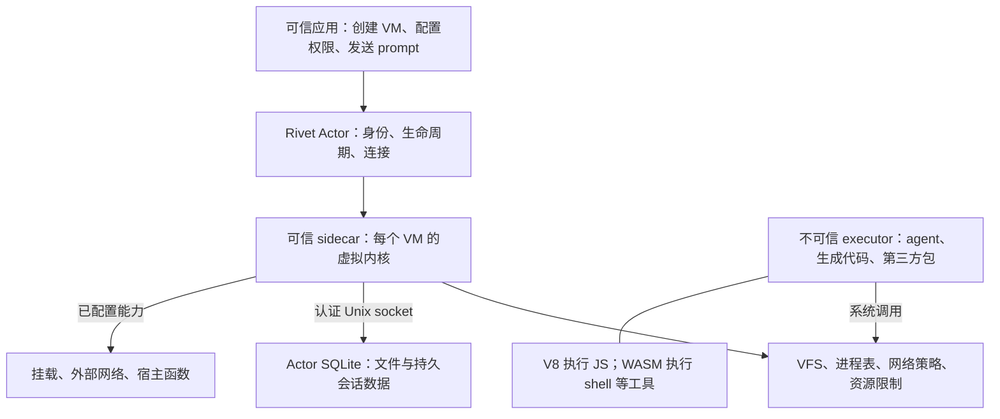
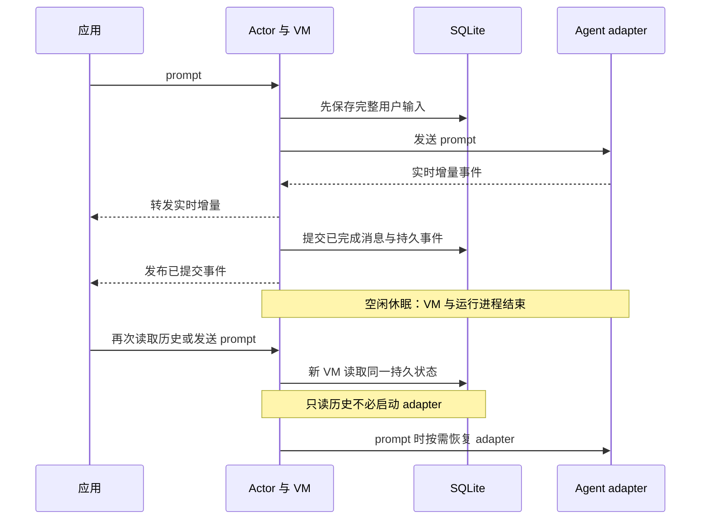
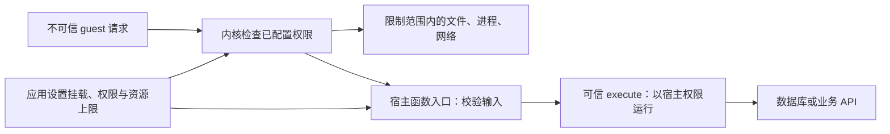

# Rivet agentOS：执行环境与持久会话

## 它解决什么问题

Rivet agentOS 是进程内运行的受控沙箱，通过 V8 执行 JavaScript，通过 WebAssembly 执行 Shell 与核心工具。它用虚拟内核提供文件、进程和网络接口，不是启动完整 Linux 操作系统的系统虚拟机。[架构](https://rivet.dev/agentos/docs/architecture/)、[限制](https://rivet.dev/agentos/docs/limitations/)

它为 coding agent 解决三个问题：

- **在哪里执行**：提供文件、进程、网络和工具执行能力。
- **能访问什么**：限制 agent 可使用的宿主能力。
- **下次怎样继续**：通过会话与恢复接口取回已保存的状态。

截至 2026-10-07，官方仍标为 beta。本文核对文档，未运行 SDK 或验证隔离强度。[介绍](https://rivet.dev/agentos/docs/)、[安全模型](https://rivet.dev/agentos/docs/security-model/)

## 系统结构

下图展示 Actor 部署的主要组件。embedded 使用相同的 VM 能力，但生命周期由应用负责。

这里的 VM 由虚拟内核与受控执行器组成，不能安装任意 Linux 软件。[架构](https://rivet.dev/agentos/docs/architecture/)、[限制](https://rivet.dev/agentos/docs/limitations/)

agent 本身也是 VM 中的 guest 进程。session 在多次 prompt 之间组织 agent 交互，输出通过事件返回应用。数据库持久化的是会话数据，不是把整个执行器的内存原样保存。[架构](https://rivet.dev/agentos/docs/architecture/)、[持久化](https://rivet.dev/agentos/docs/persistence/)

## 两种部署方式

| 维度 | Embedded | Rivet Actors |
| --- | --- | --- |
| 入口 | `@rivet-dev/agentos-core` 的 `AgentOs.create()` | `@rivet-dev/agentos` 的 `agentOS()` 与 registry |
| 生命周期 | 应用创建、释放 VM | Actor 管理休眠和唤醒 |
| 持久化 | 默认内存；由应用配置 database 和 mounts | 自动使用 Actor SQLite |
| 分布式状态、连接与预览 | 应用自己实现 | 提供相应平台能力 |
| 采用代价 | 直接控制更多，也承担恢复和运维 | 依赖 Actor 的部署与运行接口 |

前四行来自 [Embedded quickstart](https://rivet.dev/agentos/docs/quickstart-embedded/)，最后一行是工程判断。不要把 Actor 的自动持久化描述为所有 embedded 实例的默认行为。

## 休眠、恢复与丢失的状态

阅读这个流程时需要区分三点：

- 实时增量事件没有持久序号，已完成消息才会整理为持久更新。
- 如果无法确认 prompt 是否送达，系统不会自动重发。
- 恢复时优先调用 adapter 支持的 [[wiki/topics/ai/agent-client-protocol|ACP（Agent Client Protocol）]] `session/load`。不支持时，用有限的持久历史启动新的 adapter session。

这些行为来自 [Sessions & Persistence](https://rivet.dev/agentos/docs/architecture/sessions-persistence/) 和 [Persistence & Sleep](https://rivet.dev/agentos/docs/persistence/)。

| 状态 | Actor 休眠后 |
| --- | --- |
| `/home/agentos` 文件、会话目录和已完成历史 | 保留 |
| 正在运行的进程、shell、adapter | 不保留；adapter 可按需恢复 |
| 未完成消息增量、实时订阅、内存挂载 | 不保留 |
| VM 内 cron 定义 | 不保留；不能据此推断持久调度已经配置 |

以上依据持久化文档。`destroy` 会删除相应持久数据，与 `sleep` 不同。这里描述的是文档约定，未做故障注入验证。

## 扩展能力与权限边界

Host function 使用 Zod 定义宿主函数的参数和校验规则。agentOS 为它生成 VM 内的 CLI 入口，也允许 guest JavaScript 调用。

业务 API 和凭据可以留在宿主，agent 只接触输入与结果。已有第三方服务也可通过 session 配置的 MCP 接入。[Host Functions](https://rivet.dev/agentos/docs/host-functions/)

权限检查有两层：

- 内核约束 guest 能做什么。
- agent 的工具审批决定某次工具使用是否获准。

应用负责控制谁能修改这些配置。宿主 `execute()` 拥有宿主权限，所以参数类型校验之后，还需要检查调用者是否有权执行相应业务操作。[Security Model](https://rivet.dev/agentos/docs/security-model/)、[Host Functions](https://rivet.dev/agentos/docs/host-functions/)

持久数据库可能以明文保存会话环境、MCP 凭据、prompt 和工具结果。当前文档不承诺自动加密或脱敏，因此也需要保护数据库与备份。[存储说明](https://rivet.dev/agentos/docs/architecture/sessions-persistence/)

## 采用判断与限制

基于上述文档，agentOS 适合需要隔离执行环境，并持续保存会话、文件和用户连接的应用。部署方式按承担的职责选择：

- 希望应用自行管理生命周期，评估 embedded。
- 需要分布式状态和自动休眠唤醒，评估 Actor 部署。

当前不能安装任意原生二进制或使用 apt/yum。Docker、文件监听和硬件访问也有限制。需要完整 Linux 的工作负载应评估外部沙箱，并单独考虑其费用和生命周期。[Limitations](https://rivet.dev/agentos/docs/limitations/)

估算成本时应包含运行资源、持久存储、模型请求和外部沙箱。更换部署接口与恢复方式也可能增加迁移工作。这些是选型判断，本次没有测量吞吐、延迟或实际账单。

## 结论与证据对照

| 结论 | 证据位置 | 置信度与限制 |
| --- | --- | --- |
| 执行边界在 sidecar 与 executor 之间 | Security Model / Trust model | 官方明确；未审计实现 |
| embedded 的默认生命周期与 Actor 不同 | Embedded quickstart / Choosing between Actors and embedded | 官方明确；未试跑 |
| 保存文件和完成历史，不保存整个运行进程 | Persistence & Sleep / What persists | 官方明确；adapter 恢复效果需逐个验证 |
| 持久事件与实时增量不同 | Sessions & Persistence / Session event log | 官方明确；未测中断和重放 |
| 宿主函数扩展会引入宿主权限 | Host Functions / Security | 官方明确；业务授权属于应用职责 |

完整来源链接与核对记录见 [[raw/sources/rivet-agentos]]。

## 相关页面

- [[wiki/topics/ai/agent-harness|Agent Harness]]
- [[wiki/topics/ai/agent-client-protocol|Agent Client Protocol]]
- [[wiki/topics/ai/pi-durable|Pi Durable]]
