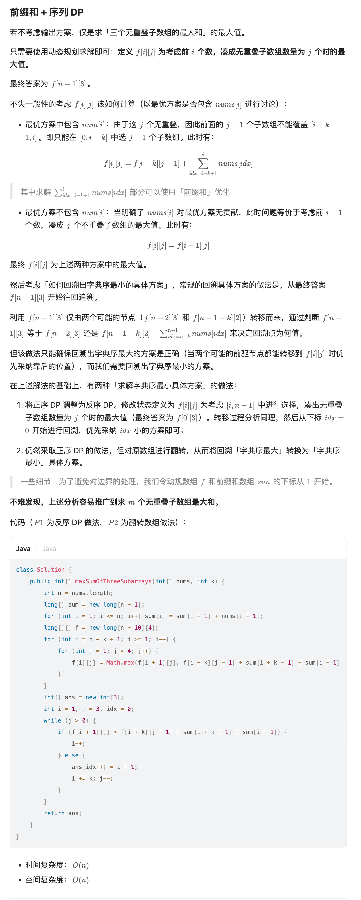

# Dynamic Programming

- 考虑问题能不能拆解成子问题，可以的话就可以考虑 DP，比如题目限制取 k 次，就可以把这一维作为一个状态，看能不能从 k - 1 次推过来，有点像数学归纳法
- LIS：
	- ```cpp
	  std::vector<int> dp(n), f;
	  for (int i = 0; i < n; i++) {
	      auto it = std::lower_bound(f.begin(), f.end(), a[i]);
	      dp[i] = it - f.begin() + 1;
	      if (it == f.end()) {
	         f.push_back(a[i]);
	      } else {
	         *it = a[i];
	      }
	  }

	  int lis = f.size();
	  ```
- SOS DP: https://codeforces.com/blog/entry/45223 O(n * 2^n)
	- 定义 $dp[mask][i]=\{x|x\in mask \&\&\ mask\oplus x < 2 ^{i + 1}\}$ 逐步转移，没有像子集那样重复使用
- https://leetcode.cn/problems/maximize-the-profit-as-the-salesman/
	- 维护 $f(i)$ 表示只考虑前 $i$ 座房子的最大收益。转移方程如下：
	- $$f(i)=max\left\{\begin{matrix}f(i-1) && // 第 i 座房子不卖
	   \\f(l_j-1)+c_j && // 第 j 个人想买从 l_j 到 i 的所有房子，且出价 c_j
	  \end{matrix}\right.$$
	- 因此我们预处理 $n$ 个 `vector`，其中第 $i$ 个 `vector` 保存了所有满足 `r_j=i` 的交易 $(l_j, r_j=i,c_j)$，就能在 $O(n)$ 的复杂度内完成 DP。
	- [[Knapsack DP]]
- https://leetcode.cn/problems/apply-operations-to-make-two-strings-equal/description/
	- 无论是哪种操作，都不会改变 $s_1$​ 中的 $1$ 的个数的奇偶性。
	- 那么只要 $s_1$ 和 $s_2$ 的 $1$ 的个数一个是奇数一个是偶数，就直接返回 $−1$。否则，哪怕只用第二种操作，都一定可以让 $s_1=s_2$
	- $dp[i][op][rev]$ 表示到 $i$ 位还有 $op$ 次可以免费反转，上一位是否翻转的最小操作代价
	- 如果第 $i$ 位相等且上一位没有翻转或者第 $i$ 位不相等且上一位使用了翻转操作，说明此时两位相等，直接找下一位 $dfs(i - 1, op, \rm{false})$
	- 否则当前两位不相等，可以执行操作 $1$ 或者执行操作 $2$ 或者如果 $op$ 大于 $0$ 的话免费借用一次
	- 边界条件是如果 $$op==0\ \&\&\ !rev$$ 说明操作合法返回 $0$，否则返回无穷大表示不合法
	- ```cpp
	  class Solution {
	  public:
	      int INF = 0x3f3f3f3f;
	      int minOperations(string s1, string s2, int x) {
	          if ((count(s1.begin(), s1.end(), '1') & 1) != (count(s2.begin(), s2.end(), '1') & 1)) {
	              return -1;
	          }
	          int n = s1.length();
	          int dp[n][n + 1][2];
	          memset(dp, -1, sizeof(dp));
	          function<int(int, int, bool)> dfs = [&](int idx, int op, bool rev) -> int {
	              if (idx == -1) {
	                  return op == 0 && !rev ? 0 : INF;
	              }
	              if (~dp[idx][op][rev]) {
	                  return dp[idx][op][rev];
	              }
	              if ((s1[idx] == s2[idx]) == !rev) {
	                  return dp[idx][op][rev] = dfs(idx - 1, op, false);
	              }
	              int ret = INF;
	              ret = min(ret, dfs(idx - 1, op, true) + 1);
	              if (op > 0) {
	                  ret = min(ret, dfs(idx - 1, op - 1, false));
	              }
	              ret = min(ret, dfs(idx - 1, op + 1, false) + x);

	              return dp[idx][op][rev] = ret;
	          };  
	          return dfs(n - 1, 0, false);
	      }
	  };

	  ```
- https://leetcode.cn/problems/maximum-sum-of-3-non-overlapping-subarrays/ #Leecode
	- 三个无重叠子数组的最大和
	- 
-

## Source Pointers

- `raw/sources/Dynamic Programming.md`

