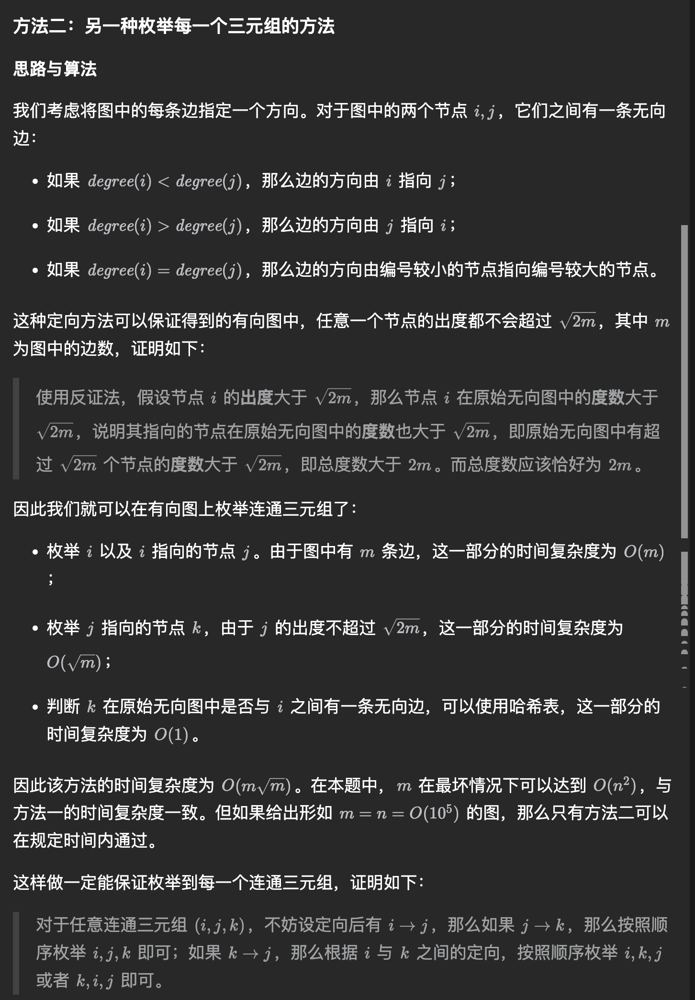

# Graph Theory

- 
	- https://leetcode.cn/problems/minimum-degree-of-a-connected-trio-in-a-graph/description/
	- ```cpp
	  class Solution {
	  public:
	      int minTrioDegree(int n, vector<vector<int>>& edges) {
	          vector<unordered_set<int>> g(n);
	          vector<vector<int>> h(n);
	          vector<int> deg(n);

	          for (auto&& edge: edges) {
	              int x = edge[0] - 1, y = edge[1] - 1;
	              g[x].insert(y);
	              g[y].insert(x);
	              ++deg[x];
	              ++deg[y];
	          }

	          for (auto&& edge: edges) {
	              int x = edge[0] - 1, y = edge[1] - 1;
	              if (deg[x] < deg[y] or (deg[x] == deg[y] and x < y)) {
	                  h[x].push_back(y);
	              } else {
	                  h[y].push_back(x);
	              }
	          }

	          int ans = INT_MAX;
	          for (int i = 0; i < n; ++i) {
	              for (int j: h[i]) {
	                  for (int k: h[j]) {
	                      if (g[i].count(k)) {
	                          ans = min(ans, deg[i] + deg[j] + deg[k] - 6);
	                      }
	                  }
	              }
	          }

	          return ans == INT_MAX ? -1 : ans;
	      }
	  };

	  ```
- https://leetcode.cn/problems/collect-coins-in-a-tree/description/
	- 可以用类拓扑排序的方法把所有不合法的叶子节点删掉，把度数为 1 的丢进队列里，然后删
- [[基环树]]
- [[Shortest Path]]
- 一棵树的最小高度树的根节点为树的直径上的中点，树的直径的中点，可以在 DFS 的时候记录每个节点的父节点，然后不断的跳父节点，找到中点即可
-

## Source Pointers

- `raw/sources/Graph Theory.md`

