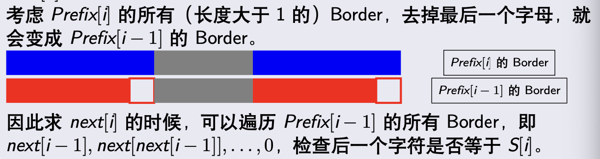
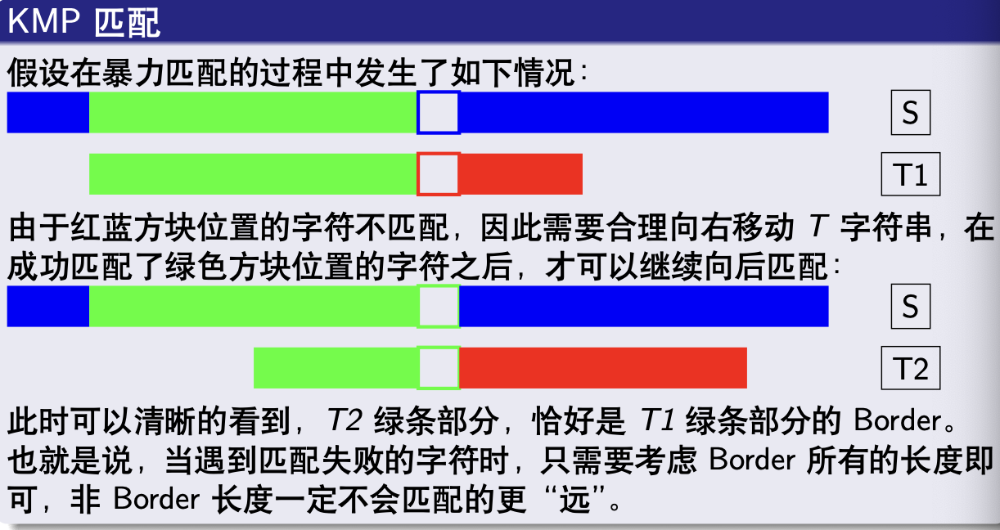

# KMP

- $\rm{next}[i]=\rm{Prefix[i]}$ 的非平凡最大 Border
- $\rm{next}[1] = 0$
- 
- $\rm{Prefix}[i]$ 的所有 Border 去掉最后一个字母一定是 $$\rm{Prefix}[i-1]$$ 的 Border，反过来推不出来，一般这时候可以遍历后者去检验合法性来求
- 
	- 求出 $T$ 的 Border，然后匹配 $S$ 的时候失配就跳 Border 继续匹配

## Source Pointers

- `raw/sources/KMP.md`
