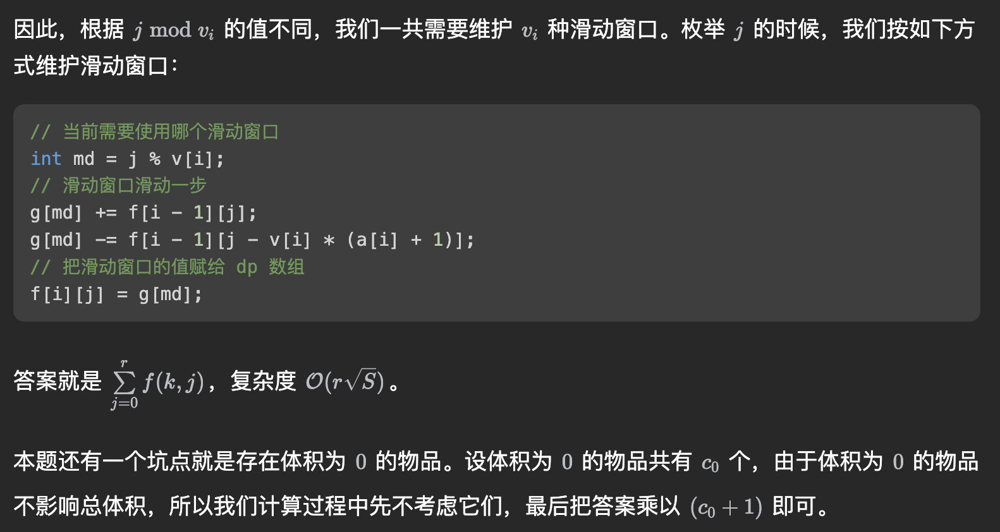

# Knapsack DP

- 背包上界优化：如果当前遍历的物品组成的重量 $up <= W$，去 $up$ 作为上界即可
- 多重背包方案数优化
	- 朴素的求法为 $f[i][j]$ 表示前 $i$ 种物品存储恰好 $j$ 容量的方案数，设第 $i$ 种物品数量为 $c_i$，重量为 $v_i$
	- 转移方程为：$f[i][j] = f[i - 1][j] + f[i - 1][j - v_i] + f[i - 1][j - 2 * v_i] + \dots + f[i - 1][c_i * v_i]$
	- 时间复杂度为 $O(\sum_{i = 1}^{n}c_i* W)$，其中 $n$ 为物品的数量，$W$ 为背包的容量
	- 如果我们观察 $f[i][j - v_i]$ 的转移方程：
		- $f[i][j - v_i] = f[i - 1][j - v_i] + f[i - 1][j - 2 * v_i] + \dots + f[i - 1][c_i * v_i] + f[i - 1][j - (c_i + 1) * v_i]$
		- 可以得到 $$f[i][j] - f[i][j - v_i] = f[i - 1][j] - f[i - 1][j - (c_i + 1) * v_i]$$
		- 整理式子得到 $$f[i][j] = f[i - 1][j] + f[i][j - v_i] - f[i - 1][j - (c_i + 1) * v_i]$$
		- 因此可以发现 $f[i][j]$ 可以在 $O(1)$ 的时间算出
		- 因此时间复杂度可以降到 $$O(nW)$$
	- ```cpp
	  // https://leetcode.cn/problems/count-of-sub-multisets-with-bounded-sum/description/
	  class Solution {
	  public:
	      int P = 1e9 + 7;
	      void add(int& a, int b) { a += b; if (a >= P) a -= P; }
	      int countSubMultisets(vector<int>& nums, int l, int r) {
	          int mx = 0, sum = 0;
	          unordered_map<int, int> cnt;
	          for (int x: nums) {
	              mx = max(mx, x);
	              cnt[x]++;
	              sum += x;
	          }
	          if (sum < l) {
	              return 0;
	          }

	          int LIM = min(sum, r);
	          vector<int> f(LIM + 1, 0);
	          // 题目中存在 0，因为 f[0] 的方案数为 0 的个数 + 空集
	          f[0] = cnt[0] + 1;
	          cnt.erase(0);
	          int up = 0;
	          for (auto& [v, c]: cnt) {
	              vector<int> new_f(f);
	              up += v * c;
	              // 循环的最大上界可以优化，如果当前遍历的物品组成的重量 up <= LIM
	              // 取 up 作为上界即可
	              for (int j = v; j <= min(up, LIM); ++j) {
	                  add(new_f[j], new_f[j - v]);
	                  if (j - (c + 1) * v >= 0) {
	                      add(new_f[j], P - f[j - (c + 1) * v]);
	                  }
	              }
	              f.swap(new_f);
	          }
	          int ans = 0;
	          for (int i = l; i <= LIM; ++i) {
	              add(ans, f[i]);
	          }

	          return ans;
	      }
	  };

	  ```
	- 还有一种写法是对 $v_i$ 取模，等价于要维护 $v_i$ 种滑动窗口，见下面：
		- 
		- ```cpp
		  class Solution {
		  public:
		      int countSubMultisets(vector<int>& nums, int l, int r) {
		          // mx 表示 nums 里的最大值
		          int mx = 0;
		          // cnt[x] 表示大小为 x 的物品有几个
		          unordered_map<int, int> cnt;
		          for (int x : nums) mx = max(mx, x), cnt[x]++;
		          // n 表示共有几种物品
		          int n = cnt.size();

		          const int MOD = 1e9 + 7;
		          auto gao = [&](int LIM) {
		              if (LIM < 0) return 0LL;

		              // g[md] 是第 md 个滑动窗口的元素之和
		              // 这里 g 的大小设为 mx + 1 是因为可能 mx == 0，c++ 不能开大小为 0 的数组
		              long long f[n + 1][LIM + 1], g[mx + 1];
		              memset(f, 0, sizeof(f));
		              f[0][0] = 1;

		              int i = 0;
		              for (auto &p : cnt) if (p.first > 0) {
		                  i++;
		                  memset(g, 0, sizeof(long long) * p.first);
		                  for (int j = 0; j <= LIM; j++) {
		                      // 当前需要使用哪个滑动窗口
		                      int md = j % p.first;
		                      // 滑动窗口滑动一步
		                      g[md] = (g[md] + f[i - 1][j]) % MOD;
		                      int t = j - p.first * (p.second + 1);
		                      if (t >= 0) g[md] = (g[md] - f[i - 1][t] + MOD) % MOD;
		                      // 把滑动窗口的值赋给 dp 数组
		                      f[i][j] = g[md];
		                  }
		              }

		              // 加起来就是答案
		              long long ret = 0;
		              for (int j = 0; j <= LIM; j++) ret = (ret + f[i][j]) % MOD;
		              return ret * (cnt[0] + 1) % MOD;
		          };

		          return (gao(r) - gao(l - 1) + MOD) % MOD;
		      }
		  };

		  ```
-

## Source Pointers

- `raw/sources/Knapsack DP.md`
