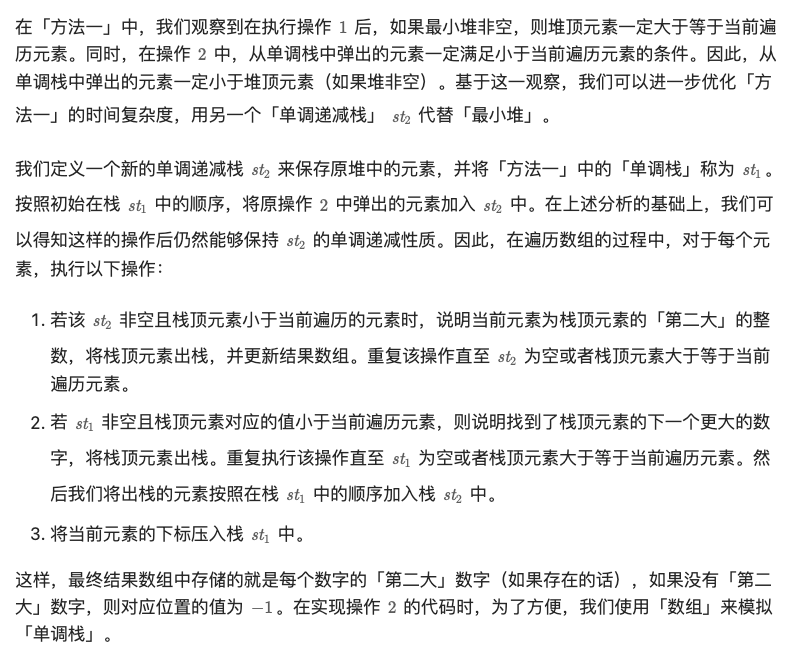

# Monotonic Stack

- ```cpp
  auto gao = [&](vector<long long>& f) {
      stack<int> stk;
      for (int i = 0; i < n; ++i) {
          while (!stk.empty() && maxHeights[stk.top()] >= maxHeights[i]) {
              stk.pop();
          }
          if (stk.empty()) {
              f[i] = 1LL * maxHeights[i] * (i + 1);
          } else {
              f[i] = f[stk.top()] + 1LL * maxHeights[i] * (i - stk.top());
          }
          stk.push(i);
      }
  };

  ```
- https://leetcode.cn/problems/beautiful-towers-ii/description/
- https://leetcode.cn/problems/next-greater-element-iv/description/
	- 
	- ```cpp
	  class Solution {
	  public:
	      vector<int> secondGreaterElement(vector<int>& nums) {
	          int n = nums.size();
	          vector<int> res(n, -1);
	          vector<int> st1, st2;
	          for (int i = 0; i < n; ++i) {
	              int v = nums[i];
	              while (!st2.empty() && nums[st2.back()] < v) {
	                  res[st2.back()] = v;
	                  st2.pop_back();
	              }
	              int pos = st1.size() - 1;
	              while (pos >= 0 && nums[st1[pos]] < v) {
	                  --pos;
	              }
	              st2.insert(st2.end(), st1.begin() + (pos + 1), st1.end());
	              st1.resize(pos + 1);
	              st1.push_back(i);
	          }
	          return res;
	      }
	  };
	  ```

## Source Pointers

- `raw/sources/Monotonic Stack.md`

