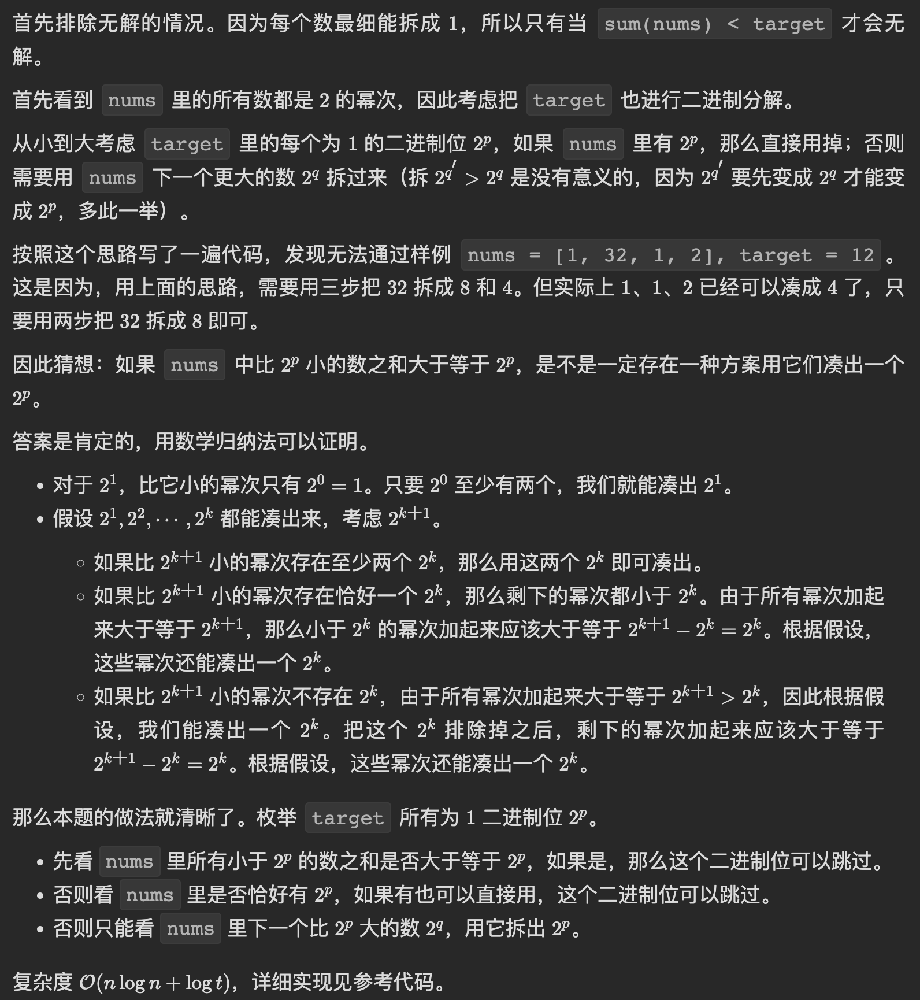
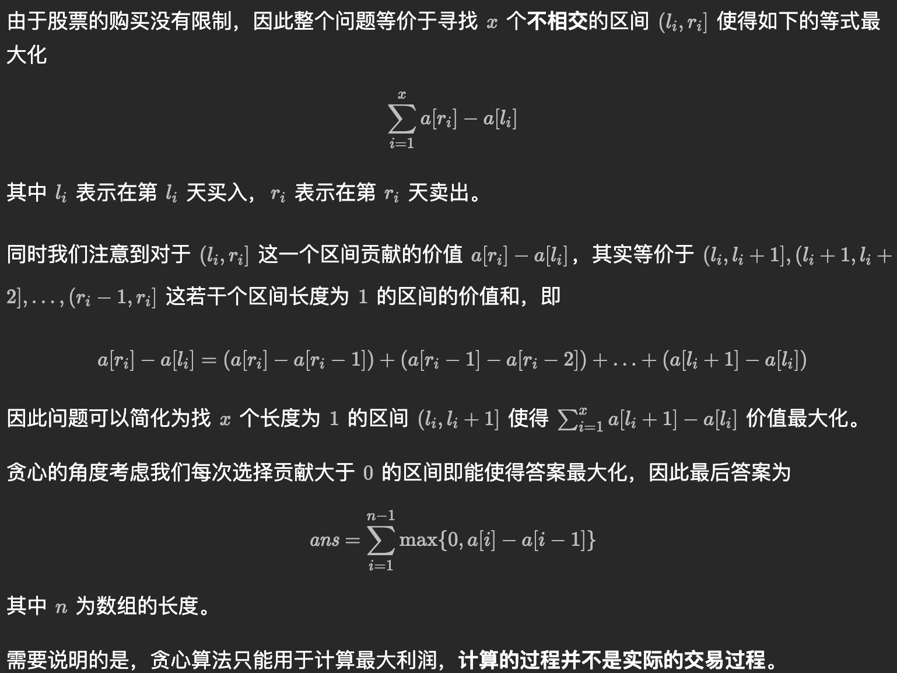

# 解题思路

- 数据范围较小可以考虑枚举 ((633bdc37-f5a7-4095-bbab-1574dde0c25b))
- [[Algorithm]]
- 当该序列是环状序列时，我们应该如何求解呢？
	- 我们可以发现，环状序列相较于普通序列，相当于添加了一个限制：普通序列中的第一个和最后一个数不能同时选。这样一来，我们只需要对普通序列进行两遍动态即可得到答案，第一遍动态规划中我们删去普通序列中的第一个数，表示我们不会选第一个数；第二遍动态规划中我们删去普通序列中的最后一个数，表示我们不会选最后一个数。将这两遍动态规划得到的结果去较大值，即为在环状序列上的答案。
- 
	- https://leetcode.cn/problems/minimum-operations-to-form-subsequence-with-target-sum/description/
- DP 看空间的时候要考虑合法的状态数是不是真的有表面上看起来这么多
	- https://atcoder.jp/contests/abc208/tasks/abc208_e
- https://leetcode.cn/problems/maximum-number-of-k-divisible-components/description/
	- 一条边左右两侧的点权和都是 $k$ 的倍数，那么这条边就可以删除
	- 整棵树已经保证可以被 $k$ 整除，所以只要一侧的点权和为 $k$ 的倍数就可以删掉这条边
	- 从任意点出发搜索，发现子树的点权和是 $k$ 的倍数，就说明子树到上面父节点的这条边是可以删除的
	- 为啥可以任意点，考虑一条可删除的边 $$u\rightarrow v$$，$u$ 是 $v$ 的父节点还是 $v$ 是 $u$ 的父节点都不会影响答案，前者是算 $v$ 为起点的点权和，后者是算 $u$ 为起点的点权和
- 
- 处理前后中插入删除的操作，可以考虑由维护一个数据结构变成维护前后两个数据结构从而降低复杂度，不用在一个数据结构上纠结怎么快速操作
	- https://leetcode.cn/problems/design-front-middle-back-queue/

## Source Pointers

- `raw/sources/解题思路.md`

