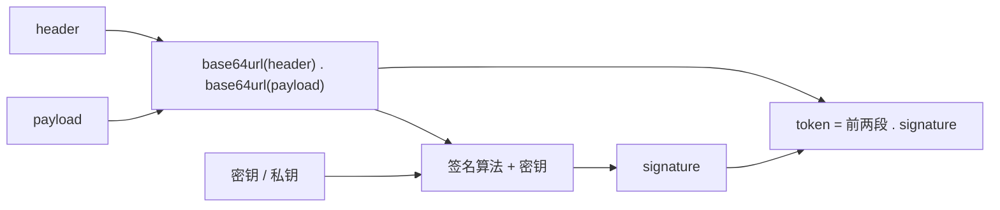

# JWT

## 摘要

JWT（JSON Web Token，RFC 7519）是一种 token 格式：把一组 JSON 字段（claim）编码后连同签名一起发给客户端，服务端验签后直接使用里面的字段，不需要查存储。它只规定 token 长什么样，不规定怎么拿到 token；获取流程由 [[OAuth]] 之类的协议负责。

日常说的 JWT 几乎都是 JWS（签名版，RFC 7515）：**只签名，不加密**。内容也需要保密时用 JWE（RFC 7516），业务里少见。

## 结构

JWS 的紧凑格式是三段 Base64URL 字符串，用 `.` 连接：

```text
eyJhbGciOiJIUzI1NiIsImtpZCI6InYxIn0 . eyJzdWIiOiIxMjMiLCJleHAiOjE3NTc3MDM2MDB9 . SflKxwRJSMeKKF2QT4fwpMeJf36POk6yJV_adQssw5c
            header                                  payload                                     signature
```

| 段 | 内容 | 说明 |
| --- | --- | --- |
| header | `{"alg":"HS256","typ":"JWT","kid":"v1"}` | 签名算法、类型、密钥编号 |
| payload | `{"sub":"123","exp":1757703600}` | 业务字段。只是 Base64URL 编码，任何拿到 token 的人都能解开 |
| signature | `HMAC-SHA256(base64url(header) + "." + base64url(payload), key)` | 覆盖前两段，改任意一个字节都验不过 |



## 标准字段（Registered Claims）

RFC 7519 §4.1 定义，都是可选的，但建议使用：

| 字段 | 含义 |
| --- | --- |
| `iss` | 签发者 |
| `sub` | 主体，一般是用户 ID |
| `aud` | 接收方，校验方应确认自己在其中 |
| `exp` | 过期时间（Unix 秒）。实际使用中应视为必填 |
| `nbf` | 在此时间之前无效 |
| `iat` | 签发时间 |
| `jti` | token 唯一编号，用于黑名单或"只能用一次" |

自定义字段放同一层即可。payload 不要放密码、手机号这类数据，也不要放太大的内容（每个请求都要带）。

## 签名算法

| 算法 | 类型 | 签发 | 校验 | 适合 |
| --- | --- | --- | --- | --- |
| HS256 | 对称（HMAC） | 共享密钥 | 同一个共享密钥 | 只有签发方自己验签 |
| RS256 | 非对称（RSA） | 私钥 | 公钥 | 多个服务各自验签、SSO |
| ES256 | 非对称（ECDSA） | 私钥 | 公钥 | 同上，密钥和签名更短 |
| EdDSA | 非对称（Ed25519） | 私钥 | 公钥 | 同上 |

对称算法的问题是：能验签的一方也能伪造，所以密钥只能放在一个地方。需要让很多服务自己验签时，用非对称算法，把公钥（常见做法是 JWKS 端点）发给它们。

## 签名 ≠ 加密

- 签名（JWS）保证内容没被改过，不保证内容保密。
- 传输保密靠 HTTPS。
- 内容本身需要对持有者保密时，才用 JWE。JWE 的紧凑格式是五段：header、加密后的内容密钥、IV、密文、认证标签。

## JWT 自身的限制

这些限制来自"服务端不存记录"这个设计，不是某个库的缺陷：

1. **签出去就作废不了**：在 `exp` 之前一直有效。要提前作废只能另外存黑名单，这时就不再是纯无状态。
2. **不能原地续期**：`exp` 在签名覆盖范围内，改了就验不过。续期只能签一个新 token。
3. **泄露后拦不住**：纯 JWT 被偷后唯一的止损是等过期，所以 `exp` 不能设长。

这几条如何在工程上取舍，见 [[Session vs JWT vs 双 Token]]。

## 常见攻击与防御

RFC 8725（JWT Best Current Practices）列出了主要问题：

| 攻击 | 做法 | 防御 |
| --- | --- | --- |
| `alg: none` | 把 header 里的算法改成 none，让服务端跳过验签 | 服务端写死允许的算法列表，不信 token 头里声明的算法 |
| 算法混淆 | 把 RS256 改成 HS256，拿公开的公钥当 HMAC 密钥签名 | 同上；每把密钥只绑定一种算法 |
| `kid` 注入 | 在 `kid` 里放路径或 SQL，诱导服务端加载攻击者控制的密钥 | `kid` 只能命中服务端已知的有限集合 |
| 弱密钥 | HS256 用短字符串做密钥，被离线暴力破解 | 用足够长的随机密钥（至少与哈希输出等长） |
| 跨服务复用 | 给 A 服务的 token 拿去调 B 服务 | 校验 `iss`、`aud`；不同用途的 token 用不同密钥或 `typ` 区分 |
| 重放 | 截获合法 token 重复使用 | 短 `exp`；一次性 token 用 `jti` 记录已用 |
| 窃取 | XSS 读 localStorage、抓包 | HTTPS；浏览器里优先放 HttpOnly Cookie；短 `exp` |

## 校验清单

1. 按服务端配置的算法验签，拒绝 `none` 和不在白名单里的算法。
2. 按 `kid` 选密钥，未知 `kid` 直接拒绝。
3. 校验 `exp`、`nbf`（允许少量时钟偏差）。
4. 校验 `iss`、`aud` 是否符合预期。
5. 有撤销需求时，查 `jti` 黑名单或会话记录。
6. 校验通过后再读取业务字段。

## 相关页面

- [[OAuth]]
- [[Session vs JWT vs 双 Token]]
- [[SSO]]

## 来源指针

- RFC 7519 JSON Web Token：https://www.rfc-editor.org/rfc/rfc7519
- RFC 7515 JSON Web Signature：https://www.rfc-editor.org/rfc/rfc7515
- RFC 7516 JSON Web Encryption：https://www.rfc-editor.org/rfc/rfc7516
- RFC 7518 JSON Web Algorithms：https://www.rfc-editor.org/rfc/rfc7518
- RFC 8725 JWT Best Current Practices：https://www.rfc-editor.org/rfc/rfc8725
