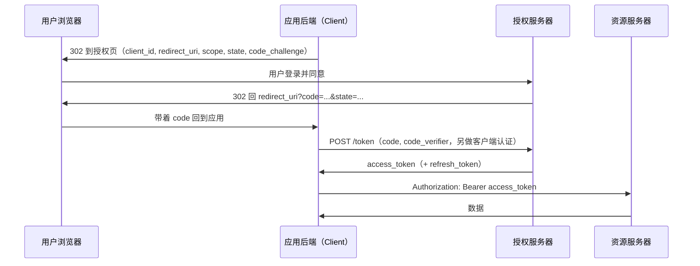
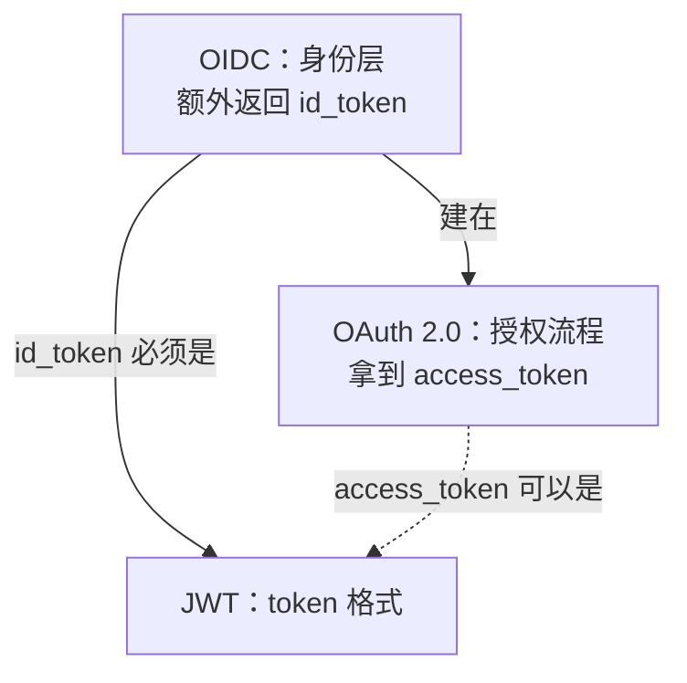

# OAuth

## 摘要

OAuth 2.0（RFC 6749）是一套**授权协议**：客户端获得限定访问范围的 access_token 后访问资源。授权可由资源所有者参与，也可采用客户端凭证等不需要用户交互的方式。

它规定"怎么拿到 token"，不规定"token 长什么样"。token 可以是随机字符串，也可以是 [[JWT]]。OAuth 本身也不负责"用户是谁"，这部分由建在它之上的 OpenID Connect（OIDC）补上。

## 四个角色

| 角色 | 是谁 |
| --- | --- |
| Resource Owner | 用户，数据的所有者 |
| Client | 第三方应用，想代表用户访问数据。事先在授权服务器注册，拿到 `client_id`（机密客户端还需配置客户端认证方式，不一定使用共享 secret） |
| Authorization Server | 负责让用户登录、确认授权、发 token |
| Resource Server | 存放数据的 API，收到请求时校验 access_token |

## 授权方式

| 方式 | 适用场景 | 现状 |
| --- | --- | --- |
| 授权码（Authorization Code）+ PKCE | 有用户参与的 Web、App、SPA | 推荐的默认方式 |
| 客户端凭证（Client Credentials） | 服务对服务，没有用户 | 常用 |
| 设备码（Device Authorization，RFC 8628） | 电视、CLI 等不方便输入或接收回调的设备 | 常用 |
| 刷新（Refresh Token） | 换取新的 access_token | 取决于授权方式与服务器策略；客户端凭证流程通常不签发 refresh_token（RFC 6749 §4.4.3） |
| 隐式（Implicit） | 早期浏览器应用 | RFC 9700 建议不再使用 |
| 密码（Resource Owner Password） | 应用直接收用户密码 | RFC 9700 规定不得使用 |

### 授权码流程



要点：

- `code` 很短（分钟级），只能用一次。
- 图中是有后端的机密客户端：兑换时同时提交 PKCE 的 `code_verifier` 并完成客户端认证，二者不互相替代。公开客户端也可直接兑换，但不应依赖保存在浏览器或 App 中的共享 secret。
- `state` 用来确认回调是自己发起的，防止伪造的回调（CSRF）。
- PKCE（RFC 7636）：客户端先生成随机的 `code_verifier`，授权请求里带它的哈希 `code_challenge`，换 token 时带原值。即使 `code` 被截获，没有 `code_verifier` 也换不到 token。原本为没有 secret 的公开客户端（App、SPA）设计。RFC 9700 规定公开客户端必须用，机密客户端推荐用。

### 设备码流程

设备先向授权服务器申请 `device_code` 和一个短的 `user_code`，把 `user_code` 和验证网址展示给用户；用户在手机或电脑浏览器上打开网址、输入 `user_code` 并同意；设备在后台按 `interval` 轮询 token 接口，直到拿到 token 或 `device_code` 过期。设备本身不需要接收回调。

## access_token 的三种实现

| 实现 | 资源服务器怎么校验 | 能立刻作废 | 代价 |
| --- | --- | --- | --- |
| 随机字符串（引用型 / opaque） | 查询共享记录或调用内省接口 | 取决于记录更新和缓存传播 | 需要查询或缓存状态 |
| 签名 JWT（RFC 9068 定义了 access_token 的 JWT 格式） | 验签并校验 claims | 仅本地验证不能及时获知撤销；可增加状态检查 | 撤销及时性与查询成本需要取舍 |
| 加密 JWT（JWE） | 解密并验证完整性与 claims；若内层还有 JWS，再验签 | 仍取决于撤销状态检查 | 增加密钥管理与加密处理 |

### 内省接口（RFC 7662）

内省接口可返回 token 的 `active` 状态及适用的 claims。它既可用于 opaque token，也可用于 JWT；不是随机字符串的唯一校验方式。端点 URL 由部署配置，不必叫 `/introspect`。缓存内省结果会影响撤销生效时间（RFC 7662 §2）。

### 撤销接口（RFC 7009）

RFC 7009 要求撤销端点支持 refresh_token，并建议支持 access_token；端点 URL 不必叫 `/revoke`。JWT access_token 的撤销也能生效，但资源服务器需要通过状态查询、通知等方式得知撤销；只做本地验证的服务器可能继续接受它直到过期。撤销 refresh_token 是否连带撤销 access_token，还取决于服务器的支持和策略。

## 使用 access_token

RFC 6750 规定的标准方式是请求头：

```http
Authorization: Bearer <access_token>
```

不要放在 URL 查询参数里，容易进日志和浏览器历史。

## OAuth、OIDC、JWT 的关系



- OAuth 管授权：第三方应用能访问什么。
- OIDC 在授权码流程上加了 `openid` scope 和 `id_token`，回答"用户是谁"，常用于 [[SSO]] 和"用 XX 账号登录"。
- JWT 只是格式。只做自己系统的前后端登录，不需要 OAuth，用 Session 或 JWT + refresh_token 即可，见 [[Session vs JWT vs 双 Token]]。

## refresh_token 的安全要求（RFC 9700 §4.14）

对公开客户端，授权服务器必须（MUST）用下面至少一种方式发现 refresh_token 被重放：

- **轮换**：每次刷新发新的 refresh_token，旧的作废；检测到旧的被再次使用时，撤销该轮换关系中当前有效的 refresh_token，要求重新授权。
- **绑定发送方**：把 refresh_token 和客户端持有的密钥绑定（如 DPoP，RFC 9449），仅取得 token 而没有对应密钥，无法通过发送方证明；密钥也泄露时仍有风险。

## 原始笔记

- https://www.ruanyifeng.com/blog/2019/04/oauth_design.html
- OAuth 就是一种授权机制。数据的所有者告诉系统，同意授权第三方应用进入系统，获取这些数据。系统从而产生一个短期的进入令牌（token），用来代替密码，供第三方应用使用
- 一般第三方应用要先去系统注册获取 client id 和 secret
- 第三方应用会向系统携带 client id，告诉系统是谁在请求，用户授权以后会 redirect 到第三方应用的网址，携带授权码，然后请求业务后端，业务后端用 client id 和 secret 加授权码去请求系统的令牌，再跳回到前端（可以是裸的令牌，可以是和业务绑定后的 token），然后前端就可以用这个令牌（以用户的身份）去请求用户在系统的信息了
- 看着向 Github 注册的 **Homepage URL** 和 **Authorization callback URL** 不会校验端口，只会校验域名和 callback 的 path
- ~~TODO 如何结合这个进一步设计登录态？~~ 见 [[Session vs JWT vs 双 Token]]

## 相关页面

- [[JWT]]
- [[Session vs JWT vs 双 Token]]
- [[SSO]]

## 来源指针

- `raw/sources/OAuth.md`
- 阮一峰《OAuth 2.0 的一个简单解释》：https://www.ruanyifeng.com/blog/2019/04/oauth_design.html
- RFC 6749 OAuth 2.0：https://www.rfc-editor.org/rfc/rfc6749
- RFC 6750 Bearer Token Usage：https://www.rfc-editor.org/rfc/rfc6750
- RFC 7636 PKCE：https://www.rfc-editor.org/rfc/rfc7636
- RFC 8628 Device Authorization Grant：https://www.rfc-editor.org/rfc/rfc8628
- RFC 7662 Token Introspection：https://www.rfc-editor.org/rfc/rfc7662
- RFC 7009 Token Revocation：https://www.rfc-editor.org/rfc/rfc7009
- RFC 9068 JWT Profile for Access Tokens：https://www.rfc-editor.org/rfc/rfc9068
- RFC 9700 OAuth 2.0 Security Best Current Practice：https://www.rfc-editor.org/rfc/rfc9700
- OpenID Connect Core 1.0：https://openid.net/specs/openid-connect-core-1_0.html
