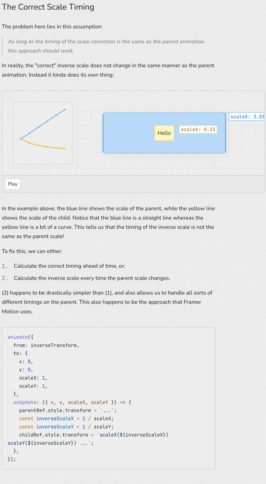

# 2023.05.08-2023.05.21

title:: 2023.05.08-2023.05.21

- Open Resource
  DEADLINE: <2023-05-21 Sun 18:00>
	- TODO 贡献一个 Block Suite 的 PR
	- TODO 贡献一个 Open Sumi 的 PR
- 清理 Tab
  DEADLINE: <2023-05-21 Sun 18:00>
	- DONE 5 个，并有记录
		- https://www.nan.fyi/magic-motion #[[Front End]]
			- 介绍了 https://github.com/framer/motion 使用的 FILP 这个动画技术，传统 CSS 属性不能 animate everything（https://developer.mozilla.org/en-US/docs/Web/CSS/CSS_animated_properties），像 justify-content 这些就不行，然后你直接改布局属性触发 transition 的话每次都会 layout，会有性能开销
			- 基于 transform 的动画开销会小一些
				- On the other hand, the browser can animate CSS properties like `transform` much faster because they don't affect layout
			- FILP(First Last Inverse Play) 就是计算出变换后的位置和变换前的位置差，然后改变变换后的位置以后用 transform 计算出要回到变换前的位置偏移量，最后用动画将偏移量变成 0，就回到变换后的位置了
				- 如果是大小的话计算比例，然后用 scale 去变换即可，变换到 scale(1)
				- 最好将变换中心定成 center，不然如果又变大又位置，计算的便宜量就会有误差
				- 如果有孩子节点不想让它有 scale 的动画，可以设置孩子相反的 scale 动画来抵消
					- 另一个坑：直接分别设置两者的动画的话因为变换的时间点不一致，会导致有问题，具体解决办法就是变换的时候计算出孩子节点的变换同时设置
					- 
				- ```js
				  import React from 'react'
				  import { animate } from 'popmotion'

				  export default function Motion({ toggled, corrected, children }) {
				    const squareRef = React.useRef();
				    const childRef = React.useRef();

				    const initialPositionRef = React.useRef();

				    React.useLayoutEffect(() => {
				      const box = squareRef.current?.getBoundingClientRect();
				      if (changed(initialPositionRef.current, box)) {
				        const transform = invert(squareRef.current, box, initialPositionRef.current)

				        animate({
				          from: transform,
				          to: { x: 0, y: 0, scaleX: 1, scaleY: 1 },
				          duration: 1000,
				          onUpdate: ({ x, y, scaleX, scaleY }) => {
				            squareRef.current.style.transform = 
				              `translate(${x}px, ${y}px) scaleX(${scaleX}) scaleY(${scaleY})`;
				            if (corrected) {
				              childRef.current.style.transform = `scaleX(${1 / scaleX}) scaleY(${1 / scaleY})`;
				            }
				          }
				        })
				      }
				      initialPositionRef.current = box;
				    });

				    return (
				      <div 
				        id="motion"
				        ref={squareRef}
				        style={{
				          width: toggled && '100%',
				          aspectRatio: 'initial',
				          height: 120
				        }}
				      >
				        <div ref={childRef}>{children}</div>
				      </div>
				    );
				  }

				  const changed = (initialBox, finalBox) => {
				    // we just mounted, so we don't have complete data yet
				    if (!initialBox || !finalBox) return false;

				    // deep compare the two boxes
				    return JSON.stringify(initialBox) !== JSON.stringify(finalBox);
				  }

				  const invert = (el, from, to) => {
				    const { x: fromX, y: fromY, width: fromWidth, height: fromHeight } = from;
				    const { x, y, width, height } = to;

				    const transform = {
				      x: x - fromX - (fromWidth - width) / 2,
				      y: y - fromY - (fromHeight - height) / 2,
				      scaleX: width / fromWidth,
				      scaleY: height / fromHeight,
				    };

				    el.style.transform = `translate(${transform.x}px, ${transform.y}px) scaleX(${transform.scaleX}) scaleY(${transform.scaleY})`;

				    return transform;
				  }

				  ```
- English
  DEADLINE: <2023-05-21 Sun 18:00>
	- TODO 背 100 个英语单词
- Reading
  DEADLINE: <2023-05-21 Sun 18:00>
	- ((6457b48f-9f63-458f-9228-354070014807))
	  id:: 64623e28-d1e6-4de4-a8ce-3ed2ebd35ece
- Project
  DEADLINE: <2023-05-21 Sun 18:00>
	- ((645396a0-2d6e-458a-8e09-26b51a0d3444))
	  id:: 64623e28-ff90-4f99-a9f8-640b2a4177c4
	- ((645396a0-8eb8-46a1-8403-0cf327c491e7))
	  id:: 64623e28-de1c-4d09-a366-1279482674d8
- 其他
  DEADLINE: <2023-05-21 Sun 18:00>
	- 有时间学习一下 qwik / svelte
	- 有时间总结一下 RSC 的原理和 Block Suite 架构
- **回顾：**完成率依然很低，这周看到之前提的两个 PR 都有问题，一个被继续 fix，一个被 revert，有点怀疑自己，想起了 siyuan 说的，拿到一份仓库要先构建对他的架构认识，再去读细的代码，觉得还是很有道理的，对 LogSeq 还是保守的先读代码，自己调调，再看看能不能提交高质量的代码吧。
	- 不过清理 TODO 还是很快乐的，后面要继续保持，有时间要读一读 Clojure 的教材，感觉理解还是太片面了
-

## Source Pointers

- `raw/sources/2023.05.08-2023.05.21.md`

