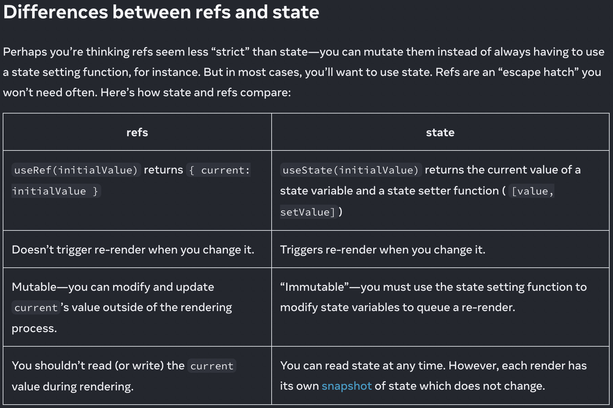

# Ref

- ref 是一种逃离 React 现有体系的方式，存储 DOM，timer ID，etc..
- 它的值不会触发 React 的二次渲染
- 可以通过 [[useRef]] 去获取一个 ref 对象
- 不要在渲染的时候去读取 ref.current，这会造成意料之外的结果
- 如果你需要一个值看，它的改变不需要触发 UI 的渲染，使用 ref 会比 state 更加的高效
- ```js
  function useRef(initialValue) {
    const [ref, unused] = useState({ current: initialValue });
    return ref;
  }
  ```
- 
- 父子组件 ref 管理——forwardRef & useImperativeHandle(暴露有限的接口给父组件而不是直接暴露 DOM)
- 不要修改被 React 持有的 DOM 元素，除非修改的部分 React 没有理由去更新（比如一个空的 div，我去增加删除里面的元素）
- callback refs 优于 useRef + useCallback。
	- ```tsx
	  // 🚫
	  const ref = useRef(null);
	  useEffect(() => {
	    ref.current?.scrollIntoView({ behavior: "smooth" });
	  }, []);
	  return <input ref={ref} />;
	  
	  // ✅
	  const ref = useCallback((node) => {
	    node?.scrollIntoView({ behavior: "smooth" });
	  }, []);
	  return <input ref={ref} />;
	  ```
- 一个思路：所有 ref 属性都只是函数
	- ```tsx
	  // 前者是后者的语法糖
	  <div ref={ref} />
	  <div ref={(node) => {ref.current = node}} />
	  ```

## Source Pointers

- `raw/sources/Ref.md`
