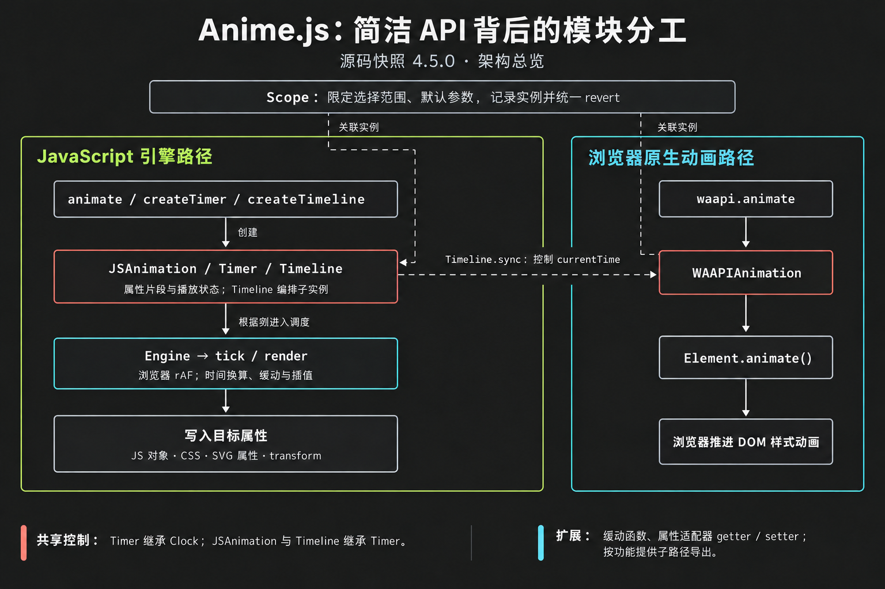
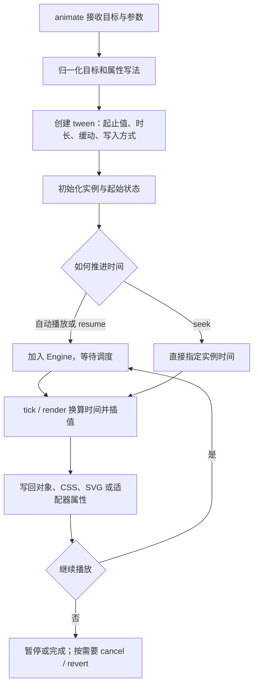

# Anime.js

## 摘要

Anime.js 是一个通用 JavaScript 动画库：调用者描述目标属性怎样随时间变化，库负责解析参数、推进时间、插值和写回属性。它既能更新网页元素，也能更新普通 JavaScript 对象；对象动画可以在 Node.js 中运行，DOM、布局和浏览器原生动画则需要浏览器能力。[目标解析](https://github.com/juliangarnier/anime/blob/01b81be1df6843ccfe0a71c0699a746bf740dd77/src/core/targets.js#L54-L61)、[运行环境选择](https://github.com/juliangarnier/anime/blob/01b81be1df6843ccfe0a71c0699a746bf740dd77/src/engine/engine.js#L41-L44)

它的入口看起来简单，是因为复杂度被放在了参数归一化和共享的播放控制里。`animate()` 返回可控制的 `JSAnimation`，`createTimeline()` 返回编排多个动画的 `Timeline`；两者复用 `Timer` 的播放状态，再由 `Engine` 统一推进。本文依据 2026-10-07 clone 的源码提交 `01b81be1df6843ccfe0a71c0699a746bf740dd77`，该快照的 `package.json` 版本为 `4.5.0`，不把默认分支快照等同于所有已发布安装包。[JSAnimation](https://github.com/juliangarnier/anime/blob/01b81be1df6843ccfe0a71c0699a746bf740dd77/src/animation/animation.js#L216-L244)、[Timeline](https://github.com/juliangarnier/anime/blob/01b81be1df6843ccfe0a71c0699a746bf740dd77/src/timeline/timeline.js#L137-L164)

## 架构：哪些模块负责哪些事



图中实线表示创建或执行关系，虚线表示 Scope 的实例管理和可选的时间同步。它是运行结构概览；继承关系单独写在下表，避免把调用箭头误当成类继承。

| 模块 | 职责与关系 | 源码 |
| --- | --- | --- |
| `Clock` | 保存时间、帧率与播放速度等公共状态，供 `Engine` 和 `Timer` 继承 | [clock.js](https://github.com/juliangarnier/anime/blob/01b81be1df6843ccfe0a71c0699a746bf740dd77/src/core/clock.js#L17-L103) |
| `Timer` | 继承 `Clock`，提供暂停、恢复、跳转、循环、回调和完成状态，不要求有被动画化的属性 | [timer.js](https://github.com/juliangarnier/anime/blob/01b81be1df6843ccfe0a71c0699a746bf740dd77/src/timer/timer.js#L108-L198) |
| `JSAnimation` | 继承 `Timer`，把每个目标的每个属性拆成 tween（两值间的插值片段），保存起止值、时长、缓动与写入方式 | [animation.js](https://github.com/juliangarnier/anime/blob/01b81be1df6843ccfe0a71c0699a746bf740dd77/src/animation/animation.js#L246-L369) |
| `Timeline` | 继承 `Timer`，持有子实例、标签和时间偏移，按自己的时间控制子动画 | [timeline.js](https://github.com/juliangarnier/anime/blob/01b81be1df6843ccfe0a71c0699a746bf740dd77/src/timeline/timeline.js#L137-L184) |
| `Engine` 与 `tick / render` | Engine 遍历正在运行的根实例；render 换算时间并插值，tick 还会推进时间线的子实例 | [engine.js](https://github.com/juliangarnier/anime/blob/01b81be1df6843ccfe0a71c0699a746bf740dd77/src/engine/engine.js#L60-L88)、[render.js](https://github.com/juliangarnier/anime/blob/01b81be1df6843ccfe0a71c0699a746bf740dd77/src/core/render.js#L364-L409) |
| `Scope` | 设置选择器查找范围和默认参数，记录其中创建的实例，以便统一刷新和恢复 | [scope.js](https://github.com/juliangarnier/anime/blob/01b81be1df6843ccfe0a71c0699a746bf740dd77/src/scope/scope.js#L41-L143) |
| `WAAPIAnimation` | 独立的包装类，通过 `Element.animate()` 创建浏览器原生动画，不继承 `Timer` | [waapi.js](https://github.com/juliangarnier/anime/blob/01b81be1df6843ccfe0a71c0699a746bf740dd77/src/waapi/waapi.js#L186-L245)、[原生动画创建](https://github.com/juliangarnier/anime/blob/01b81be1df6843ccfe0a71c0699a746bf740dd77/src/waapi/composition.js#L58-L84) |

浏览器中的 Engine 默认使用 `requestAnimationFrame`（随浏览器绘制节奏调度回调，简称 rAF）；Node.js 分支用 `setImmediate`。普通 `animate()` 不会自动切换成 WAAPI，需要显式调用 `waapi.animate()`。`Timeline.sync()` 是两条路径的一个连接点：它先暂停被同步对象，再把该对象的 `currentTime` 作为属性推进。[调度入口](https://github.com/juliangarnier/anime/blob/01b81be1df6843ccfe0a71c0699a746bf740dd77/src/engine/engine.js#L41-L44)、[sync 实现](https://github.com/juliangarnier/anime/blob/01b81be1df6843ccfe0a71c0699a746bf740dd77/src/timeline/timeline.js#L268-L285)

## API 为什么能写得短

### 1. 创建时描述目标，运行时控制实例

`animate(targets, parameters)` 的第一个参数可以是选择器、DOM 元素、对象或数组；第二个参数同时描述属性变化和播放选项。返回值不是一次性结果，而是具有 `pause()`、`resume()`、`seek()`、`restart()`、`cancel()`、`revert()` 等方法的实例。这样调用者可以先创建，再交给按钮、滚动事件或时间线控制。[目标归一化](https://github.com/juliangarnier/anime/blob/01b81be1df6843ccfe0a71c0699a746bf740dd77/src/core/targets.js#L54-L106)、[创建入口](https://github.com/juliangarnier/anime/blob/01b81be1df6843ccfe0a71c0699a746bf740dd77/src/animation/animation.js#L791-L801)、[实例控制](https://github.com/juliangarnier/anime/blob/01b81be1df6843ccfe0a71c0699a746bf740dd77/src/timer/timer.js#L365-L498)

下面的对象动画不依赖 DOM，时间单位使用默认的毫秒：

```js
import { animate } from 'animejs';

const state = { value: 0, opacity: 0 };
const animation = animate(state, {
  value: { to: 100, duration: 1000 },
  opacity: [0, 1],
  duration: 500,
  ease: 'linear',
  autoplay: false,
});

animation.seek(250);
// state.value === 25，state.opacity === 0.5
animation.revert();
```

### 2. 常见写法简短，特殊属性可以覆盖

属性值可以直接写终点 `value: 100`，写起止值 `value: [0, 100]`，也可以写完整对象 `value: { from: 0, to: 100, duration: 1000 }`。公共 `duration` / `ease` 减少重复，单个属性自己的设置覆盖公共设置；构造函数最终把这些写法归一成内部的 tween。上例的 `value` 因此持续 1000 毫秒，`opacity` 使用公共的 500 毫秒。[参数与关键帧归一化](https://github.com/juliangarnier/anime/blob/01b81be1df6843ccfe0a71c0699a746bf740dd77/src/animation/animation.js#L263-L369)

值和延迟还可以是按目标计算的函数，例如 `delay: (_, i) => i * 50`。这让一组元素共用一份配置，并按索引错峰；这些函数用于解析动画参数，不等于每帧订阅应用状态。需要重新计算函数形式的起止值时，实例提供 `refresh()`。[函数值解析](https://github.com/juliangarnier/anime/blob/01b81be1df6843ccfe0a71c0699a746bf740dd77/src/core/values.js#L82-L102)、[refresh](https://github.com/juliangarnier/anime/blob/01b81be1df6843ccfe0a71c0699a746bf740dd77/src/animation/animation.js#L735-L765)

这种写法的代价是**属性名与配置名共用一个对象空间**。源码用默认参数表区分配置项和待动画化的属性，因此业务对象若也有 `duration` 这样的属性，就不能直接把顶层 `duration` 当作普通属性动画。这是简短 API 带来的具体约束。[isKey](https://github.com/juliangarnier/anime/blob/01b81be1df6843ccfe0a71c0699a746bf740dd77/src/core/helpers.js#L64-L66)、[保留参数表](https://github.com/juliangarnier/anime/blob/01b81be1df6843ccfe0a71c0699a746bf740dd77/src/core/globals.js#L43-L71)

### 3. 时间线描述位置，不靠一串回调接续

`createTimeline()` 提供链式 `add()`、`label()`、`call()` 和 `sync()`。子动画除了目标和参数，还有第三个参数 `position`：可以是绝对时间、标签或相对位置。调用者描述动画在时间轴上的位置，时间线负责计算偏移，因此同一组动画可以整体跳转和倒放。[add 接口](https://github.com/juliangarnier/anime/blob/01b81be1df6843ccfe0a71c0699a746bf740dd77/src/timeline/timeline.js#L166-L184)、[位置解析](https://github.com/juliangarnier/anime/blob/01b81be1df6843ccfe0a71c0699a746bf740dd77/src/timeline/position.js#L35-L73)

```js
import { createTimeline } from 'animejs';

const a = { value: 0 };
const b = { value: 0 };
const timeline = createTimeline({
  autoplay: false,
  defaults: { duration: 400, ease: 'linear' },
})
  .label('intro', 0)
  .add(a, { value: 100 }, 'intro')
  .add(b, { value: 200 }, 'intro+=200');

timeline.seek(400);
// a.value === 100，b.value === 100；总时长 600 毫秒
```

`defaults` 用于子动画的默认参数，时间线自己的循环等播放设置另行指定。还有一个容易按别的库习惯记错的细节：这里的 `<` 表示前一个子动画的结束位置，`<<` 才是它的开始位置。[子动画默认值](https://github.com/juliangarnier/anime/blob/01b81be1df6843ccfe0a71c0699a746bf740dd77/src/timeline/timeline.js#L137-L159)、[相对位置语义](https://github.com/juliangarnier/anime/blob/01b81be1df6843ccfe0a71c0699a746bf740dd77/src/timeline/position.js#L35-L42)

### 4. Scope 统一管理创建范围与清理

`createScope({ root, defaults, mediaQueries })` 的作用是限定选择器范围、设置局部默认值，并登记在其执行上下文中创建的实例。`scope.revert()` 会逐个恢复这些实例，调用清理回调并移除媒体查询监听。它管理的是动画生命周期，不是完整的应用状态。[Scope 创建与执行](https://github.com/juliangarnier/anime/blob/01b81be1df6843ccfe0a71c0699a746bf740dd77/src/scope/scope.js#L41-L143)、[Scope 恢复](https://github.com/juliangarnier/anime/blob/01b81be1df6843ccfe0a71c0699a746bf740dd77/src/scope/scope.js#L226-L249)

React 的官方用法是在 effect 中创建 Scope，并在 effect 清理时调用 `revert()`。实例级别也要区分 `pause()`、`cancel()` 和 `revert()`：暂停保留继续播放的状态，取消停止并解除 tween 的关联，恢复则还会回到起始状态并恢复受影响的值或样式。不要把 `cancel()` 当成“撤销画面变化”。[暂停与恢复播放](https://github.com/juliangarnier/anime/blob/01b81be1df6843ccfe0a71c0699a746bf740dd77/src/timer/timer.js#L365-L391)、[取消与恢复](https://github.com/juliangarnier/anime/blob/01b81be1df6843ccfe0a71c0699a746bf740dd77/src/timer/timer.js#L450-L489)、[React 集成](https://animejs.com/documentation/getting-started/using-with-react/)

### 5. 把扩展点放在值、时间与属性写入处

扩展可以只提供缓动函数，也可以通过 `animejs/adapters` 注册目标识别器和属性 getter / setter，让已有动画流程更新带有自定义读写方法的对象。`render` 在写入属性时会优先调用已解析的 setter，否则使用对象属性、DOM attribute、CSS 或 transform 的默认写法。[适配器用法](https://github.com/juliangarnier/anime/blob/01b81be1df6843ccfe0a71c0699a746bf740dd77/src/adapters/registry.js#L1-L16)、[写入目标](https://github.com/juliangarnier/anime/blob/01b81be1df6843ccfe0a71c0699a746bf740dd77/src/core/render.js#L255-L284)

包还提供 `animejs/animation`、`animejs/timeline`、`animejs/waapi` 等子路径，便于按功能导入；实际打包结果仍取决于使用的功能和构建工具，不能把源码分模块直接等同于某个固定包体。[package.json](https://github.com/juliangarnier/anime/blob/01b81be1df6843ccfe0a71c0699a746bf740dd77/package.json)

## 一次普通动画怎样执行



这张图只展开普通 JavaScript 动画。构造时解析的每个 tween 记录目标、属性、起止值、缓动和时间范围；每次更新把实例时间转换成片段进度，经过缓动后插值并写回属性。Timeline 则先用自己的时间减去各子实例的偏移，再推进它们。[tween 数据](https://github.com/juliangarnier/anime/blob/01b81be1df6843ccfe0a71c0699a746bf740dd77/src/animation/animation.js#L551-L625)、[插值和写入](https://github.com/juliangarnier/anime/blob/01b81be1df6843ccfe0a71c0699a746bf740dd77/src/core/render.js#L209-L284)、[子实例时间换算](https://github.com/juliangarnier/anime/blob/01b81be1df6843ccfe0a71c0699a746bf740dd77/src/core/render.js#L398-L409)

## 与 Motion 的关系

**Anime.js 与 Motion 都属于动画库，Anime.js 的 `animate()` 与 Motion JavaScript API 最接近。** Motion for React 提供与 React 状态、手势和布局绑定的声明式组件接口；Its Hover 则是在 Motion 上写好的具体图标。[Motion animate](https://motion.dev/docs/animate)、[Motion React](https://motion.dev/docs/react-motion-component)、[Its Hover](https://www.itshover.com/icons)

| 需求 | 可从哪种 API 入手 | 区别 |
| --- | --- | --- |
| 操作元素、对象属性或时间线 | Anime.js / Motion JavaScript | 都有通用动画入口，应按目标类型、编排需求和接入方式选择 |
| React 状态、手势和布局驱动动画 | Motion for React | 动画声明直接进入组件接口；Anime.js 也可通过 effect / Scope 接入 |
| HTML 布局变化 | Anime.js `createLayout()` / Motion 的布局动画 | Anime.js 提供 `record()`、`animate()` 或 `update(callback)`；Motion React 使用 `layout` / `layoutId` 等组件声明 |
| 直接使用已有动效图标 | Its Hover | 选择成品组件，底层依赖 React + Motion |

当前源码已有 Auto Layout，不能用“Anime.js 没有布局动画”解释两者的差异。`layout.update(callback)` 会先记录布局、执行修改，再创建布局动画。以上是接口设计比较，本次未比较两库的性能或所有边界行为。[AutoLayout.update](https://github.com/juliangarnier/anime/blob/01b81be1df6843ccfe0a71c0699a746bf740dd77/src/layout/layout.js#L1590-L1612)、[Anime.js Layout](https://animejs.com/documentation/layout/)、[Motion 布局动画](https://motion.dev/docs/react-layout-animations)

## 验证范围与接入限制

已对固定源码运行 6 组 Node.js 验证：属性参数覆盖、取消与恢复、按目标计算的值与延迟、时间线标签及前后跳转、Scope 清理、自定义属性适配器。它们验证本文对象动画的接口示例，不代表浏览器动画性能测试；未运行上游完整测试，也未实测 DOM、WAAPI、布局动画或 React 的完整接入。具体预期与结果见 [[raw/sources/animejs|源码核查记录]]。

接入时仍需在元素可访问后创建 DOM 动画，并处理组件卸载和用户减少动态效果的偏好。Scope 可以提供媒体查询结果，如何降低或关闭动画由应用决定。MIT 许可允许复用，但包体、浏览器支持和性能要按实际功能验证。[React 集成](https://animejs.com/documentation/getting-started/using-with-react/)、[mediaQueries](https://animejs.com/documentation/scope/scope-parameters/mediaqueries/)、[许可](https://github.com/juliangarnier/anime/blob/01b81be1df6843ccfe0a71c0699a746bf740dd77/LICENSE.md)

## 相关页面

- [[wiki/topics/frontend/awesome-component-libraries|Awesome Component Libraries]]
- [[wiki/topics/design/web-motion-vocabulary|网页动效词汇与描述方法]]
- [[wiki/syntheses/frontend/flip-layout-animation-mental-model|FLIP 布局动画的心智模型]]

## 来源指针

- [[raw/sources/animejs|固定源码版本、证据对照表与验证结果]]。
- [Anime.js 文档](https://animejs.com/documentation/animation/)、[Timeline](https://animejs.com/documentation/timeline/)、[Layout](https://animejs.com/documentation/layout/)。
- [Motion JavaScript](https://motion.dev/docs/animate)、[Motion for React](https://motion.dev/docs/react-motion-component)。
