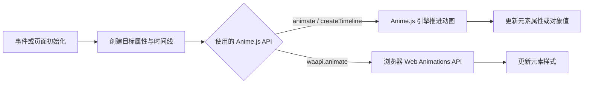

# Anime.js

## 摘要

Anime.js 是在网页中运行的通用 JavaScript 动画库。开发者指定目标、属性、时长和时间线，库负责插值与播放控制；它提供 DOM、SVG、JavaScript 对象动画，以及错峰播放、滚动联动和拖拽等能力。[官网与示例](https://animejs.com/)

**Anime.js 和 Motion 属于同一类动画库。** 更准确地说，Anime.js 与 Motion 的 JavaScript `animate()` API 最接近；Motion for React 还提供与组件状态、布局和交互绑定的声明式接口。Its Hover 则是在 Motion 上写好的具体图标，使用层次不同。[Motion animate](https://motion.dev/docs/animate)、[Motion React](https://motion.dev/docs/react-motion-component)、[Its Hover](https://www.itshover.com/icons)

## 与 Motion 的关系

| 对象 | 开发者提供什么 | 库负责什么 |
| --- | --- | --- |
| Anime.js | 动画目标、属性变化、时间线和触发条件 | 插值、播放控制、时间线与 SVG 等动画工具 |
| Motion JavaScript | 元素或对象、目标值、动画参数或序列 | 插值、弹簧与动画序列等通用能力 |
| Motion for React | `motion.*` 组件上的状态、交互与布局声明 | 将 React 更新、手势、`layout` / `layoutId` 转成动画 |
| Its Hover | 选一个图标并接入组件 | 提供预先写好的 SVG 形状和 Motion 动效 |

这里的差别是接口和集成方式，不能理解成 Anime.js 只适合原生 JavaScript，或 Motion 只能用于 React。Anime.js 的官方 React 示例使用 `useEffect()` 与 `createScope()` 创建动画，在清理时调用 `revert()`；Motion 也有不依赖 React 的 JavaScript API。[Anime.js React 示例](https://animejs.com/documentation/getting-started/using-with-react/)、[Motion animate](https://motion.dev/docs/animate)

按这些接口做选择：需要手动编排多个元素、SVG 路径和时间线时，可以从 Anime.js 入手；React 界面主要围绕状态变化、hover 和布局切换时，Motion for React 的组件接口更直接。这是使用方式上的判断，本次没有做性能对比。[Anime.js 功能示例](https://animejs.com/)、[Motion 布局动画](https://motion.dev/docs/react-layout-animations)

## 一次动画怎样执行

Anime.js 同时提供自己的动画引擎和 Web Animations API（浏览器原生动画接口，简称 WAAPI）入口。`waapi.animate()` 底层调用 `Element.animate()`，与普通 `animate()` 的能力并不完全相同；不能仅凭用了某个库就断言所有动画都由浏览器加速。[WAAPI 文档](https://animejs.com/documentation/web-animation-api/)

## 接入要点

- React 中限定动画作用的根元素，并在卸载时清理 Scope，避免旧动画继续修改元素。[React 集成](https://animejs.com/documentation/getting-started/using-with-react/)
- 根据 `prefers-reduced-motion` 调整动画；Scope 的 `mediaQueries` 可以提供这个判断条件，具体降级效果由使用者编写。[mediaQueries](https://animejs.com/documentation/scope/scope-parameters/mediaqueries/)
- 项目以 MIT 许可发布；实际包体、浏览器兼容性和页面性能需要按所用功能验证，本次只核对文档与示例。[许可](https://github.com/juliangarnier/anime/blob/master/LICENSE.md)

## 相关页面

- [[wiki/topics/frontend/awesome-component-libraries|Awesome Component Libraries]]
- [[wiki/topics/design/web-motion-vocabulary|网页动效词汇与描述方法]]
- [[wiki/syntheses/frontend/flip-layout-animation-mental-model|FLIP 布局动画的心智模型]]

## 来源指针

- [Anime.js 文档](https://animejs.com/documentation/getting-started/using-with-react/)：React 集成与清理。
- [Motion JavaScript](https://motion.dev/docs/animate)、[Motion for React](https://motion.dev/docs/react-motion-component)：两种接口的职责。
- [Its Hover 图标](https://www.itshover.com/icons)：基于 Motion 的成品组件。
