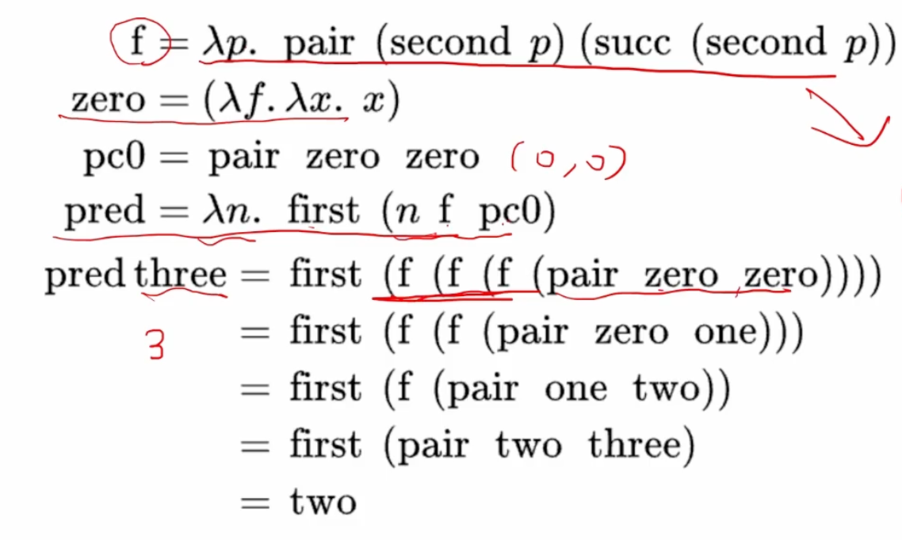

# Lambda 演算

- https://arxiv.org/pdf/1503.09060.pdf
- 和图灵机等价
- $\beta$ - reduction 是把 N 替换成 x，把 free variable 也替换了
	- $$(\lambda x.M)N==M[N/x]$$
	- 其实就是函数的 apply
- $\lambda xy.x==\lambda x.\lambda y.x$
- 常用 Primitives | 工具函数：
	- True: $\bar{T}=\lambda xy.x$
	- False: $\bar{F}=\lambda xy.y$
		- If-Then-Else: $\lambda x.x$
	- Pair: $pair=\lambda xyz.z x y$
	- Fst: $fst=\lambda p.p(\lambda xy.x)$
	- Snd: $snd=\lambda p.p(\lambda xy.y)$
	- Church numerals: $\bar{n}=\lambda fx.f^n(x)$
		- TODO Church encoding and Scott encoding #Reading
	- Succ: $succ=\lambda nfx.f(nfx)$
	- Add: $add=\lambda nmfx.nf(mfx)$
	- Test whether a number is zero: $iszero=\lambda n.n(\lambda z.\bar{F}))\bar{T}$
	- Predecessor: $pred=\lambda n. fst (n(\lambda p.pair(snd\ p)(succ(snd\ p)))(pair\ \bar{0}\bar{0}))$
		- 
	- Multiplication: $(\times) =\lambda nm.if(n=0)then\ 0\ else\ (m+(n-1)\times m)$
		- 出现了递归
		- 推导过程：
			- 先把 $\times$ 在等式右边单独提出来
			- $(\times) =(\lambda fnm.if(n=0)then\ 0\ else\ (m+f(n-1) m))(\times)$
			- 定义 $F=\lambda fnm.if(n=0)then\ 0\ else\ (m+f(n-1) m)$
			- 那么我们缩写为 $(\times)=F(\times)$
			- 我们先尝试让 F apply 一个 bottom value，bottom value 会抛出异常，逐步推导
			- $F(\perp)=\lambda nm.if(n=0)then\ 0\ else\ (m+\perp )$
			- 这个式子可以知道在 n = 0 时是成立的，那么我们继续用 $F(\perp)$ 去 apply F
			- $F(F(\perp))=\lambda nm.if(n=0)then\ 0\ else\ (m+F(\perp)(n-1)m )$
			- 这个式子可以知道在 n = 0, 1 的时候成立
			- 那么容易知道 $F^i(\perp)$ 在 $n<i$ 时计算 $n\times m$ 都能得到正确的答案
			- 如果我们能找到这样一个函数 Y，能够 $YF=F(FY)$，那么 $YF=F^{\infty}(YF)$
- Y-combinator: $Y=\lambda f.(\lambda x.f(xx))(\lambda x.f(xx))$
	- 一些用途：给函数添加缓存
- 无限循环的定义: $\Omega=(\lambda x.xx)(\lambda x.xx)$ reduction 多少次都是它自己
- $YF$ 也被称作 $F$ 的不动点
- 接上文乘法就被定义为 $(\times)=YF$
- https://www.cs.cornell.edu/courses/cs3110/2008fa/recitations/rec26.html
-

## Source Pointers

- `raw/sources/Lambda 演算.md`

