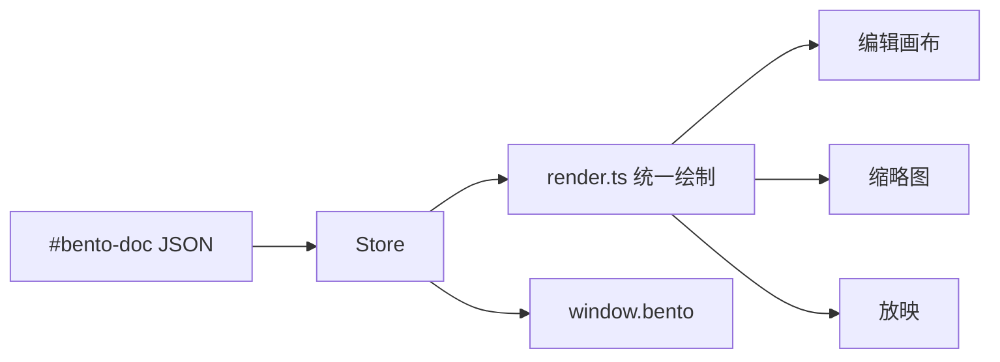

# Bento

## 摘要

Bento（[bento.page](https://bento.page)，[nyblnet/bento](https://github.com/nyblnet/bento)）是 2026 前后的开源、本地优先 office 实验：先交付 **slides**，规划 notes（spaces）、sheets（dash）等，各自仍是独立的 `.bento.html` 分发物。

核心点子：**一个 HTML 文件同时是文档、查看器、放映器和编辑器**。不用安装、默认不绑账号；打开即用，保存时把更新写回同一文件（File System Access API，失败则下载）。数据是文件顶部的明文 JSON，便于人和 agent 直接改。

它不是微软/谷歌 Office，也不是 Reveal/Slidev 那种「当库嵌进站点」的典型 slide 框架；更接近 **自带 runtime 的单文件文档格式 + 桌面级编辑体验**。

## 单文件解剖

构建产物（如 `Bento_Slides.bento.html`）大致是：

| 部分 | 变不变 | 作用 |
| --- | --- | --- |
| head chrome / NOTICE | shell | 元信息与许可证 |
| **`#bento-doc`**（`application/bento+json`） | **文档，会变** | 幻灯片 JSON；`<` 须写成 `\u003c` |
| runtime JS + CSS（可 DEFLATE） | shell ≈ 数百 KB | 编辑 / 放映 / 图表 / 协作 |
| splash + `#app` | shell | 启动与挂载点 |

Agent 与外部工具 **只应改 `#bento-doc`**，不要重生成整份 HTML。空壳下载时该块可为空；浏览器首次打开会 mint starter，磁盘上则没有可抄的 showcase。

## 文档模型：分页与风格

### 分页

不是多文件，而是 JSON 里的 **`slides[]`**。一页一项，默认画布 **1280×720** 绝对坐标元素（text / shape / chart / image / table / media / svg…）。

- 翻页与放映由 runtime 读该数组（导航层用到 Reveal 等）。
- **`stateOf`**：隐藏 drill-down 页，主流程方向键会跳过。
- **morph**：后页 `transition: "morph"`，与前页 **相同元素 `id`（或 `morphId`）** 的位姿/颜色做补间——产品签名能力。

### 风格

没有独立「换肤 CSS 包」，而是三层：

1. **`doc.theme`**（新建必填）：`background` / `color` / `accent` / `fontFamily`
2. **页与元素字段**：页 `background`；字色字号；形 `fill`/`stroke`/渐变；表 `style`；图 chart `option`
3. **`doc.assets` + `doc.fonts`**：图与 woff2 以 data URI 内嵌，引用 `asset:<key>`；不嵌则用系统字体栈

可选 **`doc.layouts`** 与文字 `role`（title/body…）支持套版，偏结构而非皮肤引擎。Skill 另约定：一 accent、≤2 字体、约 96px 边距——是 agent 设计规矩，不是强制主题系统。

## 渲染与 `window.bento`

- 模型在 `slides/src/model.ts`；**一套** `render.ts` 服务编辑、缩略图、放映（morph 由模型算，不靠 DOM 猜）。
- 打开文件或 `loadDoc` 后 runtime 自行重绘；**不是** skill 先调 `render()` 再导出 HTML。

**`window.bento` 是什么：** 浏览器打开 `.bento.html`、runtime 启动后挂在 **`window` 上的脚本 API**，不是 npm 框架名，也不在 skill 文件里。

源码挂载点：`slides/src/main.ts`（编辑模式示意）：

- `doc` / `loadDoc(json)` / `serialize()`
- `validate()` / `measure()`（真实渲染量高、结构检查）
- `undo` / `redo` / `selection` / `sync` / `anim` / `i18n` …

只改磁盘 JSON、不打开浏览器时 **没有** 该对象；目视与 `validate`/`measure` 依赖本机打开文件。

## 和 AI / Skill 的关系

| 层 | 角色 |
| --- | --- |
| 产品格式 | `#bento-doc` + agents 指南 [bento.page/agents.md](https://bento.page/agents.md) |
| **bento-slides** skill | 说明书：从零 curl 壳、只改 JSON、内容→chart/morph 映射、gotcha、目视验收 |
| `window.bento` | 打开后的校验/量测/换文档把手 |

Skill 评审与收录见 [[Awesome Agent Skills]] 与 `raw/sources/2026-08-06-bento-slides-skill-review.md`。判据讨论见 [[Skill 工程化的产物协议范式]]。

## 其它能力（产品侧）

- **本地优先 / Offline：** 可硬阻断联网更新与协作。
- **协作（可选）：** 文件内密钥 + 自研 CRDT；盲中继只见密文。
- **图表：** 自研 charts-lite（非完整 ECharts）。
- **签名自更新：** 更新写出新文件，旧文件可回滚。
- **许可：** MIT。

## 相关页面

- [[Awesome Agent Skills]]
- [[Skill 工程化的产物协议范式]]
- [[Code Agent]]

## 来源指针

- https://github.com/nyblnet/bento
- https://bento.page
- [architecture.md](https://github.com/nyblnet/bento/blob/main/docs/architecture.md)
- [agents.md](https://bento.page/agents.md)
- [slides/src/main.ts](https://github.com/nyblnet/bento/blob/main/slides/src/main.ts)（`window.bento` 挂载）
- `raw/sources/2026-08-06-bento-slides-skill-review.md`
