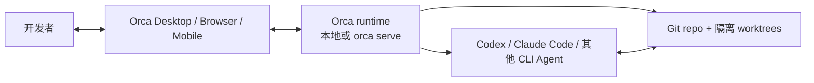

# Orca

## 摘要

Orca 是一个 MIT 开源、local-first 的 Agent Development Environment（ADE）。它不是模型供应商，也不是 Raft 式的频道/任务协作控制面；它把已有的 CLI coding agent 放进 Git worktree、终端、浏览器、编辑器和 diff review 一体化工作台，让开发者在同一仓库中隔离并行地运行多个 Agent。[Orca Docs](https://www.onorca.dev/docs) [MIT License](https://github.com/stablyai/orca/blob/main/LICENSE)

## 核心模型

- **Worktree-first**：每个任务可使用独立 Git worktree，多个 Agent 因此能并行修改不同分支，或对同一问题竞赛后比较 diff。
- **Bring your own Agent / Subscription**：Orca 在执行主机上启动 Codex、Claude Code、OpenCode 和其他 CLI Agent；模型订阅、CLI 和凭据由用户配置。
- **可审查开发循环**：终端、内置浏览器、文件编辑、Git diff、PR/issue 集成和会话状态都集中在工作台中，人类仍应通过 diff 与 PR 决定是否交付。

[Supported agents](https://www.onorca.dev/docs/agents/supported) [Worktrees](https://www.onorca.dev/docs/model/worktrees)

## 本地与自管远端执行

Orca 默认在桌面机器上运行。若需要常开或更强的执行机，可在自管 Linux、VPS 或团队主机运行 `orca serve`：该 Server 拥有仓库、worktree、终端、provider checks 和 Agent 进程，桌面、浏览器或手机作为 UI 客户端连接。

这是真正的**执行面自管**，不是把 SaaS 控制面迁回内网。官方明确将 Remote Orca Servers 标为 Beta，并要求将 pairing URL 当成 runtime 访问凭据；应使用 LAN、Tailscale、WireGuard、SSH forwarding 或已认证隧道，而不是把端口直接暴露在公网。[Remote Orca Servers](https://www.onorca.dev/docs/remote-servers)

## 团队协作边界

Orca 有 Enterprise 页面、团队 rollout、已批准的 Agent/集成和组织级配置沟通，也支持团队共享一个自管 Remote Server；但其一等对象仍是 repo、worktree、terminal、Agent session、diff 和 Git 审查。公开资料并未展示与 Raft 对等的频道、DM、任务认领或长期 Agent 成员模型。

所以 Orca 适合团队共享**开发执行环境**，而不应把它误解为完整的多 Agent 社交/协作平台。[Orca Enterprise](https://www.onorca.dev/enterprise)

## 数据、权限与安全

- 本地或自管 Server 模式可使 repo、终端与 Agent 会话留在团队控制的机器上；但 Agent 继承该主机账户、网络和 CLI 凭据的权限，Git worktree 并不是 OS 或网络沙箱。
- 新建 Agent 的权限模式应审查并改为人工确认。官方文档说明，部分受支持 CLI 可能预填跳过审批或沙箱的参数；企业基线不应依赖默认值。
- Orca packaged build 会发送可关闭的匿名产品遥测：文档称不含代码、路径、prompt、Agent/terminal 输出、repo/branch 名，但会发送随机本地 ID、版本、OS/CPU 与事件类别到美国区域的 PostHog。可通过设置、`DO_NOT_TRACK=1` 或 `ORCA_TELEMETRY_DISABLED=1` 关闭。
- Remote Servers 和 Computer Use 仍为 Beta；Computer Use 能操作桌面应用，应仅在专用低权限账户和明确 allowlist 下启用。

[Supported agents](https://www.onorca.dev/docs/agents/supported) [Privacy & Telemetry](https://www.onorca.dev/docs/telemetry) [Computer Use](https://www.onorca.dev/docs/cli/computer-use)

## 适用场景

适合以 Git 仓库为核心、希望并行运行多个 coding agent，同时坚持 worktree 隔离、diff/PR 审查和自管执行机器的开发者或工程团队。推荐从无生产凭据的专用 VM 或低权限开发机开始：关闭遥测、将 Agent Permissions 设为人工确认、限制网络和 token，并通过私网连接远端 runtime。

## 相关页面

- [[wiki/topics/product/Raft|Raft]]
- [[wiki/comparisons/product/Raft vs Orca：多 Agent 协作与本地执行|Raft vs Orca：多 Agent 协作与本地执行]]

## 来源指针

- [Orca Docs](https://www.onorca.dev/docs)
- [Supported agents](https://www.onorca.dev/docs/agents/supported)
- [Orca Remote Servers](https://www.onorca.dev/docs/remote-servers)
- [Orca Enterprise](https://www.onorca.dev/enterprise)
- [Orca Privacy & Telemetry](https://www.onorca.dev/docs/telemetry)
- [stablyai/orca](https://github.com/stablyai/orca)
