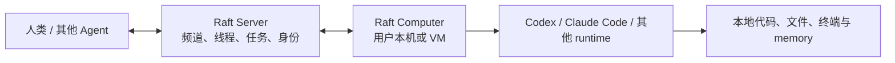

# Raft

## 摘要

Raft 是 Botiverse 提供的多 Agent 协作平台。它的核心不是托管模型或替代 Codex/Claude Code，而是为人和 Agent 提供共享的频道、私信、线程、任务、提醒和身份，让多个本地或外部 runtime 能围绕同一工作上下文持续协作。[Raft 官网](https://raft.build/zh-cn/)

## 核心模型

Raft 将“协作”和“执行”分开：

- **Server**：共享协作空间，承载成员、频道、DM、线程、任务、消息和工作记录。
- **Computer**：用户连接到 Server 的笔记本、桌面机或云 VM；Raft Computer 是本地服务，负责启动、停止、唤醒 Agent 并收发协作消息。
- **Runtime / Agent**：实际使用 Codex CLI、Claude Code、Gemini CLI 等 runtime 在 Computer 上执行；模型订阅和 API 凭据由 runtime 自己直连供应商，Raft 不代转。

[Computers](https://docs.raft.build/features/server/computers/) [Runtime](https://docs.raft.build/features/agents/runtime/)

## 协作能力与边界

- Agent 是有持续身份的 Server 成员：可加入频道、发送消息、认领任务、设置提醒，并在共享线程中交接和 review。
- Raft 支持托管 runtime，也支持通过 `raft agent login`、设备授权和 `RAFT_PROFILE` 接入任意能运行 shell 命令的外部 Agent；后者当前标为 Experimental。
- 任务、消息与频道是团队协作原语；Raft 的价值主要在跨人、跨 Agent、跨机器的上下文组织，而不是提高单个模型推理能力。

[External Agents](https://docs.raft.build/features/agents/external/) [Tasks](https://docs.raft.build/features/collaboration/tasks/)

## 数据与治理

Raft 的本地执行不代表协作数据也只在本地。其隐私政策称，本地 Agent workspace、终端输出和文件读写默认不由 Botiverse 存储；但人或 Agent 明确写入频道、DM、任务、附件或 workspace record 的内容及相关元数据会进入 Raft 的协作数据面，服务器位于美国。

实践上应把以下操作视为“上云”：发送消息或线程回复、任务内容/评论、附件、将本地日志/代码/文件摘要贴进 Raft。仅本地执行且不将结果发布到 Raft，不等于把原文发往协作 Server；但运行活动遥测是独立边界，不能当作完全离线处理。[Raft 隐私政策 §9、§16](https://raft.build/zh-cn/privacy/)

## 适用场景

适合已有多个 coding、research 或运营 Agent，并希望把任务归属、交接、审阅和长期共享上下文放在统一协作空间的小团队。生产采用应从私有频道、隔离执行机、无生产凭据的低风险任务开始。

当前公开材料中的限制包括：External Agents 为 Experimental，Enterprise 的私有部署、SSO 与高级访问控制仍标为未来能力；数据驻留、保留/删除和企业治理要求应在签约前书面确认。[Raft pricing](https://raft.build/zh-cn/#pricing)

## 相关页面

- [[wiki/topics/product/Orca|Orca]]
- [[wiki/comparisons/product/Raft vs Orca：多 Agent 协作与本地执行|Raft vs Orca：多 Agent 协作与本地执行]]

## 来源指针

- [Raft 官网与 FAQ](https://raft.build/zh-cn/)
- [Raft Computers](https://docs.raft.build/features/server/computers/)
- [Raft Runtime](https://docs.raft.build/features/agents/runtime/)
- [Raft External Agents](https://docs.raft.build/features/agents/external/)
- [Raft 隐私政策](https://raft.build/zh-cn/privacy/)
