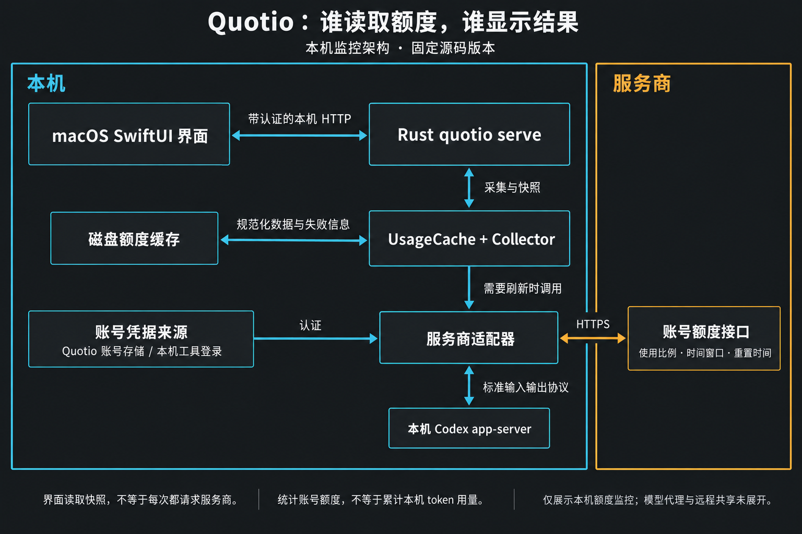
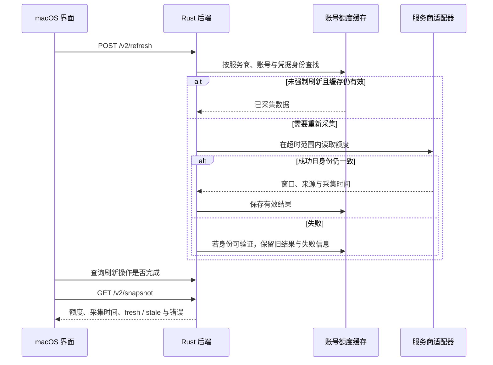

# Quotio：AI 额度监控与统计实现

## 摘要

Quotio 是一个开源的 AI 服务额度与账号管理工具，提供 macOS 界面和 Rust CLI（命令行工具），还可以管理本地 CLIProxyAPI 代理、为编码工具配置接入。macOS 产品要求 14 或以上，仓库使用 MIT 许可。[产品说明](https://github.com/nguyenphutrong/quotio/blob/71f427f7488e592406104d98936ff142000383d7/README.md)、[许可](https://github.com/nguyenphutrong/quotio/blob/71f427f7488e592406104d98936ff142000383d7/LICENSE)

**额度统计的核心是读取各服务商已有的额度数据，再统一展示。** 对本文核对的 Claude、Codex、Antigravity 路径，Quotio 获取的是服务端返回的使用比例、额度窗口和重置时间；它不靠自行累加本机每次模型请求的 token 来推算订阅额度。源码也单独建模余额、消费量和 Codex 的 token 历史，这些指标不能混作同一个百分比。[数据模型](https://github.com/nguyenphutrong/quotio/blob/71f427f7488e592406104d98936ff142000383d7/apps/cli/src/domain.rs#L40-L153)、[Codex 响应解析](https://github.com/nguyenphutrong/quotio/blob/71f427f7488e592406104d98936ff142000383d7/apps/cli/src/providers/codex_api.rs#L1-L207)

以下依据 2026-10-07 读取的提交 `71f427f7488e592406104d98936ff142000383d7`，重点覆盖额度采集与展示，不代表每个已发布版本都采用这套实现。

## 谁采集，谁展示

当前 macOS 程序以 SwiftUI 构建界面，启动随应用附带的 Rust `quotio serve` 子进程。该进程在 `127.0.0.1` 的动态端口提供接口，Swift 通过 `QuotioCLIBackend` 读取快照、发起刷新。额度采集由这个后端承担，与被管理的 CLIProxyAPI 模型代理是不同职责。[组件装配](https://github.com/nguyenphutrong/quotio/blob/71f427f7488e592406104d98936ff142000383d7/apps/macos/Quotio/App/CompositionRoot.swift#L85-L110)、[子进程启动](https://github.com/nguyenphutrong/quotio/blob/71f427f7488e592406104d98936ff142000383d7/Packages/QuotioCore/Sources/QuotioInfrastructure/QuotioCLI/QuotioCLIServerProcess.swift#L80-L173)

图中的 UsageCache / Collector 属于 Rust 后端内部，负责选择缓存或调用服务商适配器；图将它们展开以说明职责，并非额外部署的服务。

这张图限定在 macOS 本机额度监控路径。Quotio CLI 也能单独运行一次查询，复用采集与缓存代码；源码另有远程共享功能，本文没有审查其部署与权限配置，不能把“本机监听”推广成整个产品没有远程访问能力。[CLI 查询入口](https://github.com/nguyenphutrong/quotio/blob/71f427f7488e592406104d98936ff142000383d7/apps/cli/src/usage.rs)、[共享模块](https://github.com/nguyenphutrong/quotio/blob/71f427f7488e592406104d98936ff142000383d7/apps/cli/src/server/sharing.rs)

## 额度具体从哪里来

| 服务商与入口 | 读到什么 | Quotio 怎样处理 |
| --- | --- | --- |
| Claude 的 OAuth（账号授权）usage 接口 | `five_hour`、`seven_day` 等窗口中的 `utilization` 与 `resets_at` | 将使用百分比和重置时间映射到统一窗口；缺失的窗口不凭空补满 |
| Codex 本机 `app-server --stdio` | 通过 `account/rateLimits/read` 读取限额，查询前后还读取账号身份 | 解析主、次窗口和模型专属限额；前后账号不一致时拒绝这次结果 |
| Codex 账号 OAuth API 路径 | `chatgpt.com/backend-api/wham/usage` 的 `used_percent`、窗口秒数、`reset_at` | 转换成统一窗口，另外处理 credits 等补充信息 |
| Antigravity 的 Cloud Code 接口 | 优先 `retrieveUserQuotaSummary`；特定失败时再尝试模型和额度接口 | 把 `remainingFraction` 转为剩余百分比，保留重置时间；不会把所有回退结果无条件视为有效额度 |

依据：[Claude](https://github.com/nguyenphutrong/quotio/blob/71f427f7488e592406104d98936ff142000383d7/apps/cli/src/providers/catalog/oauth_primary.rs#L294-L423)、[Codex 本机协议](https://github.com/nguyenphutrong/quotio/blob/71f427f7488e592406104d98936ff142000383d7/apps/cli/src/providers/codex.rs#L258-L408)、[Codex HTTP 接口](https://github.com/nguyenphutrong/quotio/blob/71f427f7488e592406104d98936ff142000383d7/apps/cli/src/providers/codex_api.rs#L1-L207)、[Antigravity 查询顺序](https://github.com/nguyenphutrong/quotio/blob/71f427f7488e592406104d98936ff142000383d7/apps/cli/src/providers/antigravity.rs#L374-L479)。上表是读到的实现路径，不是对这些服务商接口稳定性或第三方接入支持的保证。

## 统一的是数据格式，不是计费标准

核心结构是 `ProviderUsage` 下的多个 `QuotaWindow`。窗口保留自己的名称、额度状态、可选余额及单位、重置时间、采集时间和来源置信度。`Quota` 能区分可用、耗尽、无限、未知等情况；未知不能显示成“还剩 100%”。[Quota 与 QuotaWindow](https://github.com/nguyenphutrong/quotio/blob/71f427f7488e592406104d98936ff142000383d7/apps/cli/src/domain.rs#L40-L153)

计算本身很简单：已用比例为 35%，剩余就是 65%；来源给出 `remainingFraction = 0.65` 时，换算为 65%。难点在于识别窗口、账号和数据语义。五小时窗口、周窗口、模型专属窗口不能相加成总额度，百分比也不能直接换算为剩余 token。[百分比转换](https://github.com/nguyenphutrong/quotio/blob/71f427f7488e592406104d98936ff142000383d7/apps/cli/src/domain.rs#L40-L153)、[Antigravity 比例转换](https://github.com/nguyenphutrong/quotio/blob/71f427f7488e592406104d98936ff142000383d7/apps/cli/src/providers/antigravity.rs#L148-L179)

因此，参考它实现自己的统计时，应该先区分三个问题：账号当前还剩多少额度、经过自己代理的请求用了多少 token、服务商最终扣了多少钱。Quotio 的窗口数据主要回答第一个；另外两个需要各自的请求记录或账单依据。这是本文根据数据来源做出的设计判断，统计标准另见 [[wiki/topics/ai/token-usage-and-billing|Token 与计费统计标准]]。

## 刷新、缓存与失败

图中缓存查找与网络采集在实现里由 `UsageCache` 协调，缓存标识包含服务商、账号和凭据身份摘要。刷新前后会重新核对身份，避免账号切换时误用旧缓存；无法确认身份时不复用这份缓存。失败时只有满足身份条件的旧值才保留，并携带失败信息。快照会按失败状态和 TTL（缓存有效期）标记数据是否过期。[缓存实现](https://github.com/nguyenphutrong/quotio/blob/71f427f7488e592406104d98936ff142000383d7/apps/cli/src/cache.rs#L196-L391)、[快照时效判断](https://github.com/nguyenphutrong/quotio/blob/71f427f7488e592406104d98936ff142000383d7/apps/cli/src/contract/snapshot.rs#L273-L377)

macOS 界面约每三秒读取一次后端状态，这不等于每三秒向服务商发请求：服务商采集由后端的刷新间隔、缓存与手动刷新共同决定。手动刷新接口先返回操作状态，Swift 等待操作完成后再读取快照。[界面读取循环](https://github.com/nguyenphutrong/quotio/blob/71f427f7488e592406104d98936ff142000383d7/Packages/QuotioCore/Sources/QuotioPresentation/Quota/QuotaFeatureController.swift#L309-L320)、[后端刷新循环](https://github.com/nguyenphutrong/quotio/blob/71f427f7488e592406104d98936ff142000383d7/apps/cli/src/server.rs#L1137-L1172)、[手动刷新调用](https://github.com/nguyenphutrong/quotio/blob/71f427f7488e592406104d98936ff142000383d7/Packages/QuotioCore/Sources/QuotioInfrastructure/QuotioCLI/QuotioCLIBackend.swift#L486-L565)

## 凭据与扩展边界

- 服务商适配器实现 `ProviderAdapter`，负责认证、请求、解析及缓存身份，返回统一 `ProviderUsage`；增加服务商还需完成注册和凭据接入。[适配器接口](https://github.com/nguyenphutrong/quotio/blob/71f427f7488e592406104d98936ff142000383d7/apps/cli/src/providers/mod.rs#L62-L88)
- macOS 管理的账号存储使用 Keychain；CLI 的 Linux 存储分支使用加密文件。原有 CLI / IDE 登录也可作为凭据来源，不能把所有账号都理解成由 Quotio 重新登录。[账号存储选择](https://github.com/nguyenphutrong/quotio/blob/71f427f7488e592406104d98936ff142000383d7/apps/cli/src/accounts/vault.rs#L269-L323)、[Claude 读取链路](https://github.com/nguyenphutrong/quotio/blob/71f427f7488e592406104d98936ff142000383d7/apps/cli/src/providers/catalog/oauth_primary.rs#L294-L423)
- 本机 UI 与后端之间使用单独生成的认证 token；服务商凭据用于服务商请求，额度缓存保存规范化数据与失败信息。它们是不同用途的数据，不应把凭据复制到统计输出中。[本机认证启动](https://github.com/nguyenphutrong/quotio/blob/71f427f7488e592406104d98936ff142000383d7/Packages/QuotioCore/Sources/QuotioInfrastructure/QuotioCLI/QuotioCLIServerProcess.swift#L80-L173)、[缓存结构](https://github.com/nguyenphutrong/quotio/blob/71f427f7488e592406104d98936ff142000383d7/apps/cli/src/cache.rs#L63-L71)

## 验证范围与限制

本次阅读了实现和测试代码，未安装或运行 Quotio，未访问个人账号凭据，也未验证服务商线上接口是否仍接受这些请求。源码包含缓存恢复、部分失败保留和快照语义测试，本次未运行这些测试。[缓存测试](https://github.com/nguyenphutrong/quotio/blob/71f427f7488e592406104d98936ff142000383d7/apps/cli/tests/cache.rs#L171-L225)、[快照测试](https://github.com/nguyenphutrong/quotio/blob/71f427f7488e592406104d98936ff142000383d7/apps/cli/tests/contract.rs#L257-L343)

可借鉴的是按服务商解析额度、保留独立窗口、标记采集时间与错误。需要持续维护的是 OAuth 和本机凭据格式、服务商接口字段、窗口含义；不能将源码中的端点当作稳定公开 API。图和结论的逐项核查位置见 [[raw/sources/quotio|源码证据记录]]。

## 相关页面

- [[wiki/topics/ai/token-usage-and-billing|Token 与计费统计标准]]
- [[wiki/topics/tooling/ai-cli|ai-cli]]

## 来源指针

- [Quotio 官网](https://www.quotio.dev/)、[固定版本源码](https://github.com/nguyenphutrong/quotio/tree/71f427f7488e592406104d98936ff142000383d7)。
- [[raw/sources/quotio|源码版本、证据对照表与未测试项]]。
