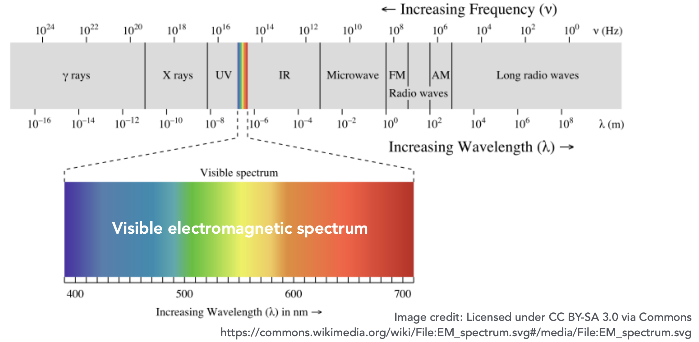
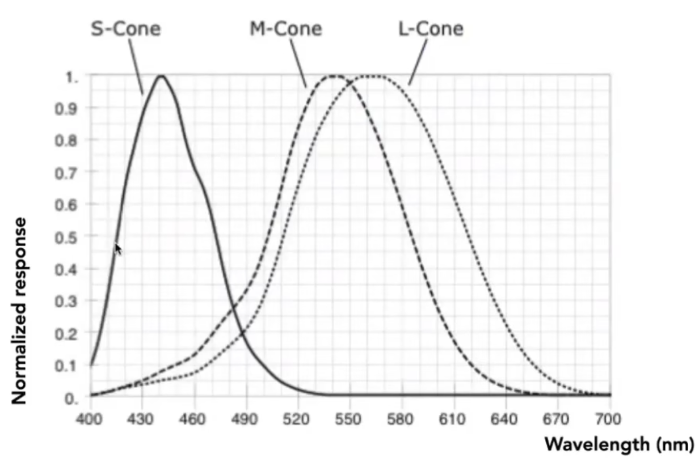
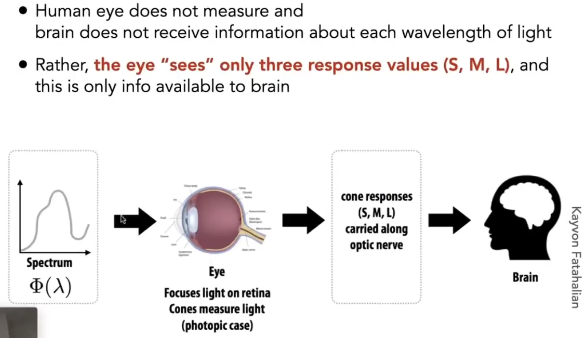
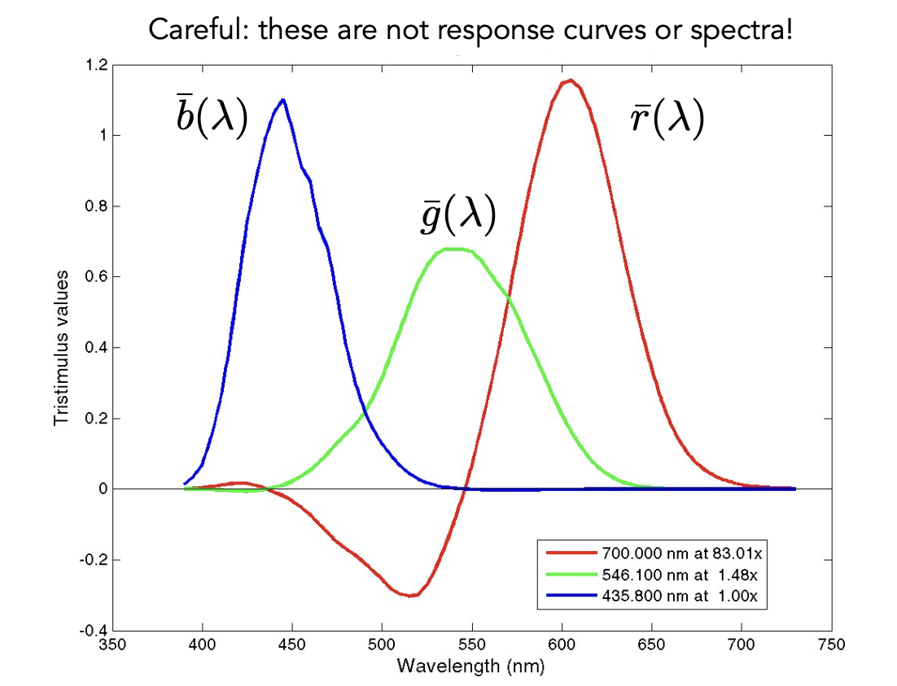
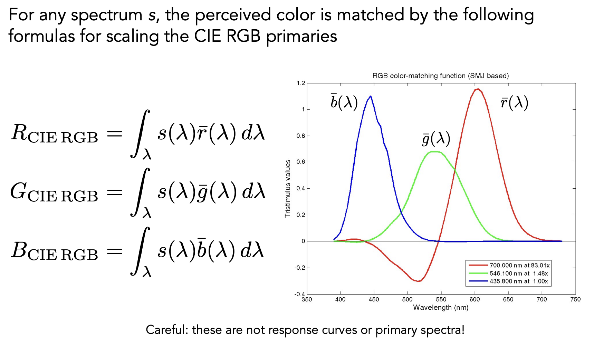
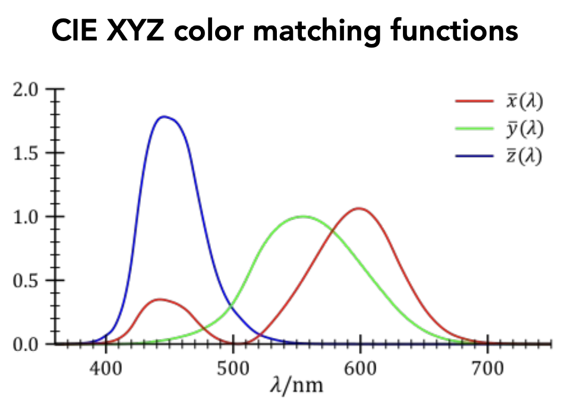
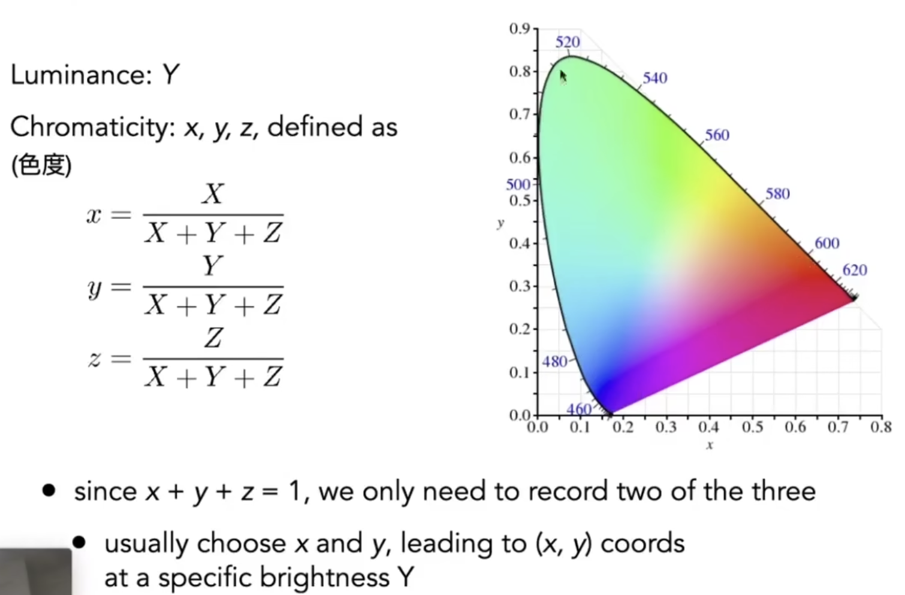
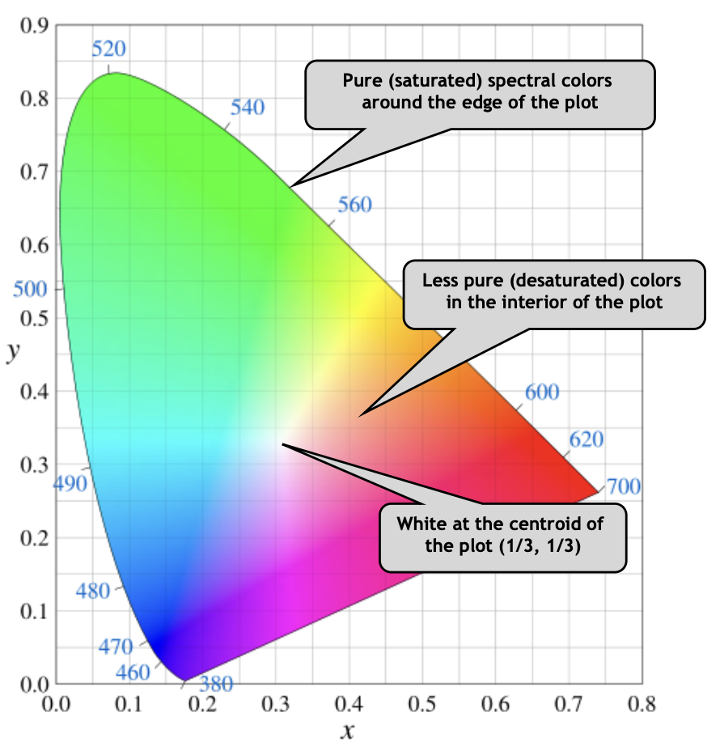
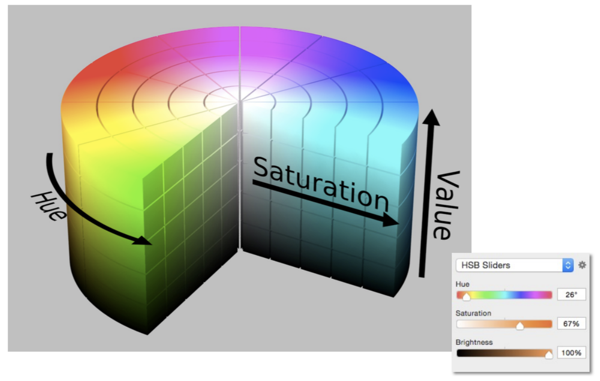
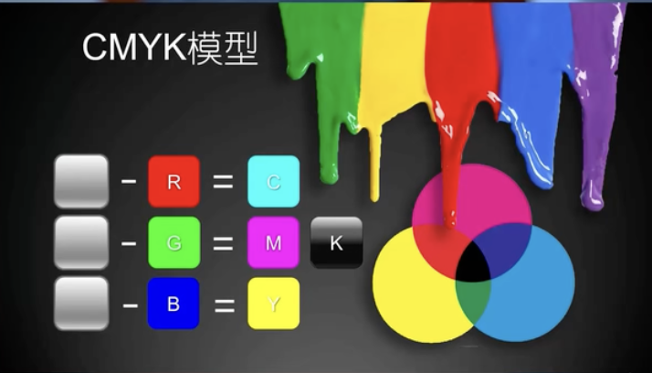

# Color and Perception

- [[光]]本质是一种[[电磁波]]，它具有波长和强度两个特性，不同波长的光呈现不同的颜色，一个颜色也会有明暗一说
- 光谱(Spectrum)，全称为光学频谱，是复色光通过色散系统（如光栅、棱镜）进行分光后，依照光的波长（或频率）的大小顺次排列形成的图案
	- 可以理解为一束光有各种波长（或频率）的光，然后就会有谱功率密度的概念，按不同波长展开
- 光谱按光的波长铺开，人眼可见的大概在 400nm - 700nm，也被称为可见光
	- 
- 不同波长的光对应不同的折射率，所以白光穿过棱镜能打出不同的颜色
- 谱功率密度（SPD）表示一束光在不同波长上的强度，谱功率密度具有线性的性质
- [[颜色]]是人的感知，不是光线的属性
- 视网膜是最终光线到达的地方
- 视网膜上有许多感光细胞
	- 棒状细胞，感知光的强度，不感知[[颜色]]，可以得出一个灰度的分布图，数量很多
	- 视锥细胞能感知[[颜色]]，又被分为三类，分别为 S M 和 L，分别对应在响应曲线上最大响应对应的波长，数量很少（对应红绿蓝三种光线）
		- 
		- 每个人的三种细胞的分布都不相同，其实也就说明每个人看到的世界是不一样的（色盲色弱？）
	- 把响应的强度和对应光在这个波长上的强度相乘起来再积分，就可以得到一个值，三个细胞对应三个值。
	- 对于一种类型的光线，它有不同的 SPD，人类能看到不同的 S M L，人类看不到感受不到光谱
		- 
- 同色异谱现象：不同的光线（光谱不一样）进入眼睛后经过积分算出的 S M L 三个值是一致的。可以用来进行模拟，比如显示器模拟一些颜色，就不需要光谱完全一致。
- 加色系统（适用于光源 / 发光体）
  collapsed:: true
	- 给定三种基本光，这三个光对应的光谱是一个单峰值函数，以它们为基本向量空间中的分量，然后调整系数 R G B （代表对应光线的强度）来混合出（线性组合出）不一样的颜色即所谓的 RGB
		- 下面这个图就是通过做实验得出的，给定一个颜色的光，然后用其他三个颜色去混合，并让实验者观察是否相等，然后有些情况会发现我不论怎么调三个颜色都混不出来，但是如果给被测试的光补一点某个光的话可以相等，那就相当于一个负数，也就是下图为什么会有负坐标的原因
			- 其他表述：
				- 颜色匹配实验就是给观察者一种颜色的光，投在大屏上。然后将三基色光按不同比例混合在一起，当观察者认为混合光和被测光分别照亮的两部分大屏完全一致时，就得到了三个比例值 r, g, b。
				- 现在，有人给了你一种被测光，让你找出相应的 rgb 值。可是你穷尽 0-1 范围内的所有 K 比例值，却不能用三基色复现被测光。但你发现，如果向被测光中加入一点红光，就可以让两块光屏的颜色一致。注意，是向被测光里增加了成份。于是，为了得到原被测光的三基色比例值，就需要减去添加的分量。这一减，就出现了负值。
		- 
	- 给定一个混色光的光谱，通过积分确定最后的值
		- 
	- 加色系统中光线混合会越来越来亮，趋近于白色
- 色彩空间：（我理解就是怎么表示一个颜色，然后这个空间是有限的）
	- sRGB 很流行
	- 不同于上面 RGB 是通过实验得出的，CIE XYZ 是自己造了三个原色，都为正，能表示尽可能多的颜色（CIE RGB 的线性变换）
		- 
		- 然后设计上 Y 代表亮度，X 和 Z 统一代表色度，我们固定 Y，算出 x 和 z，就能看出颜色的分布了，因为改变 Y 只会改变亮度，如下图，边缘是光谱上的颜色连成的曲线，里面的颜色是混合出来的，光谱上并不存在，也就是说这个颜色光谱并不是「一个单峰函数，就是一根线竖着」
			- TODO 自己画一个？
			- TODO 既然很多显示器表示的色彩都很少，那我是怎么看到这个图表示的颜色变化的？
		- 
		- 
	- 其他更友好的色彩空间：
		- HSV
			- 
		- CIE LAB：红绿是互补色，蓝黄是互补色（色差太大了，很少说红绿色，蓝黄色）
- 减色系统（反光体）：CMYK，减色系统是越混越黑的（不懂），特意有个黑色主要是因为减色系统通常用在打印，然后黑色的墨水会比各种颜色混起来成黑色成本更低，又因为打印黑色墨水用的频率会很高，所以会单独列出来
  collapsed:: true
	- 
	- 只吸收红色，反射出其他所有颜色；只吸收绿色，反射出其他所有颜色；只吸收蓝色，反射出其他所有颜色
- RGB 是在发光体的世界中来做三色混合，做的是加法，亮度提升，颜色越来越浅。是色彩模型，不是色彩空间
- CMYK 反光体的世界中来做三色混合，做的是减法，亮度下降，颜色越来越深。是色彩模型，不是色彩空间
- https://zhuanlan.zhihu.com/p/24214731
- https://zhuanlan.zhihu.com/p/24281841
- https://medium.com/hipster-color-science/a-beginners-guide-to-colorimetry-401f1830b65a 讲了那个马蹄图是怎么画出来的

## Source Pointers

- `raw/sources/Color and Perception.md`

