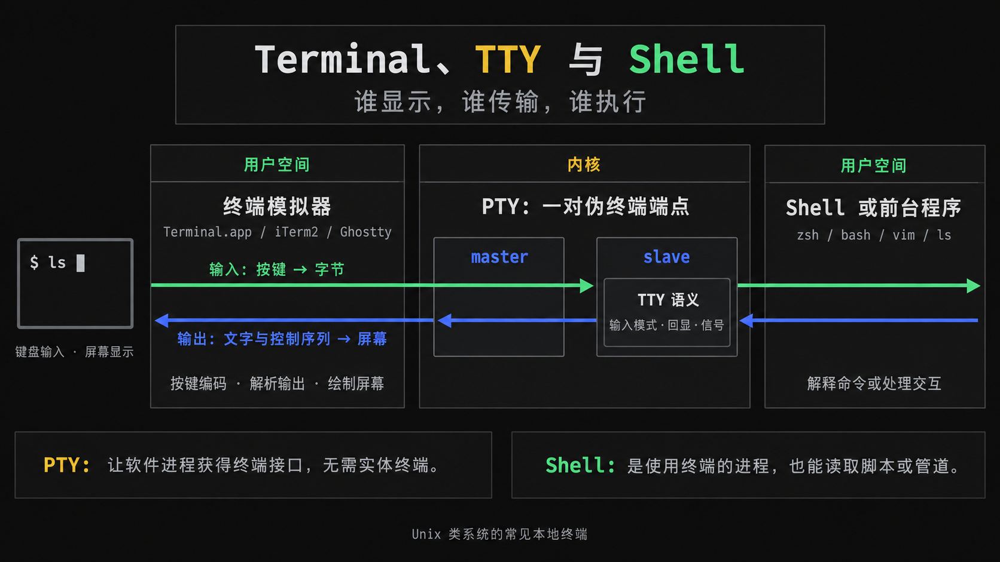

# Terminal：终端、TTY 与 Shell

## 摘要

终端提供人与程序之间的文本输入输出界面。今天桌面上打开的“终端”通常是终端模拟器，例如 Terminal.app、iTerm2 或 Ghostty：它把按键编码为字节，再把程序输出的文字和控制序列画到屏幕上。输入的命令由 shell 解释执行。本文讨论 Unix 类系统的常见本地终端，不展开 Windows 的终端实现。

[How Terminals Work](https://how-terminals-work.vercel.app/) 用可交互演示解释字符网格、控制序列、键盘输入、信号和 TUI（文本用户界面），适合先建立直观认识；下面用系统文档补足其中的条件与职责划分。

## Terminal、TTY、PTY、Shell 分别是什么

| 名称 | 职责 |
| --- | --- |
| 终端模拟器 | 接收键盘输入，解析输出控制序列，维护字符网格、颜色、光标与屏幕缓冲区 |
| TTY | 名称来自 teletype；在现代 Unix 语境中通常指内核提供的终端设备与接口，带有输入缓冲、回显、信号和前台进程组等终端语义 |
| PTY（伪终端） | 一对相连的 master / slave 端点；模拟器读写 master，shell 或程序使用具有 TTY 语义的 slave，无需实体终端硬件 |
| Shell | Bash、Zsh 等命令解释器和脚本语言，负责展开变量、查找命令、连接管道、重定向和启动程序 |

依据：[POSIX 终端接口](https://pubs.opengroup.org/onlinepubs/9799919799/basedefs/V1_chap11.html)、[pty(7)](https://man7.org/linux/man-pages/man7/pty.7.html)、[Bash 对 shell 的定义](https://www.gnu.org/software/bash/manual/html_node/What-is-a-shell_003f.html)。



图示：输入字节从左向右传递，输出文字与控制序列沿相同连接返回。TTY 处理发生在内核，终端模拟器与 shell / 前台程序运行在用户空间。

模拟器通常创建 PTY 并启动 shell。输入 `ls` 后，shell 解析命令并启动 `ls`；`ls` 可以直接向终端输出，不必让 shell 逐字转发。TTY 是输入输出接口，shell 是使用这个接口的进程。shell 也能从脚本文件或管道读取命令，因此运行 shell 不以存在 TTY 为前提。[pty(7)](https://man7.org/linux/man-pages/man7/pty.7.html)、[Bash](https://www.gnu.org/software/bash/manual/html_node/What-is-a-shell_003f.html)

## 为什么需要 PTY，直接用管道不行吗

管道可以传字节，但交互程序还需要知道终端有多少行列、是否回显输入、何时交付输入，以及哪个前台进程组接收 `Ctrl+C` 等信号。普通管道没有这些终端接口。PTY 在纯软件环境中提供同样的终端行为，让 shell、Vim 等程序继续按终端接口工作。[POSIX 终端接口](https://pubs.opengroup.org/onlinepubs/9799919799/basedefs/V1_chap11.html)、[pty(7)](https://man7.org/linux/man-pages/man7/pty.7.html)

一对端点解决的是两边不同的需要：

- **模拟器使用 master**：把按键字节写进去，并读出程序的输出，再绘制到窗口。
- **程序使用 slave**：像使用终端设备一样读写它，并设置输入模式等终端属性。程序写向 slave 的内容会出现在 master，master 写入的数据则经过终端输入处理后供程序读取。

所以，“pseudo”表示没有实体终端硬件，不表示接口是假的。PTY 负责带有终端行为的连接，模拟器负责显示，shell 负责解释命令；三者解决的问题不同。[pty(7)](https://man7.org/linux/man-pages/man7/pty.7.html)

## 屏幕由字节流驱动

终端显示的基本单位是字符单元及其样式，程序通过控制序列设置颜色、移动光标、清屏。例如 `ESC[31m` 设置红色前景，`ESC[0m` 重置样式；`ESC` 是字节 `0x1B`，常被写成 `^[`。TUI 更新界面时输出文字和这些序列，不需要终端理解“按钮”或“菜单”。[教程的 Escape Sequences / State Management](https://how-terminals-work.vercel.app/#escape)、[xterm 控制序列](https://invisible-island.net/xterm/ctlseqs/ctlseqs.html)

网格只是显示模型，不能推成“一个 Unicode 字符固定占一格”：字符的列宽可以是 0、1 或 2，组合字符和 emoji 还会增加处理难度。布局需要考虑显示宽度。[wcwidth(3)](https://man7.org/linux/man-pages/man3/wcwidth.3.html)

## 备用屏幕为什么看起来像“第二个 frame”

Alternate screen buffer（备用屏幕缓冲区）是模拟器另外维护的一份字符网格。它不是视频的下一帧，也不是新开一个终端进程。可以分别修改两份显示内容，并切换当前显示哪一份；普通屏幕原来的内容因此不必被全屏程序的反复绘制覆盖。[教程的 Alternate Screen Buffer](https://how-terminals-work.vercel.app/#alternate-screen)、[xterm Alternate Screen Buffer](https://invisible-island.net/xterm/ctlseqs/ctlseqs.html#h2-The-Alternate-Screen-Buffer)

以启动并退出 Vim 为例：

| 时刻 | 当前显示 | 另一份内容怎样处理 |
| --- | --- | --- |
| 执行 `vim file.txt` 前 | 普通屏幕上的提示符与命令输出 | 备用屏幕尚未使用 |
| Vim 请求切换后 | 备用屏幕上的文件内容、状态栏与光标 | 普通屏幕保留，Vim 的反复重画不混入原来的命令输出 |
| Vim 请求切回后 | 恢复普通屏幕，shell 继续显示提示符 | Vim 的临时全屏界面不再显示 |

xterm 兼容终端常用 `ESC[?1049h` 进入备用屏幕并保存光标状态，用 `ESC[?1049l` 返回普通屏幕并恢复光标。普通屏幕通常关联滚动历史，xterm 的备用屏幕没有同样的滚动历史；具体模拟器和配置可能有所不同。[xterm 1049 与备用屏幕说明](https://invisible-island.net/xterm/ctlseqs/ctlseqs.html)

两点容易混淆：保存屏幕内容不等于保存 Vim 正在编辑的文件；终端也并非完全没有状态，它维护光标、颜色和屏幕缓冲区，只是不理解应用自己的菜单、编辑内容或业务状态。程序退出时需要正确恢复终端模式。[教程的 State Management](https://how-terminals-work.vercel.app/#state)、[xterm](https://invisible-island.net/xterm/ctlseqs/ctlseqs.html)

## 按键什么时候变成命令或信号

- **按行还是按字符交付**：TTY 的 `ICANON` 开启时，内核按行处理输入，并支持擦除等编辑；关闭后，读取由 `VMIN` / `VTIME` 等设置控制。raw mode 通常还会关闭回显、信号字符处理等多项功能，不等于只关闭 `ICANON`。[termios(3)](https://man7.org/linux/man-pages/man3/termios.3.html)
- **输入编辑由谁负责**：现代交互式 shell 常用 Readline 或自己的行编辑器处理方向键、补全和历史。按 Enter 才执行命令，并不代表内核一直替 shell 缓冲整行。[Readline](https://www.gnu.org/software/bash/manual/html_node/Readline-Interaction.html)
- **`Ctrl+C` 为什么能中断程序**：通常会产生字节 `0x03`；当 `ISIG` 开启且它匹配 `VINTR` 时，内核向终端的前台进程组发送 `SIGINT`。关闭该处理时，程序可以收到输入字节；收到 `SIGINT` 也不保证程序一定退出。[POSIX §11.1.9](https://pubs.opengroup.org/onlinepubs/9799919799/basedefs/V1_chap11.html)、[termios(3)](https://man7.org/linux/man-pages/man3/termios.3.html)
- **方向键与鼠标**：常见模式下，上箭头编码为 `ESC[A`，具体序列随终端模式而变；鼠标事件一般要由程序开启报告后才发送。历史回查与点击后的业务行为由程序决定。[xterm 控制序列](https://invisible-island.net/xterm/ctlseqs/ctlseqs.html)

## 两个小实验

在 Unix 类系统的交互式 shell 中执行：

```sh
tty
printf 'hello\n' | tty
printf '\033[31mred\033[0m\n'
```

第一个 `tty` 打印标准输入连接的终端设备名；第二个的标准输入是管道，所以报告 `not a tty`。最后一个命令在支持相应控制序列的模拟器中显示红字。这个实验区分了“程序在终端窗口内运行”和“程序的标准输入连接着终端”。[tty(1)](https://man7.org/linux/man-pages/man1/tty.1.html)、[xterm](https://invisible-island.net/xterm/ctlseqs/ctlseqs.html)

## 相关页面

- [[wiki/topics/systems/shell|Shell]]
- [[wiki/topics/systems/syscalls-and-shell|系统调用和 Shell]]
- [[wiki/topics/tooling/cmux|cmux]]

## 来源指针

- [How Terminals Work](https://how-terminals-work.vercel.app/)；[[raw/sources/how-terminals-work|阅读与补充核对记录]]。
- [POSIX General Terminal Interface](https://pubs.opengroup.org/onlinepubs/9799919799/basedefs/V1_chap11.html)：进程组、输入处理和特殊字符。
- [pty(7)](https://man7.org/linux/man-pages/man7/pty.7.html)、[termios(3)](https://man7.org/linux/man-pages/man3/termios.3.html)：伪终端与终端模式。
