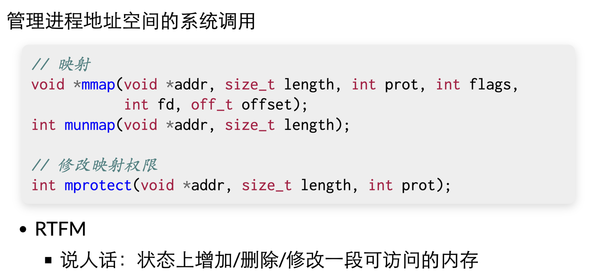

# 进程的地址空间

- /proc/[pid]/maps(man 5 proc)
- 查看进程的地址空间：[[pmap]]，通过访问 procfs(/proc/) 实现的
- 进程的地址空间：若干连续的 “段”
	- 代码 / 数据（static 全局变量） / 堆栈 / 运行时分配内存 / 动态链接库
- “段”的内存可以访问
- 不在“段”内或者违反权限的内存访问都会触发 SIGSEGV
- [[进程]]地址中的每一段
	- 地址的范围和权限(rwxsp)
	- 对应的文件：offset, dev, inode, pathname
- [[vdso]] (7): Virtual system calls: 只读的系统调用也许可以不陷入内核执行
- 操作系统每隔一段时间往 vvar（所有进程都共享） 上写数据，然后进程就可以通过 [[vdso]] 去访问 vvar 里的数据，不进入内核执行
- 在程序执行的时候改变地址空间 - [[mmap]]
	- {:height 360, :width 746}
	- 当前进程的状态机上增加/删除/修改一段可访问的内存
	- 可以直接把文件映射到进程地址空间，对其进行修改或者读取
		- [[ELF]] Loader 用 mmap 非常容易实现
			- 解析出要加载哪部分内存，直接用 mmap 就完了
- 地址空间的隔离
	- 每个指针只能访问本进程（状态机） 的内存
	- 除非 mmap 显示指定、映射共享文件或共享内存多线程
- 
-

## Source Pointers

- `raw/sources/进程的地址空间.md`

