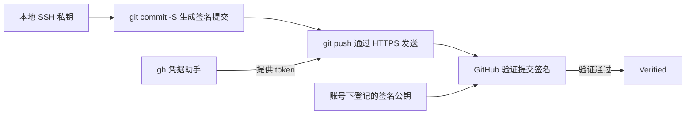

# Git

## 摘要

Git 管理文件快照和提交历史，GitHub 托管仓库并提供 PR 等协作功能，`gh` 是 GitHub 的命令行客户端。理解日常提交时，需要分别看本地生成 commit、访问远端仓库和验证提交签名这几个环节。

## 数据模型与常用命令

- 存储的数据模型：
	- ```ts
	  type blob = Array<byte> // 最基础的文件
	  type tree = Map<string, tree | blob>
	  type commit = {
	    parent: Array<commit>; // 有向无环图
	    author: string;
	    message: string;
	    snapshot: tree;
	  }

	  type object = blob | tree | commit;
	  type objects = Map<string, object>; // string 是一个 object 的哈希值
	  // 第二个 string 代表代表 objects 的 key，第一个就是
	  // 常说的 HEAD 或者是什么
	  type references = Map<string, string> 
	  ```
- git merge 的时候如果被 merge 的分支正好是基于当前分支往前开发的几个 commit 的话，就会直接 fast forward，不会创建新的 commit，而是直接移动 HEAD 指针
- 为什么要先 add？
	- 很多时候我们不希望把当前的所有改动都提交上去，因此先 add，可以做到当前改动和暂存区的分开，相当于有一个选择的机会
- git add -p <文件名> 可以交互式地把部分内容添加到暂存区（但是似乎仍然无法按行提交）
- `git log --all --graph --decorate`: visualizes history as a DAG
- `git fetch`: retrieve objects/references from a remote
- `git pull`：先 fetch，再按参数和配置整合远端历史，例如 fast-forward、merge 或 rebase，不能一概等同于 `fetch; merge`。见 [git-pull](https://git-scm.com/docs/git-pull)。
- `git clone`: download repository from remote
- `git checkout -- <file>`: discard changes（不包含暂存区的改动）
- **GitHub**: Git is not GitHub. GitHub has a specific way of contributing code to other projects, called [pull requests](https://help.github.com/en/github/collaborating-with-issues-and-pull-requests/about-pull-requests).
- **Other Git providers**: GitHub is not special: there are many Git repository hosts, like [GitLab](https://about.gitlab.com/) and [BitBucket](https://bitbucket.org/).
- 可阅读的材料
	- [Oh Shit, Git!?!](https://ohshitgit.com/) is a short guide on how to recover from some common Git mistakes.
	- [Git for Computer Scientists](https://eagain.net/articles/git-for-computer-scientists/) is a short explanation of Git’s data model, with less pseudocode and more fancy diagrams than these lecture notes.
	- [Git from the Bottom Up](https://jwiegley.github.io/git-from-the-bottom-up/) is a detailed explanation of Git’s implementation details beyond just the data model, for the curious.
	- [How to explain git in simple words](https://smusamashah.github.io/blog/2017/10/14/explain-git-in-simple-words)

## Git、gh 与远端认证

`git push` 负责把提交发送到远端；远端根据登录凭据识别账号，再结合仓库权限和分支规则决定是否接受。GitHub 支持以下两种常见连接方式：[GitHub 认证文档](https://docs.github.com/en/authentication/keeping-your-account-and-data-secure/about-authentication-to-github#authenticating-with-the-command-line)。

| 连接方式 | 远端地址示例 | 认证凭据 |
| --- | --- | --- |
| HTTPS | `https://github.com/OWNER/REPO.git` | token，可由 credential helper 提供 |
| SSH | `git@github.com:OWNER/REPO.git` | 本地 SSH 私钥；对应认证公钥已登记到 GitHub |

credential helper 是 Git 调用的外部凭据助手。使用 HTTPS 且将 `gh` 配成 helper 时，过程是：

1. 用户执行 `git push`。
2. Git 调用 `gh auth git-credential` 获取凭据。
3. Git 带着凭据通过 HTTPS 与 GitHub 通信。
4. GitHub 校验凭据与权限，接受或拒绝推送。

实际执行推送的仍是 Git。`gh auth setup-git` 负责把 GitHub CLI 配置成 helper；登录过 `gh` 并不等于已经确认某个仓库正在使用它，也不能据此判断仓库走 HTTPS 还是 SSH。需要查看远端地址和生效配置。[Git 凭据机制](https://git-scm.com/docs/gitcredentials)、[gh auth setup-git](https://cli.github.com/manual/gh_auth_setup-git)

## 提交签名与 Verified

提交签名在本地生成 commit 时完成：签名工具用私钥对 commit 内容生成数字签名，验证者用对应公钥检查内容与签名是否匹配。Git 把签名附在 commit 对象中；它没有加密代码，拥有仓库读取权限的人仍能正常阅读内容。[Git 签名格式](https://git-scm.com/docs/gitformat-signature#_commit_signatures)

签名和加密解决的问题不同：签名用于验证来源与完整性；公钥加密通常用接收方公钥加密，再由接收方私钥解密。不要把提交签名理解成“用私钥把代码加密”。[GnuPG 的签名与加密命令](https://www.gnupg.org/documentation/manuals/gnupg/Operational-GPG-Commands.html)

### SSH 认证密钥与 SSH 签名密钥

| GitHub 上登记的用途 | 发生在哪一步 | 作用 |
| --- | --- | --- |
| Authentication key | 通过 SSH 访问仓库 | 证明连接者持有对应私钥；能否写入还取决于仓库权限 |
| Signing key | 验证 commit 或 tag | 验证对象签名并关联账号，本身不授予仓库写权限 |

公钥登记在 GitHub **账号的密钥设置**中，无需作为文件提交到仓库；私钥保留在本地或签名设备中。同一把 SSH 公钥可以用于认证和签名，但在 GitHub 上必须按两个用途分别登记。只有签名密钥时，依然可以通过 HTTPS 凭据推送。[GitHub SSH 密钥用途](https://docs.github.com/en/authentication/connecting-to-github-with-ssh/adding-a-new-ssh-key-to-your-github-account)

下面是一种有效组合：本地用 SSH 签名，推送用 HTTPS，凭据由 `gh` 提供。



`Verified` 表示 GitHub 成功验证了该提交的签名；它不代表代码通过测试、没有漏洞或已经获得 review。GitHub 支持 SSH、GPG 和 S/MIME，标识不会因使用 GPG 而多一个安全等级。启用 vigilant mode 等设置后，还可能出现 `Partially verified`，应查看标识详情。[GitHub 签名状态说明](https://docs.github.com/en/authentication/managing-commit-signature-verification/about-commit-signature-verification)

若项目要求“提交签名并确认 GitHub Verified”，约束的是提交来源的验证流程；这项要求本身没有指定推送必须走 SSH，也没有指定签名必须使用 GPG。

## SSH 签名与 GPG 签名的取舍

GPG 是 GnuPG 的常用命令名，通常用它管理 OpenPGP 密钥并执行签名、加密等操作。它与 SSH 使用不同的密钥格式和工具；两者都能为 Git 提交生成签名。

| 维度 | SSH 签名 | GPG / OpenPGP 签名 |
| --- | --- | --- |
| 配置与维护 | 沿用 OpenSSH 工具，通常更容易配置；Git 需支持 SSH 签名 | 需要 GnuPG，维护密钥环及相关配置 |
| 密钥组织 | 普通公钥结构简单；本地验证可配置允许的签名者和吊销列表 | 支持主密钥、不同用途的子密钥、有效期与吊销证书 |
| 日常用途 | SSH 连接认证，以及文件、commit、tag 签名 | commit、tag、文件签名，以及邮件、文件加密 |
| 适合的需求 | 日常提交签名，希望减少配置成本 | 已使用 OpenPGP，或需要主密钥与子密钥等管理能力 |

SSH 签名需要 Git 2.34 或更高版本；GitHub 给出了两种签名方式的配置步骤。[GitHub 签名配置](https://docs.github.com/en/authentication/managing-commit-signature-verification/telling-git-about-your-signing-key) GPG 的子密钥、过期与吊销机制见 [GnuPG 密钥管理](https://gnupg.org/documentation/manuals/gnupg/OpenPGP-Key-Management.html)。

### 怎样理解“更安全”

选择建议：只给 GitHub commit 签名时，SSH 通常已满足需求；需要 OpenPGP 的主密钥、子密钥等能力时，再考虑 GPG。安全性还要比较算法、私钥保存方式和使用权限，仅凭工具名称无法得出强弱结论。例如 OpenSSH 也支持需触碰确认的 FIDO 硬件密钥，私钥保护并非 GPG 独有。[OpenSSH 硬件密钥说明](https://man.openbsd.org/ssh-keygen.1#FIDO_AUTHENTICATOR)

两个容易被过度简化的细节：

- **SSH 也能管理有效期和吊销。** 普通 SSH 公钥本身不携带 OpenPGP 式有效期，但本地 Git 验证可通过 allowed signers 文件的 `valid-after` / `valid-before` 限定有效时间，并通过 `gpg.ssh.revocationFile` 拒绝指定密钥。这些是本地验证规则，不会自动同步到 GitHub。[Git SSH 签名验证配置](https://git-scm.com/docs/git-config#Documentation/git-config.txt-gpgsshallowedSignersFile)
- **吊销密钥不会让 GitHub 上所有旧提交自动失去 Verified。** GitHub 在仓库及其 fork 网络内保留已建立的验证记录，后续密钥过期或吊销不会追溯改变那些提交的验证状态。这个行为同时适用于 GPG、SSH 和 S/MIME。[GitHub 持久签名验证](https://docs.github.com/en/authentication/managing-commit-signature-verification/about-commit-signature-verification#persistent-commit-signature-verification)

## 如何检查实际使用的配置

在目标仓库执行以下只读命令，分别检查连接方式、凭据助手和签名设置。配置未设置时，`git config --get` 可能没有输出并返回非零状态。

```bash
git remote get-url origin
git remote get-url --push origin
git config --show-origin --get-regexp '^credential(\..*)?\.helper$'
git config --show-origin --get gpg.format
git config --show-origin --get user.signingkey
git config --show-origin --get commit.gpgsign
```

`--show-origin` 显示配置来自哪个文件，不记录它最初由谁、何时写入。当前配置和账号密钥列表也不能证明历史上从未使用过其他认证方式。

`commit.gpgsign=true` 的名称含有 `gpg`，但它是提交签名开关；实际格式由 `gpg.format` 决定，`ssh` 表示 SSH 签名，默认 `openpgp` 表示 OpenPGP。命令行参数还可以覆盖持久配置，应同时检查实际提交。[Git 配置文档](https://git-scm.com/docs/git-config)

```bash
git log -1 --show-signature
git verify-commit HEAD
```

本地验证 SSH 签名需要通过 `gpg.ssh.allowedSignersFile` 配置信任的公钥。GitHub 已登记公钥，不会自动替本地建立这份信任配置；因此本地验证失败与 GitHub 显示 Unverified 需要分别排查。[Git 本地验证规则](https://git-scm.com/docs/git-config#Documentation/git-config.txt-gpgsshallowedSignersFile)

如果推送成功但 GitHub 没有显示 Verified，应查看提交的签名状态，确认本地实际使用的公钥已按**签名用途**登记，并检查平台要求的身份关联。推送认证成功只说明上传这一环节通过。[GitHub 签名与推送流程](https://docs.github.com/en/authentication/managing-commit-signature-verification/signing-commits)

分享检查结果前，应去掉机器路径、账号等私有信息；无需输出私钥或 token。

## 相关页面

- [[wiki/topics/systems/SSH|SSH]]
- [[wiki/syntheses/ai/Git 与 Agent 协作的摩擦点和演进方向|Git 与 Agent 协作的摩擦点和演进方向]]

## 来源指针

- `raw/sources/Git.md`
- [[raw/sources/2026-09-16-git-auth-signing|Git 认证与提交签名整理记录]]：本次讨论的问题与官方来源目录。
- [Git 凭据机制](https://git-scm.com/docs/gitcredentials)
- [Git 签名格式](https://git-scm.com/docs/gitformat-signature)
- [Git 配置](https://git-scm.com/docs/git-config)
- [GitHub CLI 凭据助手配置](https://cli.github.com/manual/gh_auth_setup-git)
- [GitHub 提交签名验证](https://docs.github.com/en/authentication/managing-commit-signature-verification/about-commit-signature-verification)
- [GnuPG 密钥管理](https://gnupg.org/documentation/manuals/gnupg/OpenPGP-Key-Management.html)
